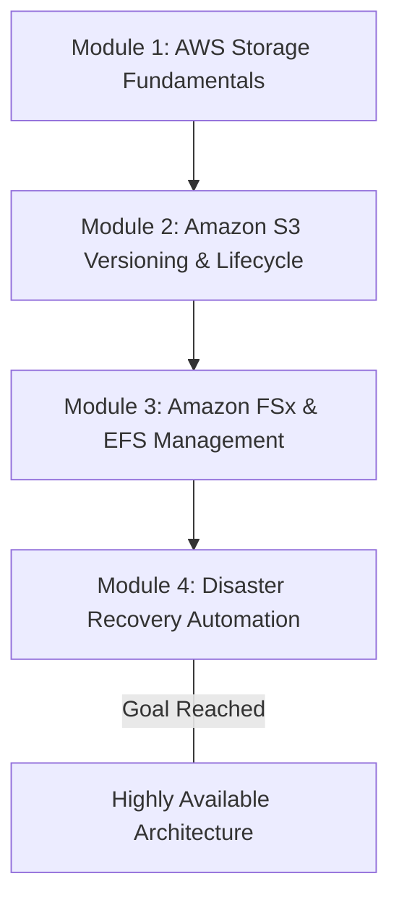

## Prerequisites

Before diving into the configuration and management of versioning for AWS storage services like Amazon S3 and Amazon FSx, learners must establish a foundational understanding of AWS cloud operations. 

Ensure you are comfortable with the following prerequisites:

* **AWS Fundamentals**: Familiarity with the AWS Management Console and AWS Command Line Interface (CLI).
* **Core Storage Concepts**: Understanding the difference between object storage (Amazon S3) and file/block storage (Amazon EFS, Amazon EBS, Amazon FSx).
* **Identity and Access Management (IAM)**: Ability to apply the principle of least privilege using identity-based and resource-based policies.
* **Disaster Recovery Basics**: Conceptual grasp of backup strategies and data protection metrics.

> [!IMPORTANT]
> If you are not familiar with API calls to Amazon S3 (e.g., `PUT`, `GET`, `LIST`), it is highly recommended to review basic S3 operations first, as S3 cannot be used as an operating system root volume and interacts entirely via API.

## Module Breakdown

This curriculum is structured to progressively build your expertise from fundamental storage mechanics to advanced, automated disaster recovery implementations.



| Module | Focus Area | Difficulty | Est. Time |
| :--- | :--- | :--- | :--- |
| **Module 1** | Storage Fundamentals & Selection | Introductory | 2 Hours |
| **Module 2** | S3 Versioning & Cross-Region Replication | Intermediate | 4 Hours |
| **Module 3** | Amazon FSx & File System Backups | Intermediate | 4 Hours |
| **Module 4** | Disaster Recovery & AWS Backup | Advanced | 5 Hours |

## Learning Objectives per Module

### Module 1: AWS Storage Fundamentals
* **Select appropriate storage solutions** based on application performance, migration, or transfer needs.
* **Differentiate** between the primary use cases for Amazon S3 (data lakes, RTO/RPO backups) and Amazon FSx.

### Module 2: Amazon S3 Versioning & Lifecycle
* **Implement Amazon S3 Versioning** to protect against accidental deletion and application overwrites.
* **Configure Cross-Region Replication (CRR)** alongside versioning to ensure regional availability of objects.
* **Design data lifecycle rules** to transition older object versions to cost-effective storage tiers like Amazon S3 Glacier.

### Module 3: Amazon FSx & EFS Management
* **Deploy Amazon FSx** across its supported file systems (NetApp ONTAP, OpenZFS, Windows File Server).
* **Integrate Amazon EFS and FSx with compute** options like Amazon EC2, Amazon ECS, and Amazon EKS.
* **Monitor storage limits** and utilize automated patching and backup features provided by fully managed FSx architectures.

### Module 4: Disaster Recovery Automation
* **Automate centralized data protection** by creating backup plans and vaults using AWS Backup.
* **Evaluate recovery objectives** to ensure strategies meet specific RPO (Recovery Point Objective) and RTO (Recovery Time Objective) parameters.
* **Execute point-in-time restores** for storage systems to maintain business continuity.

## Success Metrics

How will you know you have mastered this curriculum? You will be able to demonstrate competence in the following measurable actions:

* **Zero Data Loss on Overwrite**: You can successfully upload a file to S3, overwrite it, and restore the original file using S3 Versioning via the AWS CLI.
* **Automated Retention**: You can point to an active AWS Backup plan that automatically captures Amazon FSx state every 24 hours and purges backups older than 30 days.
* **Calculated Cost Optimization**: You can estimate the storage growth cost formula for versioning:

$$ \text{Total Storage Space} = \text{Base Object Size} + \sum_{i=1}^{n} (\text{Size of Version } i) $$

* **RTO and RPO Mastery**: You can design a backup architecture that successfully brings a system back online within strict time constraints.

### Understanding RTO and RPO

The visual below anchors the concepts of RPO and RTO, which are critical success metrics for any backup and versioning strategy:

```tikz
\begin{tikzpicture}[x=1.2cm, y=1.2cm]
    % Time axis
    \draw[thick, ->] (0,0) -- (9,0) node[right] {\mbox{Time}};
    
    % Disaster Event Line
    \draw[thick, red, dashed] (4.5,-0.5) -- (4.5,1.5) node[above] {\mbox{Disaster Event}};
    
    % RPO arrow
    \draw[<->, blue, thick] (1.5,0.5) -- (4.4,0.5) node[midway, above] {\mbox{RPO (Data Loss)}};
    
    % RTO arrow
    \draw[<->, green!60!black, thick] (4.6,0.5) -- (7.5,0.5) node[midway, above] {\mbox{RTO (Downtime)}};
    
    % Markers
    \filldraw (1.5,0) circle (2pt) node[below] {\mbox{Last Backup / Version}};
    \filldraw (7.5,0) circle (2pt) node[below] {\mbox{System Restored}};
\end{tikzpicture}
```

## Real-World Application

Implementing versioning and backup strategies is not just theoretical—it is the primary defense line for organizational data resilience.

* **Ransomware Mitigation**: Malicious actors often encrypt active files. With S3 versioning and AWS Backup integration, previous unencrypted versions of objects can be instantly restored, neutralizing the attack.
* **Accidental Deletions (Human Error)**: A developer executing an accidental `rm -rf` or an incorrect API `DELETE` call on a production S3 bucket. Versioning inserts a "delete marker" rather than permanently removing the data, allowing immediate recovery.
* **Regulatory Compliance**: Financial and healthcare industries enforce strict data retention policies. Using immutable storage features and keeping historical versions ensures that an organization can provide complete audit trails during legal discovery.
* **Long-term Collaboration**: When geographically distributed teams collaborate on assets (e.g., using Amazon FSx for NetApp ONTAP), automated snapshots and versioning ensure that complex file changes can be rolled back if a project direction changes unexpectedly.