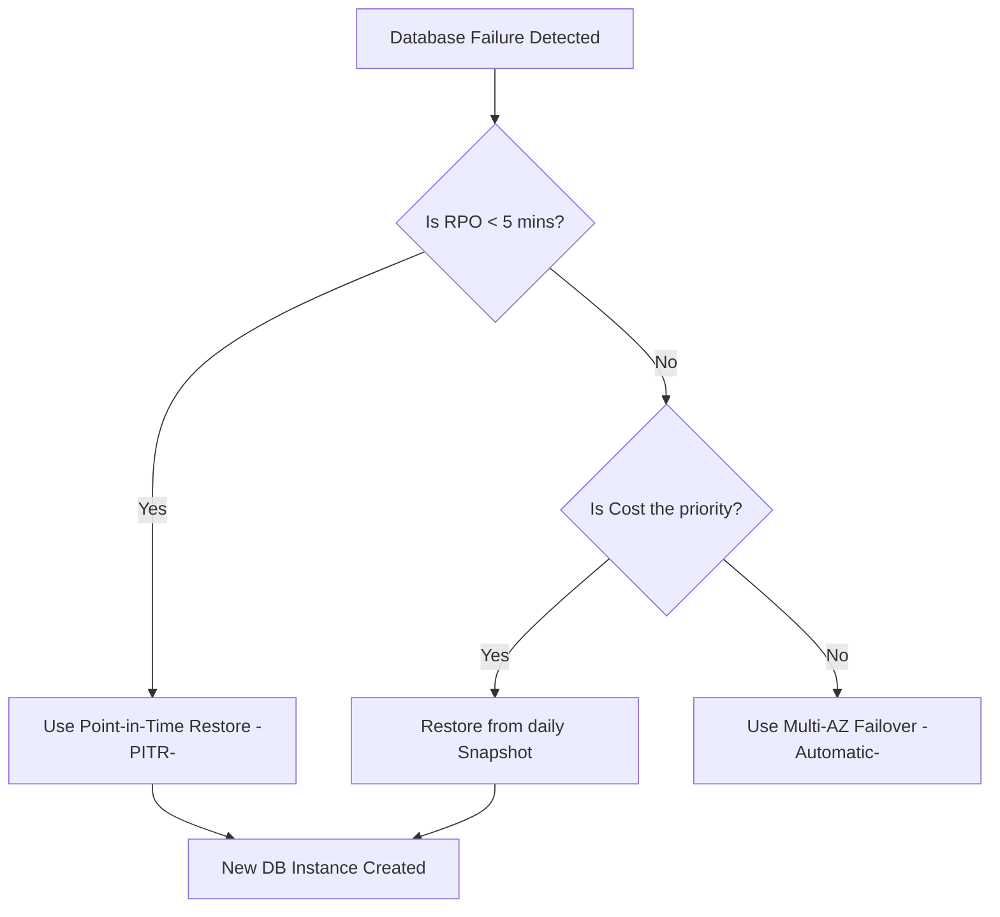

# Database Restoration & Recovery Strategies: RTO, RPO, and Cost Management

This guide covers the critical skills required to implement backup and restore strategies in AWS, specifically focusing on meeting business requirements for data recovery speed, data currency, and budget constraints.

## Learning Objectives
After studying this guide, you should be able to:
- Define and calculate **Recovery Time Objective (RTO)** and **Recovery Point Objective (RPO)**.
- Select the appropriate restoration method (PITR vs. Snapshot) for Amazon RDS and DynamoDB.
- Evaluate cost trade-offs between different Amazon S3 Glacier retrieval tiers.
- Design a recovery strategy that balances performance with operational costs.

## Key Terms & Glossary
- **RTO (Recovery Time Objective):** The maximum acceptable delay between the interruption of service and restoration of service. (How long can you be down?)
- **RPO (Recovery Point Objective):** The maximum acceptable amount of data loss measured in time. (How much data can you lose?)
- **Point-in-Time Restore (PITR):** A restoration method that uses continuous backups and transaction logs to restore a database to any specific second within a retention period.
- **Snapshot:** A storage-level, point-in-time backup of an entire DB instance or volume.
- **Hydration:** The process of "warming up" or loading data from a backup (like an EBS snapshot) into active storage.

## The "Big Idea"
In disaster recovery, there is an inverse relationship between cost and the "Rs" (RTO/RPO). To achieve an RTO of near-zero, you must pay significantly more for active-active or multi-region setups. Conversely, for non-critical data where you can afford 24 hours of downtime, you can utilize high-latency, low-cost storage like S3 Glacier Deep Archive. The SysOps Administrator's job is to find the "Sweet Spot" where the cost of the solution does not exceed the cost of the potential downtime.

## Formula / Concept Box

| Metric | Definition | Goal | Cost Impact |
| :--- | :--- | :--- | :--- |
| **RPO** | Time since last backup | Minimize data loss | Lower RPO requires more frequent backups/replication. |
| **RTO** | Time to restore service | Minimize downtime | Lower RTO requires faster hardware and automation. |

> [!IMPORTANT]
> **RDS PITR Limitation:** When you restore an RDS instance to a point in time, AWS creates a **new** DB instance with a new endpoint. You must update your application configuration to point to the new endpoint.

## Hierarchical Outline
- **1. Amazon RDS Restoration Methods**
    - **Snapshot Restore:** Restores from a manual or automated full backup. Slower for large DBs due to "lazy loading."
    - **Point-in-Time Restore (PITR):** Uses transaction logs. Requires `BackupRetentionPeriod` > 0.
- **2. Amazon S3 Glacier Retrieval Tiers**
    - **Instant Retrieval:** Millisecond access; highest storage cost, lowest retrieval cost.
    - **Flexible Retrieval (formerly Glacier):** Expedited (1-5m), Standard (3-5h), Bulk (5-12h).
    - **Deep Archive:** Standard (12h), Bulk (48h). Lowest storage cost in AWS.
- **3. DynamoDB Recovery**
    - **On-demand Backups:** Full backups for long-term retention.
    - **Continuous Backups (PITR):** Protects against accidental write/delete for the last 35 days.

## Visual Anchors

### RTO vs RPO Timeline
\begin{tikzpicture}[>=stealth, thick]
    % Timeline
    \draw[->] (0,0) -- (10,0) node[right] {Time};
    
    % Disaster event
    \draw[red, line width=1.5pt] (6,-0.5) -- (6,1) node[above] {\textbf{Disaster Event}};
    
    % RPO Bracket
    \draw[blue, <->] (2,-0.8) -- (6,-0.8);
    \node[blue, below] at (4,-0.8) {RPO (Data Loss)};
    \draw[dashed, blue] (2,0) -- (2,-1);
    \node[below, blue] at (2,-1) {Last Backup};
    
    % RTO Bracket
    \draw[orange, <->] (6,-0.8) -- (9,-0.8);
    \node[orange, below] at (7.5,-0.8) {RTO (Downtime)};
    \draw[dashed, orange] (9,0) -- (9,-1);
    \node[below, orange] at (9,-1) {Service Restored};
\end{tikzpicture}

### Restoration Decision Flow

## Definition-Example Pairs
- **Expedited Retrieval:** A Glacier retrieval option for urgent data needs.
    - *Example:* A company accidentally deleted its payroll database and needs the backup file within minutes to process checks today.
- **Bulk Retrieval:** A free (or low cost) retrieval option for large datasets that aren't time-sensitive.
    - *Example:* An annual compliance audit requires 10TB of logs from 3 years ago; the auditor can wait 48 hours for the data.
- **Pilot Light:** A DR strategy where a minimal version of the environment is always running.
    - *Example:* A database is kept synchronized via RDS Read Replicas, but application servers are only launched from AMIs during a disaster.

## Worked Examples

### Scenario 1: RDS Recovery Selection
**Problem:** A SysOps Administrator needs to restore an RDS MySQL DB because a junior dev ran `DROP TABLE` at 10:05 AM. The last snapshot was at 12:00 AM. The business requires an RPO of 1 minute.
- **Solution:** Use **Point-in-Time Restore (PITR)**. 
- **Step 1:** Select the instance in the RDS Console.
- **Step 2:** Choose "Restore to point in time."
- **Step 3:** Set the time to 10:04 AM (just before the error).
- **Result:** A new instance is created with all data up to 10:04 AM, meeting the 1-minute RPO.

### Scenario 2: S3 Storage Class Cost Optimization
**Problem:** You have 100TB of medical imaging data. It is rarely accessed, but if a doctor requests it, they need it in under 5 minutes. If it is for research, they can wait 24 hours. 
- **Analysis:** 
    - **S3 Glacier Instant Retrieval:** High storage cost ($0.004/GB), but instant access. 
    - **S3 Glacier Flexible Retrieval:** Lower storage cost ($0.0036/GB), 1-5 min access with Expedited Retrieval ($0.03/GB retrieved).
- **Recommendation:** Use **S3 Glacier Flexible Retrieval** with **Expedited Tiers** for doctor requests to minimize monthly storage fees while meeting the 5-minute RTO.

## Checkpoint Questions
1. What is the main difference between an RDS Snapshot restore and an RDS Point-in-Time Restore?
2. Which S3 Glacier retrieval tier offers a 5-12 hour window at no retrieval cost?
3. If you require an RPO of 0 (no data loss), what architecture should you implement for your database?
4. Why might a restored EBS volume perform slowly immediately after a restore, and how can you mitigate this?
5. True/False: Restoring a DynamoDB table using PITR overwrites the existing table.

Click to see Answers

1. Snapshots are full backups taken at specific times; PITR uses transaction logs to restore to any specific second (within the retention window).
2. Bulk Retrieval (under the Glacier Flexible Retrieval class).
3. Multi-AZ or synchronous replication.
4. EBS Snapshots must be "hydrated" from S3. You can mitigate this using Amazon EBS Fast Snapshot Restore (FSR).
5. False. Like RDS, DynamoDB PITR creates a **new** table.

