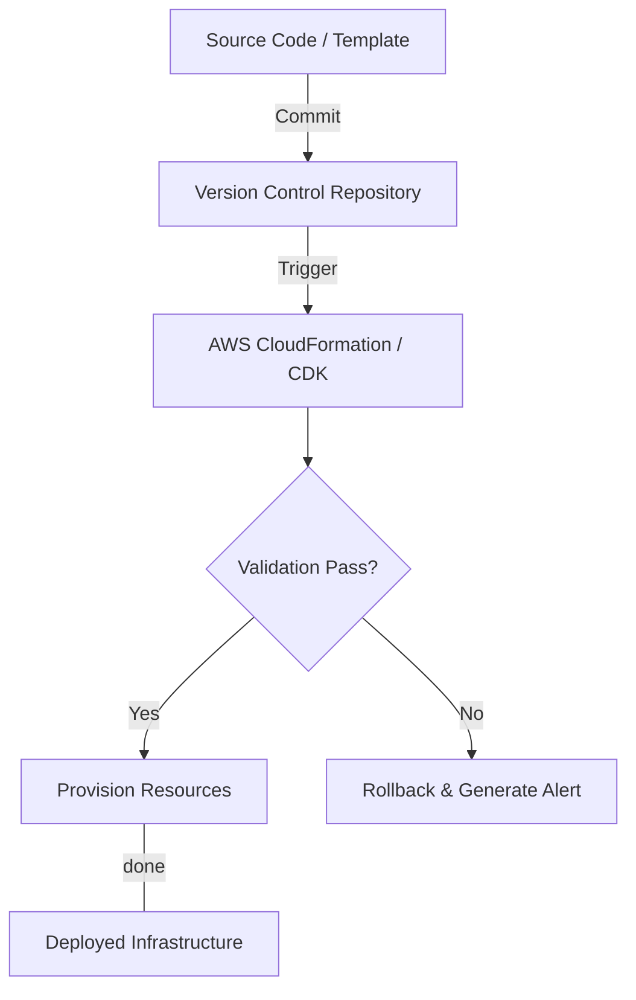
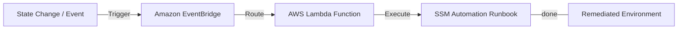

# Curriculum Overview: Deployment, Provisioning, and Automation

Welcome to **Unit 3: Deployment, Provisioning, and Automation**, a critical domain for modern Cloud Operations and Systems Administration. This curriculum is aligned with Domain 3 of the AWS Certified SysOps/CloudOps Administrator - Associate (SOA-C02/SOA-C03) exam. It focuses on replacing manual infrastructure management with programmatic, automated, and repeatable processes.

---

## Prerequisites

Before diving into this unit, learners must have a foundational understanding of the AWS ecosystem to ensure a smooth progression through automated deployment strategies.

* **Core AWS Services**: Working knowledge of Amazon EC2, Amazon S3, Amazon VPC, and AWS IAM.
* **Command Line Interface (CLI)**: Basic ability to navigate the terminal and use the AWS CLI.
* **Data Serialization Languages**: Comfort reading and editing **JSON** or **YAML** files, which form the backbone of Infrastructure as Code (IaC) templates.
* **Basic Networking concepts**: Understanding of subnets, CIDR blocks, and security groups.

> [!WARNING] 
> Attempting to automate infrastructure without understanding the underlying manual processes will lead to configuration errors. Ensure you can manually provision an EC2 instance within a custom VPC before starting this module.

---

## Module Breakdown

This unit is divided into sequential modules that progress from basic resource provisioning to complex, event-driven automation architectures.

| Module | Topic | Difficulty | Key Tools / Services |
| :--- | :--- | :--- | :--- |
| **1** | Infrastructure as Code (IaC) | ⭐⭐ | AWS CloudFormation, AWS CDK, Terraform |
| **2** | Image & Container Management | ⭐⭐ | EC2 Image Builder, Amazon ECR, ECS, EKS |
| **3** | Application Provisioning | ⭐⭐⭐ | AWS Elastic Beanstalk, Deployment Strategies |
| **4** | Cross-Account & Multi-Region | ⭐⭐⭐⭐ | CloudFormation StackSets, AWS RAM |
| **5** | Event-Driven Automation | ⭐⭐⭐⭐ | AWS Systems Manager (SSM), EventBridge, Lambda |

### High-Level Deployment Flow

---

## Learning Objectives per Module

By completing the modules in this unit, you will achieve the following tactical skills and conceptual understandings:

### Module 1: Infrastructure as Code (IaC)
* **Manage Stacks**: Create, update, and delete resource stacks using AWS CloudFormation.
* **Identify Drift**: Detect and remediate CloudFormation stack drift when manual changes occur.
* **Programmatic Modeling**: Explain the role of the AWS Cloud Development Kit (CDK) in modeling cloud infrastructure using standard programming languages.

### Module 2: Image & Container Management
* **Golden Images**: Automate Amazon Machine Image (AMI) creation and distribution using **EC2 Image Builder**.
* **Container Operations**: Manage workloads, task health, and container registries across Amazon ECS and EKS.

### Module 3: Application Provisioning
* **Deployment Scenarios**: Select and execute appropriate deployment strategies (e.g., *All-at-once*, *Rolling*, *Immutable*, and *Blue/Green*).
* **Elastic Beanstalk**: Manage application versions, environments, and extensions using AWS Elastic Beanstalk.

### Module 4: Cross-Account & Multi-Region Operations
* **Resource Sharing**: Provision and share resources across organizational boundaries using AWS Resource Access Manager (RAM).
* **Global Deployments**: Deploy standardized infrastructure across multiple AWS Regions and accounts using CloudFormation StackSets.

### Module 5: Event-Driven Automation
* **Systems Manager**: Execute SSM Automation runbooks to remediate common configuration issues and manage fleet updates with SSM Patch Manager.
* **Event Responses**: Implement event-driven automation by routing state changes from Amazon S3 Event Notifications or EventBridge to AWS Lambda.

> [!TIP]
> Pay special attention to **Deployment Strategies** (Blue/Green vs. Rolling). This is a heavily tested topic on the exam and a frequent pain point in real-world DevOps pipelines.

---

## Success Metrics

How will you know you have mastered the material in this curriculum? Your success will be measured against the following practical and theoretical benchmarks:

1. **Template Creation**: You can write a multi-resource CloudFormation template (YAML/JSON) from scratch that successfully deploys a VPC, public subnet, and an EC2 instance.
2. **Drift Resolution**: Given a drifted CloudFormation stack, you can successfully align the deployed resources back to their template definition without downtime.
3. **Troubleshooting Prowess**: You can rapidly identify and remediate deployment failures caused by common issues, such as:
   * Subnet sizing exhaustion (no available IP addresses)
   * Strict IAM permissions issues (e.g., missing `PassRole`)
   * Service quota limits being exceeded
4. **Automated Remediation Pipeline**: You can configure an EventBridge rule that detects a specific resource change and successfully triggers a Systems Manager Automation runbook to fix it.
5. **Exam Readiness**: You consistently score 85%+ on Domain 3 practice questions for the SOA-C03 exam.

### Event-Driven Remediation Architecture

---

## Real-World Application

Understanding deployment, provisioning, and automation is not just about passing an exam; it is the foundation of modern **Site Reliability Engineering (SRE)** and **DevOps**.

* **Eliminating Human Error**: Manual server configuration (often called "ClickOps") is prone to mistakes. By defining infrastructure as code, teams guarantee that the staging environment matches production perfectly, eliminating the "it works on my machine" paradigm.
* **Disaster Recovery**: If an entire AWS region goes down, a business relying on manual configuration might take days to rebuild. A CloudOps engineer utilizing CloudFormation can spin up a replica environment in a new region in minutes.
* **Cost Efficiency**: Automation allows systems to scale dynamically. Automated provisioning scripts can tear down expensive development environments on Friday evenings and rebuild them Monday mornings, saving organizations thousands of dollars.
* **Security Auditing**: When infrastructure is provisioned through code (Git), every change to the environment is tracked, versioned, and auditable, creating an immediate paper trail for compliance frameworks.