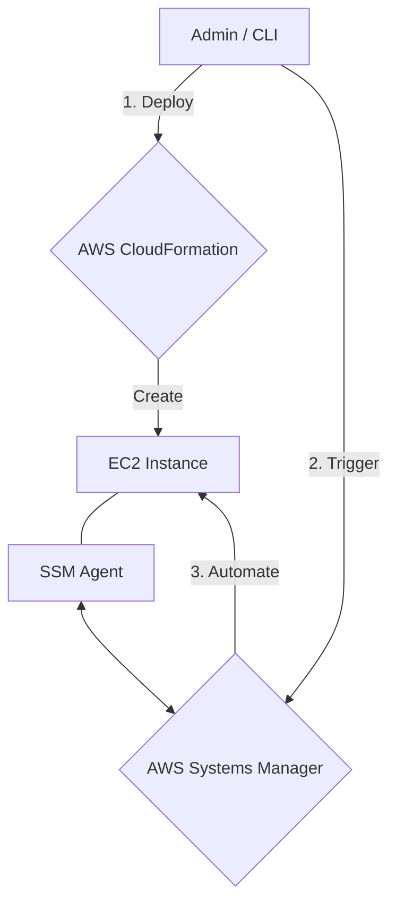

# Lab: Automating Infrastructure and Remediation with CloudFormation and SSM

This hands-on lab focuses on the lifecycle of cloud resources within the **AWS Certified SysOps Administrator** scope. You will provision infrastructure using **AWS CloudFormation**, detect manual configuration changes using **Drift Detection**, and perform automated remediation using **AWS Systems Manager (SSM)**.

> [!WARNING] Remember to run the teardown commands at the end of this lab to avoid ongoing charges for the EC2 resources created.

## Prerequisites

*   An **AWS Account** with administrative permissions.
*   **AWS CLI** installed and configured (`aws configure`).
*   Basic familiarity with YAML syntax for templates.
*   Standard internet access and a terminal/command prompt.

## Learning Objectives

1.  Deploy a managed infrastructure stack using AWS CloudFormation.
2.  Perform Drift Detection to identify manual "out-of-band" configuration changes.
3.  Execute an AWS Systems Manager (SSM) Automation runbook to remediate instance states.
4.  Manage resource lifecycles programmatically via the CLI.

## Architecture Overview

We will deploy a simple EC2 instance within a default VPC, managed via CloudFormation and registered with Systems Manager.



\begin{tikzpicture}[scale=0.8, every node/.style={scale=0.8}]
\draw[thick, rounded corners, fill=blue!5] (0,0) rectangle (6,4);
\node at (3,3.5) {\textbf{AWS Cloud (Region)}};
\draw[thick, dashed, fill=orange!10] (1,0.5) rectangle (5,3);
\node at (3,2.6) {\textbf{Default VPC}};
\draw[fill=green!20] (2,1) rectangle (4,2) node[midway] {\textbf{EC2}};
\draw[<->, thick] (4,1.5) -- (7,1.5) node[right] {\textbf{SSM API}};
\end{tikzpicture}

## Step-by-Step Instructions

### Step 1: Prepare the CloudFormation Template

Create a file named `lab-stack.yaml` on your local machine with the following content. This template defines a single EC2 instance using the latest Amazon Linux 2 AMI and an IAM role for SSM access.

```yaml
AWSTemplateFormatVersion: '2010-09-09'
Description: 'SysOps Lab - EC2 with SSM Role'
Resources:
  MyInstance:
    Type: 'AWS::EC2::Instance'
    Properties:
      InstanceType: t3.micro
      ImageId: !Sub "{{resolve:ssm:/aws/service/ami-amazon-linux-latest/amzn2-ami-hvm-x86_64-gp2}}"
      Tags:
        - Key: Name
          Value: BrainyBee-Lab-Instance
```

### Step 2: Deploy the Stack

Now, we will provision the resources using the AWS CLI.

```bash
aws cloudformation create-stack \
  --stack-name brainybee-infra-stack \
  --template-body file://lab-stack.yaml
```

<details><summary>Console alternative</summary>
1. Navigate to <b>CloudFormation</b> in the AWS Console.\n2. Click <b>Create stack</b> > <b>With new resources (standard)</b>.\n3. Upload the <code>lab-stack.yaml</code> file.\n4. Name it <code>brainybee-infra-stack</code> and follow the wizard to <b>Submit</b>.
</details>

### Step 3: Trigger and Detect Drift

Drift occurs when resources are modified outside of CloudFormation. Let's simulate this by manually adding a tag to our instance via the CLI.

```bash
# Get Instance ID
INSTANCE_ID=$(aws ec2 describe-instances --filters "Name=tag:Name,Values=BrainyBee-Lab-Instance" --query "Reservations[0].Instances[0].InstanceId" --output text)

# Add a manual tag (Drift)
aws ec2 create-tags --resources $INSTANCE_ID --tags Key=ManualChange,Value=True

# Trigger Drift Detection
aws cloudformation detect-stack-drift --stack-name brainybee-infra-stack
```

### Step 4: Automate Remediation with SSM

If an instance is misconfigured or needs a restart as part of a maintenance task, we use SSM Automation. We will trigger the `AWS-RestartEC2Instance` runbook.

```bash
aws ssm start-automation-execution \
  --document-name "AWS-RestartEC2Instance" \
  --parameters "InstanceId=$INSTANCE_ID"
```

> [!TIP]
> SSM Automation runbooks are JSON/YAML documents that define a sequence of steps. Using pre-defined AWS runbooks reduces operational overhead.

## Checkpoints

| Verification Step | Command / Action | Expected Result |
| :--- | :--- | :--- |
| **Stack Status** | `aws cloudformation describe-stacks --stack-name brainybee-infra-stack` | `StackStatus` should be `CREATE_COMPLETE`. |
| **Drift Result** | `aws cloudformation describe-stack-drift-detection-status --stack-name brainybee-infra-stack` | `DetectionStatus` should be `DETECTION_COMPLETE`. |
| **SSM Execution** | Check SSM Console > Automation | The execution for `AWS-RestartEC2Instance` should show `Success`. |

## Troubleshooting

| Error | Likely Cause | Solution |
| :--- | :--- | :--- |
| `ROLLBACK_COMPLETE` | Invalid template or insufficient permissions. | Check **CloudFormation > Events** in the console for the specific error message. |
| `IncompatibleParameterException` | The Instance ID provided to SSM is incorrect. | Re-run the `describe-instances` command to capture the correct ID. |
| `AccessDenied` | IAM user lacks CloudFormation or EC2 permissions. | Attach the `AdministratorAccess` or specific SysOps managed policy to your IAM user. |

## Clean-Up / Teardown

To avoid costs, delete the resources in the reverse order of creation. Since CloudFormation manages the instance, deleting the stack will remove the EC2 instance automatically.

```bash
# Delete the CloudFormation Stack
aws cloudformation delete-stack --stack-name brainybee-infra-stack

# Verify deletion
aws cloudformation wait stack-delete-complete --stack-name brainybee-infra-stack
```

> [!IMPORTANT]
> Always verify that the stack status is `DELETE_COMPLETE` to ensure no orphaned resources remain in your account.

## Cost Estimate

*   **CloudFormation**: Free to use for AWS resources.
*   **EC2 (t3.micro)**: Free Tier eligible (750 hours/month). If not on free tier, ~$0.0104 per hour.
*   **SSM Automation**: Free for AWS-provided runbooks. Free tier for custom runbooks up to 100,000 steps per month.