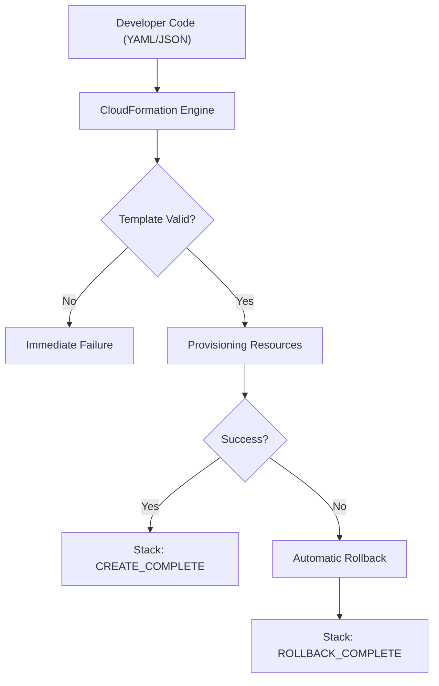

# AWS CloudFormation & CDK: Infrastructure as Code Study Guide

## Learning Objectives

By the end of this study guide, you should be able to:
- **Articulate** the core components of an AWS CloudFormation template and their functions.
- **Manage** stacks through their entire lifecycle: creation, updates, and deletion.
- **Differentiate** between AWS CloudFormation and the AWS Cloud Development Kit (CDK).
- **Implement** cross-account and cross-region provisioning using CloudFormation StackSets.
- **Detect and remediate** infrastructure drift to maintain environment consistency.
- **Integrate** secrets from AWS Secrets Manager using dynamic references within templates.

## Key Terms & Glossary

- **Stack**: A single unit of management for a collection of AWS resources defined in a template.
- **Template**: A YAML or JSON formatted text file that serves as the blueprint for your AWS infrastructure.
- **Construct**: The basic building block of AWS CDK applications, representing a single resource or a higher-level abstraction.
- **Drift**: A condition where the actual configuration of a resource differs from its expected configuration defined in the stack template.
- **Intrinsic Function**: Built-in functions (e.g., `!Ref`, `!GetAtt`) used in templates to assign values to properties that are not available until runtime.
- **StackSet**: A feature that allows you to create, update, or delete stacks across multiple AWS accounts and Regions with a single operation.

## The "Big Idea"

The central concept of **Infrastructure as Code (IaC)** is treating your infrastructure the same way you treat application code. Instead of manually clicking through the AWS Management Console, you define your desired state in a declarative (CloudFormation) or imperative (CDK) manner. This allows for version control, automated testing, and repeatable deployments, which are the cornerstones of the AWS Operational Excellence pillar. It transforms infrastructure from a "craft" into a predictable, scalable "factory" process.

## Formula / Concept Box

| Template Section | Purpose | Example / Note |
| :--- | :--- | :--- |
| **Parameters** | Custom inputs at runtime | `DBInstanceClass`, `VPCID` |
| **Mappings** | Static lookup tables | Region-to-AMI ID maps |
| **Resources** | (Required) AWS objects to create | `AWS::S3::Bucket`, `AWS::EC2::Instance` |
| **Outputs** | Values to return (e.g., URLs) | `BucketDomainName`, `LoadBalancerDNS` |
| **Conditions** | Logic for resource creation | `IsProduction: !Equals [ !Ref Env, prod ]` |

> [!IMPORTANT]
> **Dynamic References for Secrets**: To use a secret from Secrets Manager, use: 
> `{{resolve:secretsmanager:secret-id:SecretString:json-key:version-stage:version-id}}`

## Hierarchical Outline

1.  **AWS CloudFormation Fundamentals**
    - **Templates**: JSON/YAML blueprints defining **Resources**.
    - **Stack Lifecycle**: Create $\rightarrow$ Update $\rightarrow$ Delete.
    - **Change Sets**: Preview changes before executing an update to avoid accidental service disruption.
2.  **Advanced Provisioning**
    - **Nested Stacks**: Reusable templates called within other templates for modularity.
    - **StackSets**: Managing infrastructure across **Multi-Account** and **Multi-Region** environments.
    - **Drift Detection**: Identifying manual changes that bypass IaC processes.
3.  **AWS Cloud Development Kit (CDK)**
    - **Abstraction**: Use TypeScript, Python, Java, or C# to define resources.
    - **Synthesis**: CDK code "synthesizes" into standard CloudFormation templates.
    - **Construct Library**: Access to pre-architected "L2" and "L3" constructs (e.g., `Vpc` with subnets).
4.  **Troubleshooting & Maintenance**
    - **Rollback**: Automatic reversion to the last known stable state on failure.
    - **Termination Protection**: Guarding critical stacks from accidental deletion.

## Visual Anchors

### The CloudFormation Deployment Workflow



### CDK to CloudFormation Translation

```tikz
\begin{tikzpicture}
[node distance=2cm, every node/.style={rectangle, draw, rounded corners, minimum width=3cm, minimum height=1cm, align=center}]
\node (CDK) {CDK App\\(TypeScript/Python)};
\node (SYNTH) [right of=CDK, xshift=3cm] {cdk synth\\(Transformation)};
\node (CFN) [right of=SYNTH, xshift=3cm] {CloudFormation\\Template (JSON/YAML)};
\draw [->, thick] (CDK) -- (SYNTH);
\draw [->, thick] (SYNTH) -- (CFN);
\node (AWS) [below of=CFN, yshift=-0.5cm, cloud, draw, cloud puffs=15, cloud puff arc=120, minimum width=4cm, minimum height=2cm] {AWS Environment};
\draw [->, dashed, thick] (CFN) -- (AWS) node[midway, left] {cdk deploy};
\end{tikzpicture}
```

## Definition-Example Pairs

- **Stack Drift**: The difference between the template state and the real-world resource state. 
  - *Example*: A developer manually adds an Inbound Rule to a Security Group via the Console; CloudFormation detects this as drift.
- **Constructs**: The building blocks of CDK code.
  - *Example*: An `s3.Bucket` construct in CDK allows you to define a bucket with encryption enabled in just one line of code.
- **Intrinsic Function - !GetAtt**: Returns a value for an attribute of a resource.
  - *Example*: Using `!GetAtt MyS3Bucket.Arn` to provide the bucket's Amazon Resource Name to an IAM policy.

## Worked Examples

### Example 1: Basic S3 Bucket Template (YAML)

This snippet creates a private S3 bucket with a specific name passed as a parameter.

```yaml
AWSTemplateFormatVersion: '2010-09-09'
Parameters:
  BucketNameParam:
    Type: String
    Description: The name of the bucket to create
Resources:
  MyS3Bucket:
    Type: 'AWS::S3::Bucket'
    Properties:
      BucketName: !Ref BucketNameParam
      PublicAccessBlockConfiguration:
        BlockPublicAcls: true
        BlockPublicPolicy: true
Outputs:
  BucketARN:
    Value: !GetAtt MyS3Bucket.Arn
```

### Example 2: CDK Initialization Commands

How to start a new CDK project in Python and deploy it.

```bash
# Initialize a project
mkdir my-infra && cd my-infra
cdk init app --language python

# Synthesize to see the CloudFormation template
cdk synth

# Deploy to your AWS account
cdk deploy
```

## Checkpoint Questions

1.  **Which CloudFormation feature should you use to preview how a stack update will impact your running resources?**
    - *Answer: Change Sets.*
2.  **True or False: AWS CDK bypasses CloudFormation to create resources directly via API calls.**
    - *Answer: False. CDK synthesizes into CloudFormation templates which are then deployed by the CloudFormation engine.*
3.  **What is the correct syntax for a dynamic reference to a secret named "MyDbSecret" stored in Secrets Manager?**
    - *Answer: {{resolve:secretsmanager:MyDbSecret}} (Simplest form, assuming AWSCURRENT version).*
4.  **If a CloudFormation stack creation fails, what is the default behavior?**
    - *Answer: The stack automatically rolls back, deleting any successfully created resources to return to a clean state.*
5.  **How do you manage identical resources across 5 accounts and 3 regions efficiently?**
    - *Answer: Use CloudFormation StackSets.*