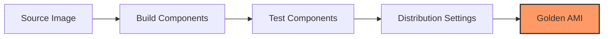

# AWS Resource Provisioning and Maintenance Study Guide

This guide covers the essential skills for provisioning and maintaining cloud resources in an AWS environment, focusing on automation, Infrastructure as Code (IaC), and cross-account resource sharing as required for the SOA-C03 exam.

## Learning Objectives

By the end of this module, you should be able to:
* **Create and manage** Amazon Machine Images (AMIs) and container images using EC2 Image Builder.
* **Orchestrate infrastructure** using AWS CloudFormation and the AWS Cloud Development Kit (CDK).
* **Identify and remediate** common deployment issues such as subnet sizing, service quotas, and CloudFormation errors.
* **Implement resource sharing** across multiple AWS accounts and Regions using AWS Resource Access Manager (RAM) and CloudFormation StackSets.
* **Automate deployments** using third-party tools like Terraform and version control with Git.

## Key Terms & Glossary

* **Infrastructure as Code (IaC):** The practice of managing and provisioning computing infrastructure through machine-readable definition files, rather than physical hardware configuration or interactive configuration tools.
* **AMI (Amazon Machine Image):** A master image for the creation of virtual servers (EC2 instances) in the AWS environment.
* **Stack:** A collection of AWS resources that you can manage as a single unit in CloudFormation.
* **Drift Detection:** A feature in CloudFormation that identifies if a stack's actual configuration has deviated from its expected template configuration.
* **Construct:** The basic building block of AWS CDK applications, representing a "cloud component."
* **AWS RAM (Resource Access Manager):** A service that allows you to share your AWS resources with any AWS account or within your AWS Organization.

## The "Big Idea"

In modern cloud operations, manual intervention is a liability. The "Big Idea" behind provisioning and maintenance is **Automation through Declarative Definitions**. Instead of "building" a server, we "define" a server. This allows for repeatable, predictable, and scalable environments where the infrastructure is treated exactly like software code—version-controlled, tested, and automatically deployed.

## Formula / Concept Box

| Concept | Core Rule / Syntax | Application |
| :--- | :--- | :--- |
| **CloudFormation Template** | `Resources`, `Parameters`, `Outputs` | The mandatory sections for any YAML/JSON template. |
| **CDK Synthesis** | `cdk synth` | Converts high-level code (Python/TS) into a CloudFormation template. |
| **Subnet Sizing** | $2^{(32-n)} - 5$ | Formula to calculate available IPs in a /n CIDR block (AWS reserves 5). |
| **RAM Sharing** | Principal + Resource + Permission | The triad required to share a resource via Resource Access Manager. |

## Hierarchical Outline

* **I. Image Management**
    * **EC2 Image Builder**: Automates the creation, management, and deployment of customized, secure, and up-to-date **"Golden Images"**.
    * **Container Images**: Managing ECR (Elastic Container Registry) and build pipelines for Dockerized workloads.
* **II. Infrastructure as Code (IaC)**
    * **AWS CloudFormation**: Declarative JSON/YAML templates for resource stacks.
    * **AWS CDK**: Imperative programming (Python, TypeScript) to define cloud infrastructure.
    * **Terraform**: Multi-cloud IaC provider using HCL (HashiCorp Configuration Language).
* **III. Multi-Account & Multi-Region Strategies**
    * **AWS RAM**: Sharing Transit Gateways, Subnets, and License Manager configurations.
    * **CloudFormation StackSets**: Extending stacks across multiple accounts and regions with a single operation.
* **IV. Troubleshooting & Remediation**
    * **Deployment Errors**: Addressing `ROLLBACK_IN_PROGRESS`, dependency violations, and circular dependencies.
    * **Service Quotas**: Monitoring and requesting increases for account-level limits.

## Visual Anchors

### AMI Lifecycle with Image Builder



### CloudFormation Stack Hierarchy

```tikz
\begin{tikzpicture}[node distance=1.5cm, every node/.style={draw, rectangle, rounded corners, fill=blue!10, text centered, minimum width=3cm}]
    \node (parent) {\textbf{Parent Stack}}; 
    \node (nested1) [below left of=parent, xshift=-1cm] {Nested Stack A: VPC}; 
    \node (nested2) [below right of=parent, xshift=1cm] {Nested Stack B: RDS}; 
    \node (res1) [below of=nested1] {Subnets, IGW}; 
    \node (res2) [below of=nested2] {DB Instances};

    \draw[->, thick] (parent) -- (nested1);
    \draw[->, thick] (parent) -- (nested2);
    \draw[->, dashed] (nested1) -- (res1);
    \draw[->, dashed] (nested2) -- (res2);
\end{tikzpicture}
```

## Definition-Example Pairs

* **Drift Detection**: The process of checking if manual changes were made to resources outside of CloudFormation.
    * *Example*: An administrator manually changes an EC2 instance type from `t3.micro` to `m5.large` via the console. Drift detection will flag this as a "MODIFIED" status.
* **Service Quotas**: Regional limits on the number of resources you can create.
    * *Example*: An attempt to launch the 21st VPC in a region where the default limit is 20 will result in a `VpcLimitExceeded` error.
* **Resource Access Manager (RAM)**: A service that centralizes resource sharing to reduce overhead.
    * *Example*: A "Network Account" creates a central Transit Gateway and uses RAM to share it with "App Account A" and "App Account B".

## Worked Examples

### Problem 1: Remediating a CloudFormation `UPDATE_ROLLBACK_FAILED` State
**Scenario:** A stack update failed due to a manual change in a security group, and now the stack is stuck in a failed rollback state.
**Steps to Resolve:**
1. **Identify the Cause**: Look at the "Events" tab in the CloudFormation console to find the resource that failed to delete/update.
2. **Manual Intervention**: Fix the underlying resource issue (e.g., delete the manual dependency that is blocking the rollback).
3. **Continue Update Rollback**: Use the `ContinueUpdateRollback` action in the console or CLI to retry the rollback.
4. **Skip Resources (Last Resort)**: If the resource cannot be fixed, specify it as a "Resource to skip" during the rollback continuation.

### Problem 2: Designing a Cross-Account Subnet Share
**Scenario:** You need to allow developers in a sub-account to launch EC2 instances into a VPC managed by the central IT account.
**Steps:**
1. **In Central IT Account**: Create the VPC and Subnets.
2. **In AWS RAM**: Create a "Resource Share".
3. **Select Resources**: Add the specific subnets to the share.
4. **Select Principals**: Add the AWS Account ID of the developer account.
5. **In Developer Account**: The subnets now appear in the EC2 console as if they were local, allowing the selection of these subnets for new instances.

## Checkpoint Questions

1. **What is the primary difference between AWS CloudFormation and AWS CDK?**
   * *Answer: CloudFormation uses declarative JSON/YAML templates, while CDK uses imperative high-level programming languages that synthesize into CloudFormation templates.*
2. **Which service should you use to share a specific AWS License Manager configuration across 50 different AWS accounts?**
   * *Answer: AWS Resource Access Manager (RAM).*
3. **You receive a `SubnetFull` error during an Auto Scaling event. What is the most likely cause?**
   * *Answer: The CIDR block of the subnet is too small, or too many IP addresses are reserved/in-use, leaving no room for new instances to receive a private IP.*
4. **What is the purpose of a "WaitCondition" in a CloudFormation template?**
   * *Answer: It pauses the stack creation until CloudFormation receives a signal (success/failure) from an external source, such as a script running inside an EC2 instance.*