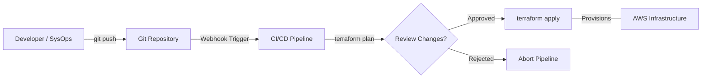

# Curriculum Overview: Automating Resource Deployment with Third-Party Tools

This curriculum provides a structured pathway for learning how to provision, manage, and maintain cloud infrastructure using third-party automation tools, primarily focusing on **Terraform** and **Git**. This aligns with the AWS Certified CloudOps / SysOps Engineer Associate (SOA-C03) domains, particularly Skill 3.1.6: *Use and manage third-party tools to automate resource deployment*.

---

## Prerequisites

Before diving into Infrastructure as Code (IaC) and third-party automation, learners must have a foundational understanding of manual cloud operations and system administration.

*   **Cloud Fundamentals:** Basic navigation of the AWS Management Console and understanding of core services (EC2, VPC, S3, RDS).
*   **AWS CLI & SDKs:** Familiarity with the AWS Command-Line Interface and basic credential configuration (`aws configure`). You should already understand that automation replaces manual "click streams."
*   **Identity and Access Management (IAM):** A strong working knowledge of how IAM permissions (Users, Roles, Policies) work, as third-party tools require authorization to provision resources.
*   **Command Line Proficiency:** Basic shell scripting (Bash/PowerShell) and terminal navigation.

> [!IMPORTANT]
> **IAM Request Context:** Remember that *every* request made by a third-party tool like Terraform to AWS passes through IAM. Misconfigured access keys or insufficient privileges are the #1 cause of deployment failures.

---

## Module Breakdown

The curriculum is structured progressively, taking you from version control basics to complete, automated infrastructure pipelines.

| Module | Topic | Core Focus | Difficulty Progression |
| :--- | :--- | :--- | :--- |
| **Module 1** | **Git for SysOps** | Version control, branching strategies, and repository management. | ⭐ Novice |
| **Module 2** | **Introduction to IaC** | Imperative vs. Declarative deployments, AWS CLI limits. | ⭐⭐ Intermediate |
| **Module 3** | **Terraform Fundamentals** | Providers, state files (`.tfstate`), `plan`, `apply`, and `destroy`. | ⭐⭐ Intermediate |
| **Module 4** | **Managing Remote State** | S3 backend configurations, DynamoDB state locking. | ⭐⭐⭐ Advanced |
| **Module 5** | **GitOps & CI/CD** | Connecting Git pushes to automated Terraform pipelines. | ⭐⭐⭐ Advanced |

### Deployment Workflow Architecture

The following flowchart visualizes the continuous deployment methodology you will build throughout this curriculum.



---

## Learning Objectives per Module

Each module is designed with specific, measurable learning outcomes to ensure you are exam-ready and operationally competent.

<details>
<summary><strong>Module 1: Git for SysOps</strong></summary>

*   Initialize a local repository and connect it to a remote origin (e.g., GitHub, AWS CodeCommit).
*   Implement a Git branching strategy suitable for infrastructure updates (e.g., `main` vs `dev` environments).
*   Safely manage `.gitignore` to prevent committing sensitive AWS credentials.
</details>

<details>
<summary><strong>Module 2: Introduction to IaC</strong></summary>

*   Compare and contrast declarative tools (Terraform) with imperative scripts (AWS CLI/SDKs).
*   Explain the concept of infrastructure drift and how IaC mitigates it.
</details>

<details>
<summary><strong>Module 3: Terraform Fundamentals</strong></summary>

*   Configure the AWS Provider within a `main.tf` file.
*   Write HCL (HashiCorp Configuration Language) to deploy a basic VPC and EC2 instance.
*   Execute the standard Terraform lifecycle commands securely.
</details>

<details>
<summary><strong>Module 4: Managing Remote State</strong></summary>

*   Migrate local `terraform.tfstate` files to an encrypted Amazon S3 bucket.
*   Implement state locking using an Amazon DynamoDB table to prevent concurrent execution conflicts.
</details>

<details>
<summary><strong>Module 5: GitOps & CI/CD</strong></summary>

*   Automate infrastructure deployments using GitHub Actions or AWS CodePipeline.
*   Implement manual approval steps for production environment changes.
</details>

---

## Success Metrics

How do you know you have mastered the use of third-party automation tools? Mastery is measured both qualitatively and quantitatively.

1.  **Zero-Touch Provisioning:** You can deploy a multi-tier application environment from scratch without logging into the AWS Management Console.
2.  **Disaster Recovery Time:** Your infrastructure can be completely destroyed and reprovisioned from code in under 15 minutes.
3.  **Auditable History:** 100% of infrastructure changes can be traced back to a specific Git commit and author.

### The Efficiency Equation

By moving from manual provisioning to automated IaC, the total time to deploy ($T_{total}$) shifts drastically. In a manual setup, human execution time scales linearly with resources. In IaC, deployment time is fundamentally constrained only by API limits:

$$ T_{total} = T_{code} + \sum_{i=1}^{n} (T_{api\_response} + T_{resource\_spinup}) $$

*Where $T_{code}$ is written once and reused infinitely across multiple regions or accounts.*

---

## Real-World Application

Why does this matter in your career as a SysOps or CloudOps Engineer? The AWS global infrastructure relies on automation for scale. Managing resources manually via the console is an anti-pattern for modern enterprise IT.

### The "Triad of Automation"

In the real world, your tools do not exist in isolation. They form a continuous feedback loop.

```tikz
\begin{tikzpicture}[thick, node distance=2.5cm]
    % Define styles
    \tikzset{
        box/.style={draw, rectangle, rounded corners, minimum width=2.5cm, minimum height=1.5cm, text centered, font=\sffamily\bfseries},
        gitbox/.style={box, fill=blue!10, draw=blue!50},
        tfbox/.style={box, fill=green!10, draw=green!50},
        awsbox/.style={box, fill=orange!10, draw=orange!50}
    }

    % Nodes
    \node[gitbox] (git) {Git (Version Control)};
    \node[tfbox, right=of git] (tf) {Terraform (IaC)};
    \node[awsbox, right=of tf] (aws) {AWS (Cloud Resources)};

    % Paths
    \draw[->, >=stealth, thick] (git.east) -- node[above, font=\scriptsize] {Source of Truth} (tf.west);
    \draw[->, >=stealth, thick] (tf.east) -- node[above, font=\scriptsize] {API Commands} (aws.west);
    
    % Curved return path for state
    \draw[->, >=stealth, thick, dashed] (aws.south) to[out=270, in=270] node[below, font=\scriptsize] {State Sync & Drift Detection} (tf.south);
\end{tikzpicture}
```

*   **Consistency:** Deploying an identical stack across `us-east-1` (Virginia) and `ap-northeast-1` (Tokyo) takes exactly the same effort: modifying a variable in your code.
*   **Compliance & Auditing:** When third-party auditors require proof of system configurations (Content Domain 4: Security and Compliance), you can simply provide your Git commit history and pull request approvals rather than taking screenshots of the AWS Console.
*   **Rollbacks:** If an update breaks your application, Git allows you to instantly `git revert` to the last known working state, and Terraform will automatically compute the shortest path to return your AWS infrastructure to that state.

> [!WARNING]
> **Common Real-World Pitfall:** Never store your AWS Access Keys in your Git repository. Always use dynamic credentials, environment variables, or IAM Roles attached to your CI/CD runner to authenticate Terraform to AWS.