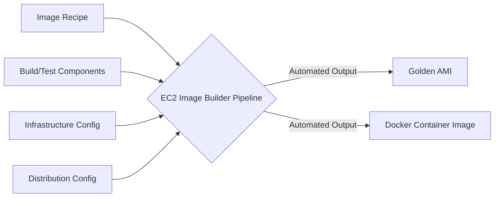
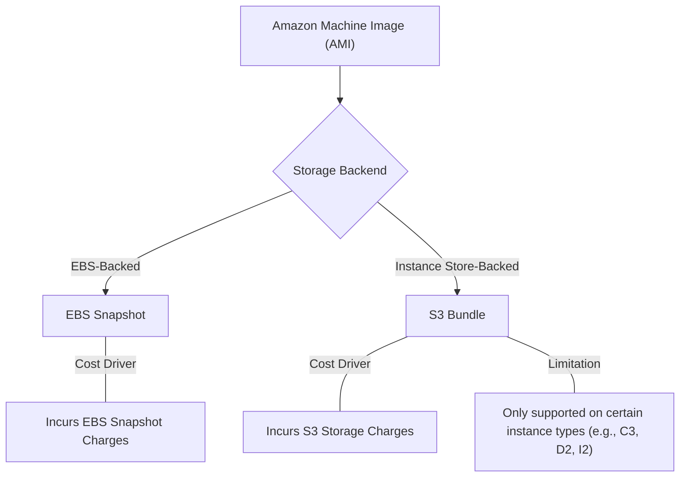

# Curriculum Overview: Creating and Managing AMIs & Container Images

Welcome to the curriculum overview for **Creating and Managing AMIs and Container Images**, a critical capability under Task 3.1 of the AWS Certified SysOps Administrator - Associate (SOA-C03) exam. This curriculum will guide you through the manual creation of Amazon Machine Images (AMIs) and the automated, scalable approach using **Amazon EC2 Image Builder**.

---

## Prerequisites

Before diving into this curriculum, learners should have a solid foundation in the following areas to ensure maximum comprehension:

*   **AWS EC2 Fundamentals:** Understanding of instances, virtual machines (VMs), and basic lifecycle states (running, stopped, terminated).
*   **Storage Concepts:** Familiarity with Amazon Elastic Block Store (EBS) volumes versus Ephemeral Instance Store volumes, as well as Amazon S3.
*   **Identity and Access Management (IAM):** Basic ability to create roles and attach policies (specifically, understanding instance profiles).
*   **Container Basics (Optional but Recommended):** High-level understanding of Docker container images and registries like Amazon ECR.

> [!WARNING] 
> **Cost Awareness:** While EC2 Image Builder itself is offered at no additional cost, the underlying resources it provisions (such as build/test EC2 instances, EBS snapshots, and S3 storage) *will* incur standard AWS fees. Always monitor your practice environments!

---

## Module Breakdown

This curriculum is divided into four progressive modules, designed to take you from foundational concepts to fully automated image pipelines.

| Module | Title | Difficulty | Est. Time | Key Focus |
| :--- | :--- | :--- | :--- | :--- |
| **Module 1** | **AMI Fundamentals & Storage Types** | Beginner | 45 mins | Anatomy of an AMI, EBS-backed vs. Instance Store-backed images. |
| **Module 2** | **Introduction to EC2 Image Builder** | Intermediate | 60 mins | Core components: Recipes, Build/Test components, Infrastructure, and Distribution configurations. |
| **Module 3** | **Automating AMI Pipelines** | Advanced | 90 mins | Building automated pipelines, managing IAM roles, and utilizing build/test instances. |
| **Module 4** | **Container Images & Advanced Integrations** | Advanced | 60 mins | Using Image Builder for Docker containers and importing external VMs (Hyper-V, VMWare). |

### Diagram: The Image Builder Pipeline Architecture

The following flowchart illustrates how the elements of EC2 Image Builder combine to produce a final asset:

---

## Learning Objectives per Module

By completing this curriculum, you will master the following objectives organized by module:

### Module 1: AMI Fundamentals & Storage Types
*   Define the purpose of an Amazon Machine Image (AMI) as the saved state of a VM boot disk.
*   Differentiate between **EBS-backed** (stored as EBS snapshots) and **Instance Store-backed** (stored as bundles in S3) AMIs.
*   Identify the cost implications of storing AMIs (e.g., $Cost = \text{Storage Volume} \times \text{Time}$).

### Module 2: Introduction to EC2 Image Builder
*   Explain how EC2 Image Builder automates the creation, building, testing, and deployment of AMIs.
*   Design **Build and Test Components**, utilizing them as powerful alternatives to basic EC2 User Data.
*   Configure **Recipes** to define the base image and the components applied to it.

### Module 3: Automating AMI Pipelines
*   Configure the required IAM roles for Image Builder execution, specifically attaching `EC2InstanceProfileForImageBuilder` and `AmazonSSMManagedInstanceCore`.
*   Explain the lifecycle of transient instances in Image Builder (the temporary *build instance* and *test instance*).
*   Create Infrastructure and Distribution configurations to share AMIs across required AWS Regions securely.

### Module 4: Container Images & Advanced Integrations
*   Extend EC2 Image Builder pipelines to generate and distribute Docker container images to Amazon ECR.
*   Understand the integration with AWS VM Import/Export (VMIE) for utilizing Microsoft Hyper-V (VHDX), VMWare vSphere (VMDK), and Open Format Virtualization (OFV) formats.
*   Distinguish between standard hypervisor-managed VMs and bare-metal instances (`.metal`).

### Diagram: AMI Storage Architectures

---

## Success Metrics

How will you know you have mastered this curriculum? You should be able to consistently demonstrate the following:

1.  **Manual Mastery:** Successfully create a custom AMI from a running EC2 instance, correctly applying tags and configuring optional volumes without error.
2.  **Pipeline Automation:** Build a functional EC2 Image Builder pipeline from scratch that produces a "Golden AMI" and automatically terminates the temporary build/test instances.
3.  **Security Compliance:** Correctly provision least-privilege IAM roles allowing Image Builder to communicate with AWS Systems Manager (SSM) and other required services.
4.  **Exam Readiness:** Consistently score 85%+ on SOA-C03 practice questions related to AMI lifecycle, Image Builder components, and cross-region AMI distribution.

---

## Real-World Application

Why is this topic critical for CloudOps Engineers and SysOps Administrators? 

*   **The "Golden Image" Pipeline:** In enterprise environments, security and compliance teams require baseline configurations (hardened OS, pre-installed security agents, updated patches). EC2 Image Builder allows you to automate the creation of these "Golden Images" so every developer is launching from an approved, secure baseline.
*   **Faster Auto Scaling:** Instead of using complex `User Data` scripts that take 10 minutes to download and install software every time an Auto Scaling Group (ASG) scales out, pre-baking the software into an AMI reduces instance boot time from minutes to seconds.
*   **Hybrid Cloud Migrations:** The ability to import existing VMDK or VHDX files allows organizations to migrate on-premises workloads seamlessly into AWS, repackaging them as native AMIs.
*   **Unified Artifact Management:** By supporting both AMIs and Container Images, operations teams can use a single toolset (Image Builder) to manage baselines for both legacy EC2 workloads and modern Amazon ECS/EKS containerized applications.

> [!TIP]
> **Pro-Tip for the Field:** Always utilize **tags** heavily in your Distribution Configurations. Tagging your automated AMIs with versions, creation dates, and approval statuses is a foundational best practice for effective lifecycle management and cost tracking.