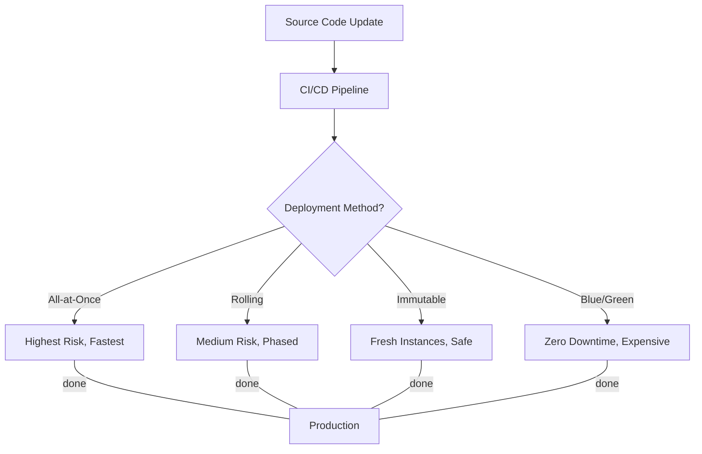

# Curriculum Overview: Implementing Deployment Strategies & Services

Welcome to the curriculum overview for **Implementing Deployment Strategies and Services**, aligned with Domain 3 of the AWS Certified CloudOps Engineer Associate (SOA-C03) exam. This curriculum focuses on provisioning and maintaining cloud resources, automating deployment pipelines, and leveraging Infrastructure as Code (IaC) to ensure scalable, elastic, and highly available environments.

---

## Prerequisites

Before diving into this curriculum, learners must possess foundational knowledge in AWS core services and cloud operations. Ensure you are comfortable with the following:

*   **Cloud Navigation**: Proficiency using the AWS Management Console and executing basic commands via the AWS Command Line Interface (CLI).
*   **Foundational Networking**: Understanding of Virtual Private Clouds (VPCs), public/private subnets, Route Tables, and Security Groups.
*   **Core Compute Concepts**: Familiarity with Amazon EC2 lifecycle, basic IAM roles, and storage types (EBS vs. S3).
*   **Scripting Basics**: Basic ability to read and understand JSON or YAML data structures, which are heavily used in AWS CloudFormation.

> [!IMPORTANT]
> If you are unfamiliar with JSON/YAML syntax, it is highly recommended to complete a brief tutorial on data serialization languages before starting Module 2.

---

## Module Breakdown

This curriculum is divided into five progressive modules designed to take you from foundational image management to advanced multi-region deployment automation.

| Module | Topic Focus | Key AWS Services | Difficulty Progression |
| :--- | :--- | :--- | :--- |
| **Module 1** | Base Image & Container Provisioning | EC2 Image Builder, ECR, ECS | ▂▃▅ Beginner |
| **Module 2** | Infrastructure as Code (IaC) | CloudFormation, AWS CDK | ▂▃▅ Intermediate |
| **Module 3** | Deployment Strategies & Automation | Elastic Beanstalk, Route 53 | ▂▃▅ Intermediate |
| **Module 4** | Multi-Region & Cross-Account Sharing | StackSets, AWS RAM | ▂▃▅▇ Advanced |
| **Module 5** | Third-Party Orchestration Tools | Terraform, Git | ▂▃▅▇ Advanced |

---

## Learning Objectives per Module

### Module 1: Base Image & Container Provisioning
*   **Create and manage AMIs**: Automate the building, testing, and distribution of secure Amazon Machine Images using EC2 Image Builder.
*   **Manage containerized workloads**: Monitor task health, update services, and manage container registries via Amazon Elastic Container Registry (ECR) and Amazon ECS/EKS.

### Module 2: Infrastructure as Code (IaC)
*   **Create and manage resource stacks**: Author CloudFormation templates (YAML/JSON) to reliably provision infrastructure.
*   **Identify and remediate deployment issues**: Troubleshoot CloudFormation errors, subnet sizing constraints, and IAM permission roadblocks.
*   **Detect Stack Drift**: Identify and remediate manual changes to resources that differ from the template definition.

### Module 3: Deployment Strategies & Automation
*   **Select appropriate deployment methodologies**: Differentiate between all-at-once, rolling, immutable, and blue/green deployment models.
*   **Deploy via AWS Elastic Beanstalk**: Manage application versions, environments, and automated deployment strategies.

<details>
<summary>Click to expand: Deployment Strategy Visualized</summary>


</details>

### Module 4: Multi-Region & Cross-Account Provisioning
*   **Provision resources across boundaries**: Utilize CloudFormation StackSets to deploy resources across multiple AWS Regions and accounts simultaneously.
*   **Share network and utility resources**: Implement AWS Resource Access Manager (AWS RAM) to share subnets and Transit Gateways securely.

### Module 5: Third-Party Orchestration Tools
*   **Integrate external tooling**: Use and manage tools like Terraform and Git to automate resource deployment.
*   **Version control for infrastructure**: Maintain infrastructure templates in Git repositories, ensuring peer review and rollback capabilities.

---

## Success Metrics

How do you know you have mastered the deployment curriculum? You will be evaluated against the following core competencies:

1.  **Deployment Velocity**: The ability to deploy a multi-tier architecture using AWS CloudFormation in under 15 minutes, with zero manual console clicks.
2.  **Zero-Downtime Rollouts**: Successfully executing a Blue/Green deployment using AWS Elastic Beanstalk and Route 53 weighted routing without dropping active user sessions.
3.  **Security Compliance**: Building a hardened, compliance-ready AMI through EC2 Image Builder pipelines that passes all automated Inspector scans.
4.  **Error Remediation**: Achieving a 100% success rate in identifying and fixing intentionally injected CloudFormation deployment failures (e.g., circular dependencies or IAM role deficiencies).

### The Infrastructure Provisioning Flow

Below is a conceptual map of how Infrastructure as Code transitions from definition to tangible cloud resources:

```tikz
\begin{tikzpicture}
    \node[draw, rectangle, rounded corners, minimum width=2.5cm, minimum height=1cm] (code) at (0, 0) {IaC Template};
    \node[draw, rectangle, rounded corners, minimum width=2.5cm, minimum height=1cm] (cfn) at (4, 0) {CloudFormation};
    \node[draw, rectangle, minimum width=2.5cm, minimum height=1cm] (ec2) at (8, 1.5) {EC2 Auto Scaling};
    \node[draw, rectangle, minimum width=2.5cm, minimum height=1cm] (rds) at (8, -1.5) {RDS Database};

    \draw[->, thick] (code) -- node[above] {Deploy} (cfn);
    \draw[->, thick] (cfn) -- node[above] {Provision} (ec2);
    \draw[->, thick] (cfn) -- node[above] {Provision} (rds);
\end{tikzpicture}
```

---

## Real-World Application

Why does mastering deployment strategies matter for a SysOps or CloudOps Engineer?

In traditional IT environments, provisioning new servers and deploying code is a manual, error-prone process that can take days or weeks. In the cloud, automated deployment strategies solve massive organizational challenges:

*   **Risk Mitigation**: Using strategies like Immutable or Blue/Green deployments ensures that if a new application version crashes, the business can immediately revert to the previous working state.
*   **Cost Efficiency**: CloudFormation and CDK allow companies to "spin up" full environments for QA testing and destroy them automatically when finished, stopping hourly billing.
*   **Uptime Optimization**: Automation heavily influences system Availability. By automating deployments and infrastructure recovery, you minimize the Mean Time to Recovery (MTTR).

$$ \text{Availability} = \frac{\text{MTBF}}{\text{MTBF} + \text{MTTR}} $$

> [!TIP]
> *MTBF = Mean Time Between Failures*. Because automation decreases MTTR (the time it takes to restore service), it mathematically forces your overall system Availability (uptime percentage) closer to 100% (or "Five Nines").