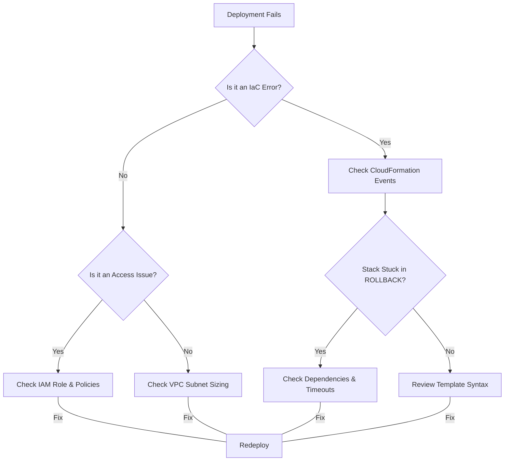

# Troubleshooting AWS Deployment Issues: Curriculum Overview

This curriculum provides a structured approach to mastering the identification and remediation of cloud deployment issues within AWS environments. Specifically aligned with the AWS Certified SysOps Administrator (SOA-C03) objectives, this path will train you to confidently resolve critical roadblocks involving VPC subnet sizing, IAM permission boundaries, and CloudFormation automation errors.

## Prerequisites

Before beginning this curriculum, learners must possess a foundational understanding of AWS infrastructure and basic command-line operations.

> [!IMPORTANT]
> Attempting these modules without the prerequisites may result in confusion, especially when navigating cross-service dependencies like IAM roles attached to CloudFormation execution stacks.

* **AWS Foundations:** Knowledge equivalent to the AWS Certified Cloud Practitioner. 
* **Networking Basics:** Familiarity with IPv4, CIDR notation, and basic routing concepts.
* **Scripting & Data Serialization:** Ability to read and write basic JSON and YAML (crucial for IAM policies and CloudFormation templates).
* **Tooling:** AWS CLI installed and configured, along with access to a non-production AWS account for sandbox testing.

## Module Breakdown

The curriculum is structured sequentially, moving from foundational networking constraints to complex infrastructure-as-code (IaC) debugging.

| Module | Title | Difficulty | Core Focus Area |
| :--- | :--- | :--- | :--- |
| **1** | VPC & Subnet Sizing Constraints | Intermediate | CIDR blocks, IP exhaustion, Route Tables, and Internet Gateways |
| **2** | CloudFormation Stacks & Drift | Advanced | Stack creation failures, dependency issues, and drift detection |
| **3** | IAM Permissions & Resource Access | Advanced | Execution roles, Secrets Manager access, `Unauthorized` errors |
| **4** | Automated Remediation | Expert | Systems Manager Runbooks, EventBridge triggers, CloudWatch Metrics |

<details>
<summary>Click to expand: Module 1 Deep-Dive Details</summary>

Module 1 focuses heavily on architectural planning. A common deployment failure occurs when a subnet runs out of available IP addresses. AWS reserves 5 IP addresses in every subnet. 

$$ \text{Available IPs} = 2^{(32 - \text{CIDR Prefix})} - 5 $$

If an Auto Scaling Group attempts to deploy instances into a `/28` subnet (16 total IPs, 11 available) that already hosts 11 resources, the deployment will fail.
</details>

## Learning Objectives per Module

Upon completing this curriculum, you will be able to perform the following tasks:

### Module 1: VPC & Subnet Sizing Constraints
* **Calculate** available IP addresses using CIDR math to prevent Auto Scaling deployment failures.
* **Provision** and tag public/private subnets using the AWS CLI.
* **Troubleshoot** routing failures by analyzing VPC Route Tables and verifying Internet Gateway (IGW) or NAT Gateway attachments.

### Module 2: CloudFormation Stacks & Drift
* **Diagnose** stack rollback events by analyzing CloudTrail and CloudFormation event logs.
* **Remediate** resource dependency errors (e.g., attempting to create an EC2 instance before its requisite Security Group).
* **Detect** and remediate manual configuration changes using CloudFormation Drift Detection.

### Module 3: IAM Permissions & Resource Access
* **Identify** the root cause of `403 Unauthorized` errors when EC2 instances attempt to retrieve database credentials from AWS Secrets Manager.
* **Configure** IAM execution roles for CloudFormation to ensure the principle of least privilege while allowing successful infrastructure provisioning.
* **Validate** policies using the IAM Policy Simulator.

### Module 4: Automated Remediation
* **Trigger** AWS Systems Manager (SSM) Automation runbooks using Amazon EventBridge rules to automatically remediate non-compliant resources.
* **Monitor** CloudWatch metrics to dynamically adjust subnet allocations or instance placements.

## Success Metrics

How will you know you have mastered this curriculum? Your success will be measured through practical, scenario-based metrics:

1. **Diagnostic Speed:** Reduce the average time to identify a root cause of a failed CloudFormation stack to under 5 minutes.
2. **Resolution Accuracy:** Achieve a 90% success rate in resolving simulated deployment errors (e.g., fixing an `Unauthorized` Secrets Manager retrieval) on the first attempt without breaking existing workloads.
3. **Automation Implementation:** Successfully build and deploy an EventBridge-triggered SSM runbook that automatically remediates a drifted resource configuration.
4. **Exam Readiness:** Consistently score 85%+ on SysOps Administrator (SOA-C03) domain 3 (Deployment, Provisioning, and Automation) practice questions.

## Visual Anchors

### The Anatomy of a Deployment Failure
When a deployment fails, SysOps administrators follow a specific diagnostic path. Below is a flowchart mapping the troubleshooting logic:



### The Core Trinity of AWS Deployments
Successful resource provisioning sits precisely at the intersection of Network Availability, Identity/Permissions, and Automation Logic.

```tikz
\begin{tikzpicture}[scale=0.9]
  \draw[thick, fill=blue!10, opacity=0.8] (0, 0) circle (2.5cm);
  \draw[thick, fill=red!10, opacity=0.8] (2.8, 0) circle (2.5cm);
  \draw[thick, fill=green!10, opacity=0.8] (1.4, 2.4) circle (2.5cm);
  
  \node[align=center] at (-0.8, -0.5) {\textbf{IAM/Access}\\(Roles, Policies)};
  \node[align=center] at (3.6, -0.5) {\textbf{VPC/Network}\\(Subnets, Routes)};
  \node[align=center] at (1.4, 3.2) {\textbf{Automation}\\(CloudFormation)};
  
  \node[align=center, font=\bfseries] at (1.4, 0.8) {Successful\\Deployment};
\end{tikzpicture}
```

## Real-World Application

In modern DevOps and CloudOps environments, infrastructure is rarely provisioned manually. Deployments are highly automated via CI/CD pipelines and infrastructure-as-code. 

When a production deployment fails due to a trivial issue—such as a developer manually editing a Security Group and causing CloudFormation stack drift, or an application throwing an `Unauthorized` error because it queried the `AWSPREVIOUS` value in Secrets Manager instead of `AWSCURRENT`—the financial and operational costs can be immense.

> [!TIP]
> **The "Why":** Mastering these troubleshooting skills directly reduces Mean Time to Recovery (MTTR) during critical outages. It transforms you from a reactive administrator into a proactive engineer capable of automating remediation strategies before the user experience is ever impacted.