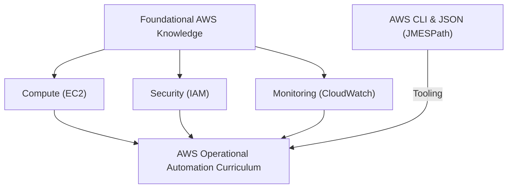

# Curriculum Overview: Automating AWS Operational Processes

> [!IMPORTANT]
> This curriculum is designed to align with the AWS Certified CloudOps Engineer / SysOps Administrator - Associate (SOA-C03) exam. It focuses specifically on utilizing AWS Systems Manager (SSM), Amazon EventBridge, and AWS CloudFormation to build automated, self-healing cloud environments.

## Prerequisites

Before diving into the automation of operational processes, learners must have a foundational understanding of core AWS services and architectural principles. 

*   **Core Compute & Networking:** Familiarity with Amazon EC2 (instances, AMIs), VPCs, and basic routing.
*   **Security Posture:** Understanding of AWS Identity and Access Management (IAM), including roles, policies, and the principle of least privilege.
*   **Monitoring Fundamentals:** Basic experience with Amazon CloudWatch (metrics, logs, and alarms).
*   **Interfacing with AWS:** Proficiency in using the AWS Management Console and executing commands via the AWS Command Line Interface (CLI).



## Module Breakdown

This curriculum is divided into four progressive modules, transitioning learners from reactive monitoring to proactive, event-driven automation.

| Module | Title | Primary Focus | Difficulty |
| :--- | :--- | :--- | :--- |
| **Module 1** | **Observability & Event Detection** | CloudWatch Metrics, Alarms, EventBridge Rules | Beginner |
| **Module 2** | **AWS Systems Manager (SSM) Mastery** | Automation Runbooks, Patch Manager, Fleet Updates | Intermediate |
| **Module 3** | **Infrastructure Provisioning & IaC** | CloudFormation, EC2 Image Builder, Stack Drift | Intermediate |
| **Module 4** | **Automated Security & Compliance** | AWS Config, Inspector, GuardDuty Remediation | Advanced |

<details>
<summary>Click to expand: Why this order?</summary>
<p>Automation cannot exist without detection. By mastering CloudWatch and EventBridge first, learners understand <em>how</em> state changes trigger actions. Moving next into Systems Manager provides the <em>mechanism</em> for those actions. Finally, scaling those mechanisms via IaC (CloudFormation) and applying them to compliance constructs a complete CloudOps mindset.</p>
</details>

## Learning Objectives per Module

### Module 1: Observability & Event Detection
*   **Configure Amazon EventBridge rules** to capture state changes and route events to targets like AWS Lambda or Systems Manager Automation.
*   **Analyze performance metrics** to define CloudWatch Alarms that act as automated triggers for remediation.
*   **Implement automated instance recovery** utilizing EC2 status checks linked to dynamic recovery actions.

### Module 2: AWS Systems Manager (SSM) Mastery
*   **Execute SSM Automation runbooks** to resolve common configuration and operational issues without manual intervention.
*   **Manage fleet-wide software updates** by defining baselines and maintenance windows using SSM Patch Manager.
*   **Troubleshoot and remediate performance problems** using resource tags and automated custom scripts triggered by Systems Manager.

### Module 3: Infrastructure Provisioning & IaC
*   **Automate AMI creation** using EC2 Image Builder to build, test, and distribute secure Amazon Machine Images.
*   **Identify and remediate CloudFormation stack drift** to maintain parity between deployed resources and template definitions.
*   **Deploy infrastructure as code** safely across multiple AWS Regions and accounts using CloudFormation StackSets.

### Module 4: Automated Security & Compliance
*   **Enforce governance automatically** by deploying AWS Config rules that trigger SSM remediation documents for non-compliant resources.
*   **Integrate Amazon Inspector** with Systems Manager agents to continuously scan and automatically patch critical CVEs.
*   **Protect infrastructure automatically** by integrating AWS Health events with external notification systems via EventBridge.

## The Automation Lifecycle

The core conceptual loop taught throughout this curriculum is the continuous cycle of monitoring, detecting, automating, and remediating.

```tikz
\begin{tikzpicture}[thick, node distance=2cm]
  \node[draw, rectangle, rounded corners, fill=blue!10, minimum width=2.8cm, minimum height=1.2cm, align=center] (A) at (0, 0) {Monitor\\(CloudWatch)};
  \node[draw, rectangle, rounded corners, fill=orange!10, minimum width=2.8cm, minimum height=1.2cm, align=center] (B) at (4.5, 0) {Detect\\(EventBridge)};
  \node[draw, rectangle, rounded corners, fill=green!10, minimum width=2.8cm, minimum height=1.2cm, align=center] (C) at (9, 0) {Automate\\(SSM)};
  \node[draw, rectangle, rounded corners, fill=purple!10, minimum width=2.8cm, minimum height=1.2cm, align=center] (D) at (4.5, -2.5) {Remediate\\(Target Resource)};

  \draw[->, >=stealth, very thick] (A) -- (B) node[midway, above] {Threshold Met};
  \draw[->, >=stealth, very thick] (B) -- (C) node[midway, above] {Trigger Event};
  \draw[->, >=stealth, very thick] (C) |- (D) node[near start, right] {Execute Runbook};
  \draw[->, >=stealth, very thick] (D) -| (A) node[near end, left] {Restore Health};
\end{tikzpicture}
```

## Success Metrics

To ensure mastery of the curriculum, learners will be evaluated against the following performance metrics:

1.  **Zero-Touch Remediation Implementation:** Successfully configure an EventBridge rule that triggers an SSM Automation document to stop an EC2 instance tagged with `Environment: Development` outside of business hours.
2.  **Fleet Compliance Rate:** Achieve a 100% patch compliance score on a fleet of 5+ managed EC2 instances using SSM Patch Manager within a designated 2-hour maintenance window.
3.  **Drift Detection Resolution:** Identify a manually modified security group and successfully use AWS Config to automatically revert it to its CloudFormation-defined state.
4.  **Exam Readiness Check:** Score 85% or higher on practice assessments mapping directly to SOA-C03 Task 1.2 (Identify and remediate issues) and Task 3.2 (Automate the management of existing resources).

## Real-World Application

> [!TIP]
> Automation is not just about saving time; it is fundamentally about **risk reduction** and **cost optimization**.

In a real-world enterprise cloud environment, manual intervention leads to human error and prolonged downtime. By mastering these automated operational processes, a CloudOps Engineer can:

*   **Drastically reduce Recovery Time Objectives (RTO):** If a primary application instance fails a health check, automated recovery replaces the instance and reattaches Elastic IPs before a human engineer even logs into the console.
*   **Ensure Continuous Compliance:** If a developer inadvertently makes an S3 bucket public, an AWS Config rule instantly detects the state change and triggers an SSM runbook to re-apply block public access settings.
*   **Control Cloud Spending:** Using automation to right-size compute instances based on AWS Compute Optimizer recommendations or automatically shutting down unused resources drastically lowers AWS monthly bills. 

Ultimately, mastering AWS Systems Manager and associated automation tools transforms operations from a reactive "firefighting" role into a proactive engineering discipline.