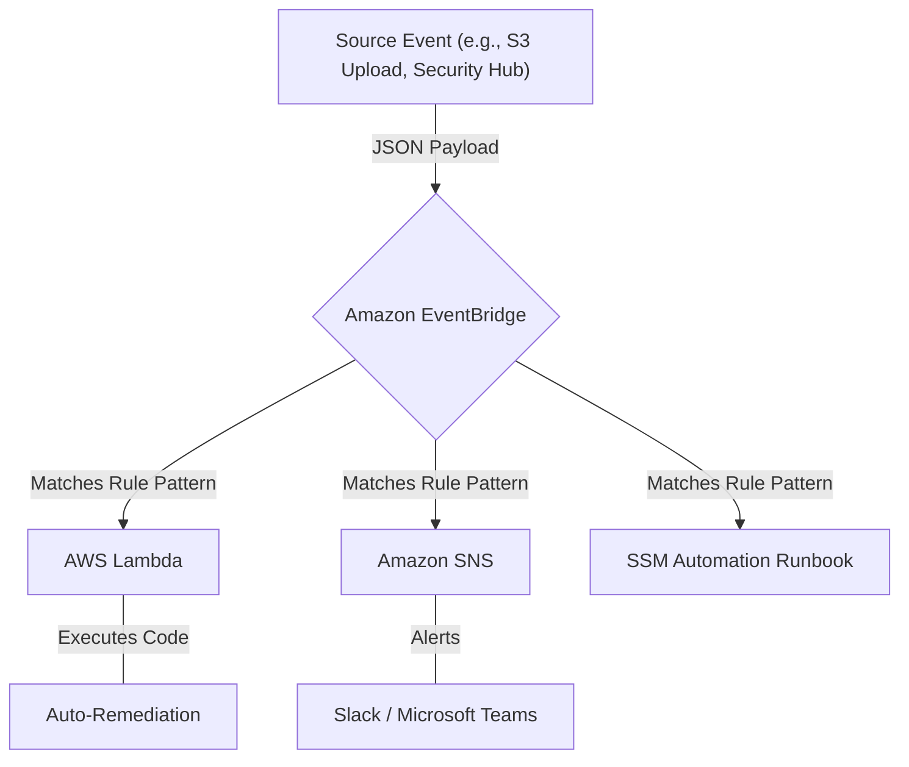

# Curriculum Overview: Event-Driven Automation in AWS

Welcome to the curriculum overview for implementing event-driven automation using AWS services. This path focuses on mastering the tools necessary to automate operational processes, remediate security findings, and respond to system events in near real-time, aligning closely with the AWS Certified CloudOps Engineer - Associate (SOA-C03) exam objectives.

## Prerequisites

Before diving into the modules of this curriculum, learners must possess foundational knowledge in cloud computing and AWS operations. 

*   **Cloud Operations Foundation:** Basic understanding of AWS architecture, the AWS Management Console, and the AWS Command Line Interface (CLI).
*   **Compute & Storage:** Familiarity with deploying Amazon EC2 instances, managing Amazon S3 buckets, and basic AWS Lambda concepts.
*   **Identity & Access Management (IAM):** Knowledge of how to apply the principle of least privilege using IAM roles, policies, and resource-based policies.
*   **Scripting Basics:** Ability to read and write basic JSON (used for EventBridge rules and API responses) and foundational knowledge of Python or Bash for Lambda and SSM custom scripts.

> [!IMPORTANT]
> An active AWS account is required for the practical labs in this curriculum. While the AWS Free Tier covers many services, some advanced features like the AWS Health API require an AWS Business Support or AWS Enterprise Support plan.

## Module Breakdown

The curriculum is structured progressively, starting from foundational event routing to advanced automated remediation strategies.

| Module | Title | Difficulty | Est. Time | Focus Area |
| :--- | :--- | :--- | :--- | :--- |
| **1** | **Foundations of Event-Driven Architecture** | Beginner | 3 Hours | Amazon EventBridge, S3 Event Notifications |
| **2** | **Automated Incident Response** | Intermediate | 4 Hours | AWS Health API, SNS, Slack/Teams Integrations |
| **3** | **Security & Compliance Automation** | Advanced | 5 Hours | AWS Security Hub, Amazon Macie, Auto-Remediation |
| **4** | **Fleet Management & SSM Runbooks** | Advanced | 4 Hours | AWS Systems Manager (SSM) Automation, Patch Manager |

### Architectural Flow of Event-Driven Systems



## Learning Objectives per Module

### Module 1: Foundations of Event-Driven Architecture
*   **Configure S3 Event Notifications:** Trigger AWS Lambda functions directly from Amazon S3 bucket events (e.g., `s3:ObjectCreated:*`).
*   **Master Amazon EventBridge:** Create custom event bus rules using predefined patterns and filter values (e.g., `AWSAccountID` or `RecordState`) to route operational events.

### Module 2: Automated Incident Response
*   **Analyze Health Events:** Use the AWS Personal Health Dashboard to identify service-level interruptions.
*   **Integrate Communications:** Deploy the AWS Health Aware (AHA) solution via CloudFormation to route AWS Health API alerts to Amazon Chime, Slack, or Microsoft Teams.

### Module 3: Security & Compliance Automation
*   **Process Security Findings:** Automatically route Amazon Macie and AWS Security Hub findings into EventBridge.
*   **Execute Remediation:** Use AWS Lambda to automatically replace vulnerable S3 bucket policies or isolate compromised EC2 instances without manual human interaction.

### Module 4: Fleet Management & SSM Runbooks
*   **Deploy Runbooks:** Create and run custom or predefined Systems Manager Automation runbooks.
*   **Automate Updates:** Manage fleet updates and automated instance recovery using SSM Patch Manager and EC2 status checks.

```tikz
\begin{tikzpicture}[node distance=3cm, auto]
  \tikzstyle{block} = [rectangle, draw, fill=blue!10, text width=2.8cm, text centered, rounded corners, minimum height=1.5cm]
  \tikzstyle{line} = [draw, -latex, thick]

  \node [block] (source) {Event Source\\(e.g., Macie/Health)};
  \node [block, right of=source, node distance=4cm] (bus) {EventBridge\\Rule Engine};
  \node [block, right of=bus, node distance=4cm] (target) {Target\\(Lambda/SSM)};

  \path [line] (source) -- node {Ingest} (bus);
  \path [line] (bus) -- node {Match & Route} (target);
\end{tikzpicture}
```

## Success Metrics

To know you have mastered the curriculum, evaluate your progress against the following key performance indicators (KPIs):

1.  **Mean Time To Recovery (MTTR) Reduction:** Successfully reduce simulated incident resolution time in lab environments by transitioning from manual response to automated Lambda/SSM remediation.
    *   *Mathematical Model:* $MTTR_{automated} = T_{detect} + T_{execute} \approx 0$ (Approaching near real-time resolution).
2.  **Lab Completion Rates:** Successfully build, test, and tear down an end-to-end auto-remediation pipeline utilizing EventBridge and Lambda.
3.  **Exam Readiness:** Consistently score 85%+ on SOA-C03 practice questions specifically targeting Content Domain 3 (Deployment, Provisioning, and Automation) and Domain 1.2 (Identify and remediate issues).

## Real-World Application

In modern cloud environments, relying on manual human interaction to resolve recurring operational or security issues is unsustainable. 

> [!NOTE]
> **Why this matters:** Automating responses to state changes ensures high availability and strict compliance, minimizing the window of vulnerability during an outage or security breach.

**Example Use Case: Data Security Automation**
Imagine an engineer accidentally modifies an S3 bucket policy, making sensitive financial data public. 
1. **Detection:** Amazon Macie detects the public bucket and sends a finding to AWS Security Hub.
2. **Routing:** Security Hub forwards this state change to Amazon EventBridge.
3. **Remediation:** An EventBridge rule detects the specific finding and triggers an AWS Lambda function.
4. **Resolution:** The Lambda function instantly rewrites the S3 bucket policy to deny public access and notifies the security team via Amazon SNS.

By mastering these tools, CloudOps engineers provide immense business value by ensuring systems are self-healing, cost-efficient, and highly secure.