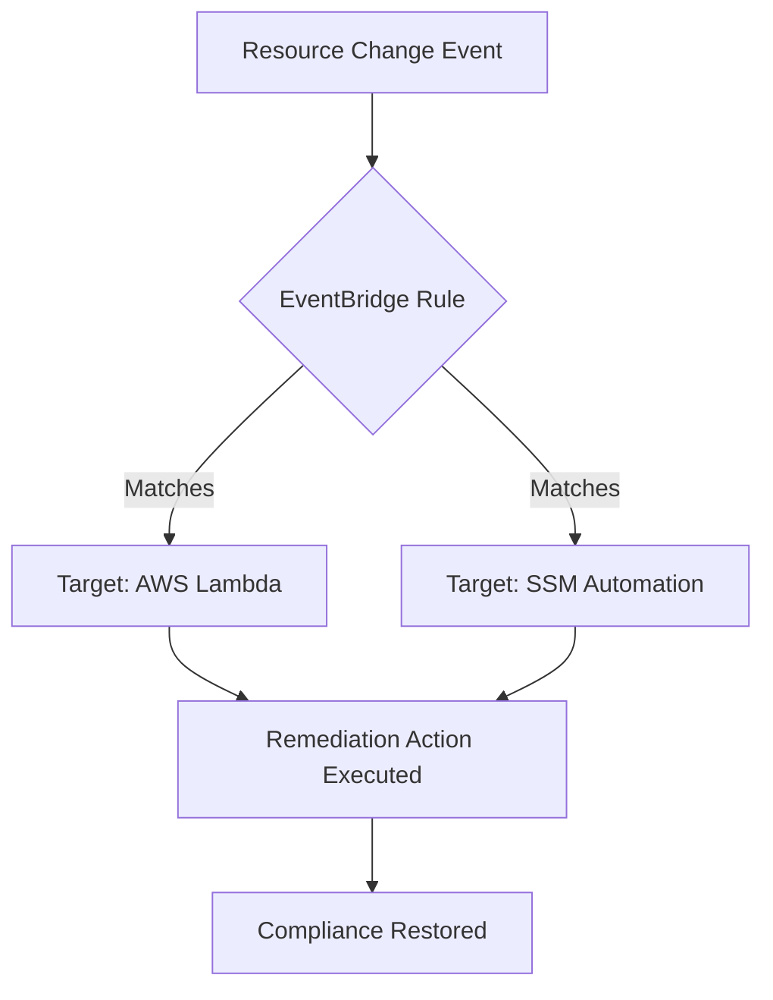

# Mastering Automation of Existing AWS Resources

This guide covers the essential strategies and tools for automating the management of active AWS infrastructure, a core competency for the AWS Certified SysOps Administrator - Associate (SOA-C03) exam.

## Learning Objectives
After studying this guide, you should be able to:
- **Automate operational processes** using AWS Systems Manager (SSM) Automation runbooks.
- **Implement event-driven remediation** using Amazon EventBridge and AWS Lambda.
- **Manage resource lifecycles** for EBS volumes and AMIs using Data Lifecycle Manager (DLM).
- **Enforce governance at scale** through AWS Organizations and tagging strategies.
- **Detect and remediate configuration drift** in existing CloudFormation stacks.

## Key Terms & Glossary
- **SSM Document**: A JSON or YAML file that defines the actions that Systems Manager performs on your managed instances.
- **Automation Runbook**: A type of SSM document used to perform common IT tasks such as backing up a fleet or restarting instances.
- **Drift Detection**: A CloudFormation feature that identifies if a resource's actual configuration differs from its expected template configuration.
- **EventBridge**: A serverless event bus that makes it easy to connect applications with data from a variety of sources.
- **Resource Tagging**: Metadata assigned to AWS resources used for automation targets, cost allocation, and security permissions.

## The "Big Idea"
Automation transforms cloud operations from **Reactive** to **Proactive**. Instead of manually fixing a stopped instance or patching a server, SysOps administrators build "Self-Healing" architectures. By leveraging EventBridge to detect state changes and SSM to execute logic, the environment manages itself, reducing human error and operational overhead.

## Formula / Concept Box

| Automation Component | Primary Function | Example Use Case |
| :--- | :--- | :--- |
| **Trigger** | Detects a change (EventBridge, CloudWatch Alarm) | EC2 Instance state changes to 'stopped' |
| **Logic** | Decides the action (Lambda, SSM Automation) | Check if the instance is production; if so, start it |
| **Target** | The resource being managed (EC2, S3, RDS) | The specific i-0abc123 instance |
| **Compliance** | Ensures rules are followed (AWS Config) | Ensure all EBS volumes are encrypted |

## Hierarchical Outline
- **I. AWS Systems Manager (SSM) Operations**
    - **SSM Automation**: Use predefined runbooks (e.g., `AWS-UpdateLinuxAmi`) to manage tasks at scale.
    - **Patch Manager**: Automate the application of security-related updates to instance fleets.
    - **Inventory**: Collect metadata from managed nodes to identify software versions and configurations.
- **II. Event-Driven Remediation**
    - **Amazon EventBridge**: Routes system events (like a console login or state change) to targets.
    - **AWS Lambda**: Executes custom Python/Node.js logic to modify resources in real-time.
    - **Amazon S3 Notifications**: Triggers automation when objects are created or deleted.
- **III. Storage and Image Automation**
    - **Data Lifecycle Manager (DLM)**: Automated snapshot management for EBS volumes based on tags.
    - **EC2 Image Builder**: Automated pipeline for creating, testing, and distributing "Golden" AMIs.

## Visual Anchors

### Event-Driven Remediation Flow

### Architecture: SSM Fleet Management
\begin{tikzpicture}[node distance=2cm, every node/.style={rectangle, draw, fill=blue!10, text centered, rounded corners, minimum height=1cm, minimum width=2.5cm}]
    \node (SSM) {SSM Service};
    \node (Agent) [below of=SSM] {SSM Agent};
    \node (EC2) [right of=Agent, xshift=2cm] {EC2 Instance};
    \node (Hybrid) [left of=Agent, xshift=-2cm] {On-Prem Server};

    \draw[<->, thick] (SSM) -- (Agent) node[midway, right] {Control Channel};
    \draw[dashed] (Agent) -- (EC2);
    \draw[dashed] (Agent) -- (Hybrid);

    \node[draw=none, fill=none, below of=Agent, yshift=0.5cm] (Desc) {\mbox{Managed Nodes}};
\end{tikzpicture}

## Definition-Example Pairs
- **Tag-Based Automation**: Using resource tags as filters for automation tasks.
    - *Example*: An SSM Patching window targets only instances with the tag `Environment: Production` to ensure high-priority updates.
- **Automated Recovery**: EC2 features that monitor instance health and restart them on new hardware if they fail.
    - *Example*: Configuring a CloudWatch Alarm that triggers the `Recover` action if the `StatusCheckFailed_System` metric exceeds 0 for 2 minutes.
- **Lifecycle Policy**: A set of rules defining when backups are created and how long they are kept.
    - *Example*: A DLM policy that creates a snapshot of all EBS volumes tagged `Role: Database` every 4 hours and retains them for 7 days.

## Worked Examples

### Example 1: Remediating an Unencrypted S3 Bucket
**Problem**: A developer created a bucket without default encryption, violating company policy.
1. **Detection**: AWS Config detects the `s3-bucket-server-side-encryption-enabled` rule is non-compliant.
2. **Trigger**: AWS Config triggers an SSM Automation runbook: `AWS-EnableS3BucketEncryption`.
3. **Action**: The runbook executes the `PutBucketEncryption` API call on the specific bucket.
4. **Result**: The bucket is now encrypted without manual intervention from the SysOps team.

### Example 2: Automating EBS Snapshots with DLM
**Problem**: Ensuring all production data is backed up daily without manual scripts.
1. **Tagging**: Apply the tag `Backup: Daily` to target EBS volumes.
2. **Policy Creation**: In the EC2 Console, navigate to **Lifecycle Manager** and create a New Policy.
3. **Schedule**: Set the schedule to repeat every 24 hours, starting at 01:00 UTC.
4. **Retention**: Set retention to "7 snapshots" to maintain a rolling week of backups.

## Checkpoint Questions
1. What service would you use to automatically restart an EC2 instance if its system status check fails?
2. How does CloudFormation 'Drift Detection' assist in managing existing resources?
3. Which SSM feature allows you to automate the installation of security patches across a fleet of 500 instances?
4. **True/False**: AWS Organizations can be used to automate the creation of new AWS accounts for different departments.

Click to see Answers

1. **CloudWatch Alarms** (with the EC2 Recover action).
2. It identifies manual changes made to resources that were originally deployed via a template, allowing you to bring them back into sync.
3. **SSM Patch Manager**.
4. **True**. AWS Organizations supports programmatic account creation via API/CLI.

