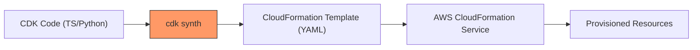

# AWS Cloud Development Kit (CDK): The Evolution of Infrastructure as Code

Infrastructure as Code (IaC) has evolved from manual scripts to declarative templates, and now to high-level programming abstractions. This guide explores how the **AWS CDK** allows CloudOps engineers to define cloud resources using familiar programming languages.

---

## Learning Objectives
After studying this guide, you should be able to:
* Define the **AWS CDK** and its relationship to **AWS CloudFormation**.
* Describe the core components: **Apps**, **Stacks**, and **Constructs**.
* Explain the **Synthesis (Synth)** and **Deployment** lifecycle.
* Identify the benefits of using imperative programming for infrastructure management.

---

## Key Terms & Glossary
*   **Construct:** The basic building block of CDK apps; can represent a single resource (L1) or a complex pattern (L3).
*   **Synthesis (Synth):** The process of executing CDK code to produce a CloudFormation YAML/JSON template.
*   **Bootstrapping:** The process of preparing an AWS environment (creating an S3 bucket for assets) before deploying CDK stacks.
*   **Imperative vs. Declarative:** Imperative (How) uses logic/code; Declarative (What) defines the end state via templates.
*   **JSII:** The technology that allows CDK to provide a consistent API across multiple programming languages (TypeScript, Python, Java, C#).

---

## The "Big Idea"
> [!IMPORTANT]
> The AWS CDK is not a replacement for CloudFormation; it is a **higher-level abstraction layer** built on top of it. 

Instead of writing thousands of lines of static YAML, you use code to "program" your infrastructure. This allows you to use loops, conditions, and classes to create reusable, shareable components (Constructs). Think of CloudFormation as the assembly language and CDK as a high-level language like Python.

---

## Formula / Concept Box

| Command | Action | Purpose |
| :--- | :--- | :--- |
| `cdk init` | Initialize Project | Creates the directory structure and core files for a specific language. |
| `cdk bootstrap` | Prepare Environment | Deploys an S3 bucket and IAM roles required by CDK to store assets. |
| `cdk synth` | Synthesize | Generates the CloudFormation template from your code for inspection. |
| `cdk diff` | Compare | Compares your local code against the currently deployed stack in AWS. |
| `cdk deploy` | Provision | Compiles code, uploads assets, and calls CloudFormation to update resources. |

---

## Hierarchical Outline
*   **I. Understanding IaC Models**
    *   **Declarative (CloudFormation):** Focuses on state; hard to reuse logic; high maintenance at scale.
    *   **Imperative (CDK):** Uses **Object-Oriented Programming (OOP)**; allows for abstraction and automation.
*   **II. The CDK Architecture**
    *   **App:** The root container for your entire CDK application.
    *   **Stack:** The unit of deployment (maps 1:1 to a CloudFormation Stack).
    *   **Constructs:** Levels of abstraction (L1 - CFN Resources, L2 - Curated, L3 - Patterns).
*   **III. The Workflow Lifecycle**
    *   **Code:** Writing infrastructure in TS, Python, etc.
    *   **Synth:** Converting code to CloudFormation templates.
    *   **Deploy:** Handing the template to the AWS CloudFormation engine.

---

## Visual Anchors

### The Synthesis Lifecycle


### The CDK Component Hierarchy
\begin{tikzpicture}[node distance=1.5cm, every node/.style={draw, rectangle, rounded corners, inner sep=5pt, align=center}]
    \node (app) {\textbf{App}\\ (The Root)};
    \node (stack) [below of=app] {\textbf{Stack}\\ (CloudFormation Unit)};
    \node (c1) [below left=1cm and 0.5cm of stack] {\textbf{Construct}\\ (VPC)};
    \node (c2) [below right=1cm and 0.5cm of stack] {\textbf{Construct}\\ (EC2)};
    
    \draw[->] (app) -- (stack);
    \draw[->] (stack) -- (c1);
    \draw[->] (stack) -- (c2);
\end{tikzpicture}

---

## Definition-Example Pairs

*   **L2 Construct:** An AWS-curated construct that provides sensible defaults and boilerplate. 
    *   *Example:* Creating a `vpc = ec2.Vpc(self, "MyVpc")` automatically handles subnets, route tables, and NAT gateways without you defining them manually.
*   **Stack Drift:** When resources are changed manually via the console, deviating from the IaC template.
    *   *Example:* You deploy an S3 bucket via CDK, then manually change its encryption settings in the AWS Console. CDK Diff will flag this as drift.
*   **Cross-Stack References:** Passing a resource (like a VPC ID) from one stack to another.
    *   *Example:* A "NetworkStack" defines the VPC, and an "AppStack" references that VPC to launch an EC2 instance.

---

## Worked Examples

### Creating an S3 Bucket with CDK (TypeScript)
In this example, we define an encrypted S3 bucket that is automatically deleted when the stack is destroyed.

```typescript
import * as cdk from 'aws-cdk-lib';
import { aws_s3 as s3 } from 'aws-cdk-lib';

export class MyStorageStack extends cdk.Stack {
  constructor(scope: cdk.App, id: string, props?: cdk.StackProps) {
    super(scope, id, props);

    new s3.Bucket(this, 'MyFirstBucket', {
      versioned: true,
      removalPolicy: cdk.RemovalPolicy.DESTROY, // Deletes bucket on stack deletion
      autoDeleteObjects: true                   // Empties bucket before deletion
    });
  }
}
```
**Step-by-Step Breakdown:**
1.  **Import:** We pull in the S3 module from the CDK library.
2.  **Class Definition:** The stack inherits from `cdk.Stack`.
3.  **Construct Initialization:** `new s3.Bucket` creates the resource. 
4.  **Properties:** We set `versioned: true` to enable S3 versioning using standard code properties.

---

## Checkpoint Questions
1.  **What is the output of the `cdk synth` command?**
    *   *Answer: An AWS CloudFormation template (usually in YAML/JSON format) and metadata.*
2.  **Why must you run `cdk bootstrap` before your first deployment?**
    *   *Answer: To create the S3 bucket and IAM roles that CDK uses to store file assets (like Lambda code or Docker images) during the deployment process.*
3.  **What is the difference between an L1 and an L2 construct?**
    *   *Answer: L1 constructs (CfnResource) are 1:1 mappings of CloudFormation resources. L2 constructs are higher-level, curated abstractions that provide security-first defaults (e.g., public access blocked by default).* 
4.  **True or False: CDK bypasses CloudFormation to create resources directly via the AWS SDK.**
    *   *Answer: False. CDK always synthesizes a CloudFormation template which is then executed by the CloudFormation service.*