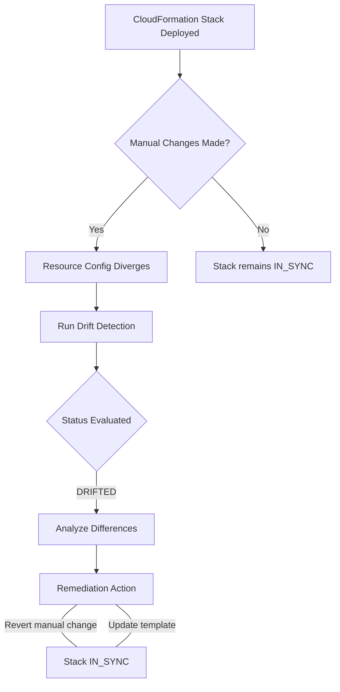

## Prerequisites

Before diving into the detection and remediation of AWS CloudFormation stack drift, learners must have a solid grasp of foundational cloud operations and Infrastructure as Code (IaC) principles. 

Ensure you meet the following prerequisites:

* **Infrastructure as Code (IaC) Fundamentals**: Understanding how infrastructure is provisioned programmatically rather than manually.
* **AWS CloudFormation Basics**: Familiarity with creating, updating, and deleting stacks. You should be comfortable reading JSON or YAML templates.
* **AWS Identity and Access Management (IAM)**: Understanding the permissions and roles required to execute CloudFormation operations safely.
* **Resource Configuration Lifecycle**: Basic knowledge of how core AWS resources (e.g., EC2, Security Groups, S3, RDS) are configured and managed.

## Module Breakdown

This curriculum is structured to take you from a foundational understanding of configuration divergence to practical, automated remediation strategies.

| Module | Topic | Difficulty | Estimated Time |
|---|---|---|---|
| **1** | The Concept and Causes of Stack Drift | Beginner | 30 mins |
| **2** | Initiating Drift Detection (Console & CLI) | Intermediate | 45 mins |
| **3** | Analyzing Drift Results & Status Codes | Intermediate | 45 mins |
| **4** | Remediation Strategies | Advanced | 60 mins |
| **5** | Automating Drift Detection via EventBridge | Advanced | 60 mins |

### The Drift Detection Workflow



## Learning Objectives per Module

By completing this curriculum, learners will achieve the following objectives aligned with the AWS Certified SysOps Administrator - Associate (SOA-C03) requirements:

* **Module 1**: Define "Drift" mathematically as $$\Delta = |S_{actual} - S_{expected}| > 0$$ where $$S$$ represents the state vector of the resource. Explain why manual, out-of-band changes occur in production environments.
* **Module 2**: Execute drift detection across entire stacks or individual resources using the AWS Management Console and the `aws cloudformation detect-stack-drift` CLI command.
* **Module 3**: Interpret the four primary drift statuses: `IN_SYNC`, `DRIFTED`, `NOT_CHECKED`, and `UNKNOWN`.
* **Module 4**: Evaluate and apply the correct remediation method (updating the CloudFormation template to match the new reality vs. reverting the resource to match the template).
* **Module 5**: Integrate AWS Config and Amazon EventBridge to automatically alert administrators or trigger AWS Systems Manager (SSM) Automation runbooks when stack drift occurs.

## Success Metrics

To verify mastery of this curriculum, learners must demonstrate the following capabilities through hands-on labs and conceptual assessments:

1. **Conceptual Mastery**: Correctly identify whether a specific manual configuration change (e.g., adding an inbound rule to a Security Group) will trigger a `DRIFTED` state for supported resources.
2. **Practical Execution**: Successfully run a drift detection operation on a live stack and extract the exact property differences using the AWS CLI (`aws cloudformation describe-stack-resource-drifts`).
3. **Remediation & Recovery**: Successfully bring a `DRIFTED` stack back to an `IN_SYNC` state without causing service downtime or unintended resource replacement.

> [!IMPORTANT]
> Mastery of this topic is critical for the SOA-C03 exam domain: **Deployment, Provisioning, and Automation**. You must be able to confidently identify manual changes to resources that differ from the template definition.

## Real-World Application

In fast-paced cloud environments, "ClickOps" (making manual changes in the AWS Console) is a common anti-pattern. While IaC via CloudFormation is the gold standard, engineers may sometimes bypass the CI/CD pipeline to apply an emergency fix—for example, opening port 22 on a Security Group to troubleshoot an unreachable instance.

**Why Drift Detection Matters in the Real World:**
* **Security & Compliance**: Identifying unauthorized access rules or unencrypted data stores that violate organizational governance.
* **Operational Consistency**: Ensuring that the source of truth (the template code repository) accurately reflects the actual deployed infrastructure.
* **Disaster Recovery**: If a region fails, rebuilding infrastructure from an outdated template will result in missing critical patches or configurations applied manually.

### Divergence Conceptual Model

```tikz
\begin{tikzpicture}
    % Nodes
    \node[draw, rectangle, rounded corners, fill=blue!10, text width=3.5cm, align=center, minimum height=1.5cm] (template) at (0,0) {Expected State\\(CFN Template)};
    \node[draw, rectangle, rounded corners, fill=red!10, text width=3.5cm, align=center, minimum height=1.5cm] (resource) at (7,0) {Actual State\\(AWS Resource)};
    
    % Arrows
    \draw[->, thick, dashed] (template) -- node[above] {Drift Detection} (resource);
    \draw[->, thick] (resource.south) -- +(0,-1) -| node[pos=0.25, below] {Remediation 1: Revert Resource} (template.south);
    \draw[<-, thick] (resource.north) -- +(0,1) -| node[pos=0.25, above] {Remediation 2: Update Template} (template.north);
\end{tikzpicture}
```

<details>
<summary>Click to expand: Real-World Scenario Walkthrough</summary>

**Scenario**: An engineer manually changes an EC2 instance type from `t3.micro` to `t3.large` to handle an unexpected traffic spike but forgets to update the original CloudFormation template in Git.

**Impact**: The next time a developer deploys a minor, unrelated update via CloudFormation, the stack update process evaluates the template. CloudFormation might automatically downgrade the instance back to `t3.micro` to match the template, causing an unexpected performance outage. 

**Solution**: Routine drift detection catches this discrepancy *before* the next deployment, allowing the team to formally commit the `t3.large` change to the template (Remediation 2).
</details>