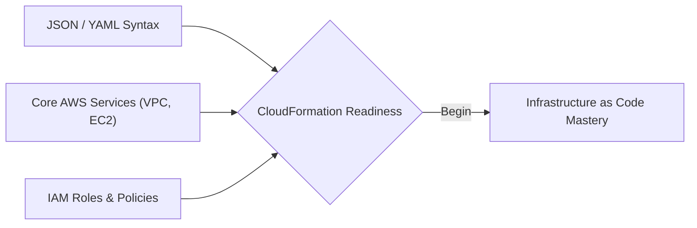
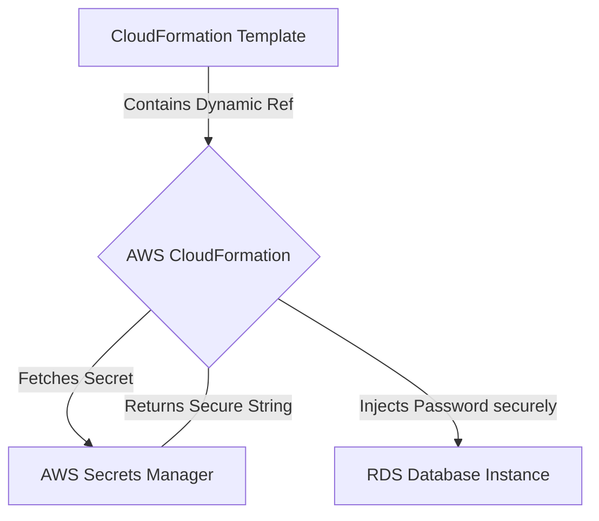

# Curriculum Overview: Managing Stacks Using AWS CloudFormation

> [!NOTE] 
> This curriculum aligns with the AWS Certified SysOps Administrator - Associate (SOA-C03) exam guide, specifically targeting Task 3.1: Provision and maintain cloud resources using Infrastructure as Code (IaC).

## Prerequisites

Before beginning this curriculum on AWS CloudFormation, learners must establish a foundational understanding of core cloud concepts and AWS services. 

* **AWS Resource Fundamentals**: Understanding of core compute (Amazon EC2), networking (Amazon VPC, subnets, Route Tables), and storage (Amazon S3, EBS, EFS).
* **Identity and Access Management (IAM)**: Familiarity with IAM roles, policies, and the principle of least privilege, as CloudFormation requires precise permissions to provision resources on your behalf.
* **Data Serialization Languages**: Basic proficiency in reading and writing **JSON** (JavaScript Object Notation) or **YAML** (YAML Ain't Markup Language).
* **AWS Management Tools**: Comfort using the AWS Management Console and basic commands within the AWS Command Line Interface (CLI).



## Module Breakdown

The curriculum is structured progressively, starting from foundational stack management and moving toward enterprise-grade, multi-region automation and drift remediation.

| Module | Title | Difficulty | Core Focus |
| :--- | :--- | :--- | :--- |
| **Module 1** | CloudFormation Fundamentals | Beginner | Templates, stack creation, updating, and deleting resources. |
| **Module 2** | Advanced Provisioning & StackSets | Intermediate | Multi-account and multi-region deployments, nested stacks. |
| **Module 3** | Security & Dynamic References | Intermediate | IAM boundaries, integrating AWS Secrets Manager. |
| **Module 4** | Maintenance & Troubleshooting | Advanced | Drift detection, stack failures, subnet/permission issues. |

## Learning Objectives per Module

### Module 1: CloudFormation Fundamentals
* **Author and Deploy Templates**: Create declarative YAML/JSON templates to define AWS architecture.
* **Manage Stack Lifecycles**: Successfully create, update, and delete resource stacks using both the AWS Management Console and the AWS CLI.
* **Understand the CloudFormation Process**: Trace the lifecycle of a stack from template submission to resource provisioning.

```tikz
\begin{tikzpicture}[node distance=2.5cm, auto, thick, >=latex]
    \node[draw, rectangle, rounded corners, fill=blue!10, minimum width=2.5cm, minimum height=1cm, align=center] (template) {Author Template \\ (YAML/JSON)};
    \node[draw, rectangle, rounded corners, fill=orange!10, minimum width=2.5cm, minimum height=1cm, right=of template, align=center] (cfn) {AWS \\ CloudFormation};
    \node[draw, rectangle, rounded corners, fill=gray!20, minimum width=2.5cm, minimum height=1cm, right=of cfn, align=center] (resources) {AWS Resources \\ (EC2, VPC, etc.)};

    \draw[->] (template) -- node[above] {Submit} (cfn);
    \draw[->] (cfn) -- node[above] {Provision} (resources);
\end{tikzpicture}
```

### Module 2: Advanced Provisioning & StackSets
* **Scale Across Regions**: Use CloudFormation StackSets to provision and share resources consistently across multiple AWS Regions and organizational accounts.
* **Implement Reusability**: Design nested stacks to overcome resource limits and encourage modular infrastructure code.

### Module 3: Security & Dynamic References
* **Protect Credentials**: Use dynamic references to securely retrieve credentials from AWS Secrets Manager during stack creation without hardcoding them in templates.
  * *Example Syntax*: `{{resolve:secretsmanager:secret-id:SecretString:json-key:version-stage:version-id}}`
* **Enforce Least Privilege**: Attach specific IAM service roles to CloudFormation stacks to strictly control what resources the stack is allowed to manipulate.



### Module 4: Maintenance & Troubleshooting
* **Identify Stack Drift**: Detect and remediate CloudFormation stack drift to identify manual, out-of-band changes to infrastructure that differ from the template definition.
* **Resolve Deployment Errors**: Troubleshoot common stack creation failures, such as subnet sizing limits, missing IAM permissions, and service quota exhaustion.

## Success Metrics

To ensure mastery of managing stacks using AWS CloudFormation, learners will be evaluated against the following quantitative and qualitative metrics:

1. **Successful Multi-Tier Deployment**: The learner can successfully provision a functioning 3-tier VPC architecture (Public/Private subnets, Route Tables, NAT Gateways) using a single YAML template with zero manual intervention.
2. **Drift Remediation Scenario**: Given a stack where a security group rule was manually altered via the console, the learner successfully detects the drift and executes a stack update to revert the environment to its defined state in under 10 minutes.
3. **Cross-Region Provisioning**: The learner configures a CloudFormation StackSet that correctly deploys identical baseline IAM roles and S3 buckets across at least three distinct AWS Regions simultaneously.
4. **Secure Credential Integration**: The learner launches an Amazon RDS database via CloudFormation, proving via audit logs that the master database password was dynamically injected from AWS Secrets Manager using a `{{resolve:secretsmanager:...}}` string, rather than passed as plain text.

> [!TIP]
> Formative assessments will heavily feature the AWS CLI to test automated retrieval of stack statuses, simulating a true SysOps environment.

## Real-World Application

In modern cloud environments, manual configuration (often called "ClickOps") introduces significant human error, makes disaster recovery incredibly slow, and creates an environment that is nearly impossible to accurately replicate or audit.

Mastering AWS CloudFormation shifts an organization from manual management to **Infrastructure as Code (IaC)**. 

| Scenario | Manual ClickOps | AWS CloudFormation (IaC) |
| :--- | :--- | :--- |
| **Disaster Recovery** | Hours/Days to manually rebuild VPCs and servers. | Minutes to execute a template in a new region. |
| **Environment Cloning** | High likelihood of configuration drift between Dev and Prod. | Dev, Test, and Prod are 100% identical, parameterized by environment variables. |
| **Security Auditing** | Requires complex resource scanning to determine intent. | Infrastructure is version-controlled in Git; intent and history are visible in code commits. |

For an AWS SysOps Administrator, automating deployment processes directly impacts the bottom line. It reduces the $Cost$ of operations by minimizing the $Time$ spent troubleshooting manual errors, allowing administrators to focus on architecture optimization, security posture improvements, and cost reduction strategies (like evaluating Spot Instances or configuring Compute Optimizer).