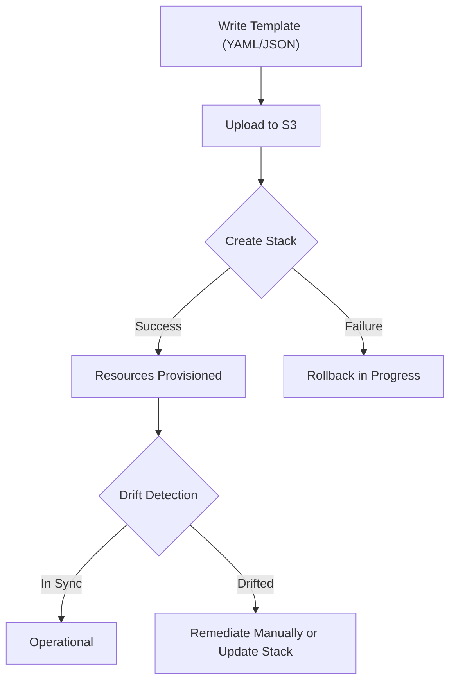

# Mastering Infrastructure as Code (IaC) and Resource Provisioning

This study guide focuses on the programmatic management of AWS resources. By shifting from manual console interactions to version-controlled templates, organizations ensure consistency, scalability, and rapid recovery.

## Learning Objectives
By the end of this module, you should be able to:
- **Manage and remediate** AWS CloudFormation stacks, including multi-account deployments using StackSets.
- **Detect and resolve** configuration drift between templates and deployed resources.
- **Explain the role** of the AWS Cloud Development Kit (CDK) in high-level infrastructure modeling.
- **Automate image creation** using EC2 Image Builder pipelines and recipes.
- **Differentiate** between various AWS deployment services like Elastic Beanstalk and Systems Manager.

## Key Terms & Glossary
- **Stack**: A collection of AWS resources managed as a single unit in CloudFormation.
- **Drift**: The difference between the "expected" configuration defined in a template and the "actual" state of live resources.
- **StackSet**: A CloudFormation feature that allows you to create, update, or delete stacks across multiple accounts and regions with a single operation.
- **Construct**: The basic building block of an AWS CDK application, representing one or more AWS resources.
- **Recipe**: In EC2 Image Builder, a document that defines the base image and the components to be applied to produce a new image.
- **Pipeline**: An automated workflow in Image Builder that triggers the image creation process based on a schedule or manual trigger.

## The "Big Idea"
Infrastructure as Code (IaC) treats infrastructure configurations with the same rigor as application code. Instead of documenting "how to click through the console," you write a "blueprint." This ensures that your Dev, Test, and Prod environments are identical, reduces human error, and allows you to "undo" a bad deployment by simply rolling back to a previous version of your template.

## Formula / Concept Box

| Tool | Primary Language | Use Case |
| :--- | :--- | :--- |
| **AWS CloudFormation** | JSON / YAML | Declarative, low-level resource definition. Native to AWS. |
| **AWS CDK** | TS, Python, Java, Go | Imperative, high-level abstraction. Compiles (synthesizes) into CloudFormation templates. |
| **Terraform** | HCL | Multi-cloud IaC; manages resources across AWS and other providers. |
| **Elastic Beanstalk** | Managed (various) | Best for developers; handles capacity, load balancing, and health monitoring automatically. |

## Hierarchical Outline
- **AWS CloudFormation**
    - **Template Anatomy**: Sections like `Parameters`, `Resources` (mandatory), `Outputs`, and `Mappings`.
    - **Stack Management**: Creation, deletion, and updates using Change Sets (previews of changes).
    - **StackSets**: Used for centralized management in **AWS Organizations**.
    - **Drift Detection**: Identifying manual changes that bypass IaC.
- **AWS CDK (Cloud Development Kit)**
    - **Core Concept**: Uses familiar programming languages to model infrastructure.
    - **Synthesis**: The process of turning code into a CloudFormation template.
- **EC2 Image Builder**
    - **Components**: YAML-based scripts for installation and configuration.
    - **Recipes**: Combining a base OS with specific components.
    - **Infrastructure Configuration**: Defining instance types and VPCs for the build process.
- **Resource Maintenance**
    - **Systems Manager (SSM)**: Fleet management, automated patching, and runbooks.
    - **Elastic Beanstalk**: Rapid application provisioning with deployment strategies (All-at-once, Rolling, etc.).

## Visual Anchors

### CloudFormation Stack Lifecycle

### Concept: Expected vs. Actual State (Drift)
\begin{tikzpicture}
    % Expected State Box
    \draw[thick, blue] (0,2) rectangle (3,4);
    \node at (1.5,4.3) {\textbf{Template (Expected)}};
    \node[blue] at (1.5,3) {Port: 80};

    % Arrow
    \draw[->, thick] (3.5,3) -- (4.5,3);
    \node at (4,3.3) {\small{Verify}};

    % Actual State Box
    \draw[thick, red] (5,2) rectangle (8,4);
    \node at (6.5,4.3) {\textbf{Resource (Actual)}};
    \node[red] at (6.5,3) {Port: 22};

    % Warning Label
    \draw[red, ultra thick] (4,1) -- (4,1.5);
    \node[red] at (4,0.7) {\Large{\textbf{DRIFT DETECTED!}}};
\end{tikzpicture}

## Definition-Example Pairs
- **Declarative IaC**: Describing *what* the end state should look like, not *how* to get there.
    - *Example*: In a CloudFormation template, you state "I want an S3 bucket named 'my-data'", and AWS handles the API calls to create it.
- **Imperative IaC**: Using logic (loops, if-statements) to define infrastructure.
    - *Example*: Using the AWS CDK in Python to loop through a list of names to create five distinct SQS queues.
- **Patch Manager**: An SSM feature that automates the process of patching managed instances.
    - *Example*: Scheduling a maintenance window to apply security patches to all Windows instances tagged with `Environment: Production` every Tuesday at 2 AM.

## Worked Examples

### Resolving CloudFormation Stack Drift
1.  **Detection**: Select the stack in the CloudFormation console and choose "Detect drift." The status changes from `IN_SYNC` to `DRIFTED`.
2.  **Analysis**: Review the drift details. For example, the template says `InstanceType: t3.medium`, but the console shows `t3.large`.
3.  **Remediation**: 
    - **Option A**: Manually change the resource back in the EC2 console to match the template.
    - **Option B**: Update the template code to match the new reality (`t3.large`) and perform a stack update to re-synchronize.

### Creating an Image Builder Pipeline
1.  **Create Component**: Write a YAML script to install `nginx` and `cloud-init`.
2.  **Create Recipe**: Select an Amazon Linux 2023 base image and attach your `nginx` component.
3.  **Define Infrastructure**: Choose a `t3.micro` instance and a specific IAM role (must have `AmazonSSMManagedInstanceCore` permissions).
4.  **Set Distribution**: Specify that the resulting AMI should be copied to the `us-west-2` region and shared with a specific development AWS account.

## Checkpoint Questions
1. What is the mandatory section of a CloudFormation template?
2. How does a Change Set differ from a Stack Update?
3. Which AWS service would you use to deploy a web application if you want AWS to handle the underlying capacity and load balancing automatically?
4. What happens to resources in a CloudFormation stack if the creation of one resource fails during initial deployment?
5. In EC2 Image Builder, what is the purpose of the "Test Component"?

> [!TIP]
> **Exam Hint**: If a question asks about managing resources across multiple accounts/regions, look for **CloudFormation StackSets**. If it asks about modeling infrastructure in Python/Java, it's almost certainly **AWS CDK**.