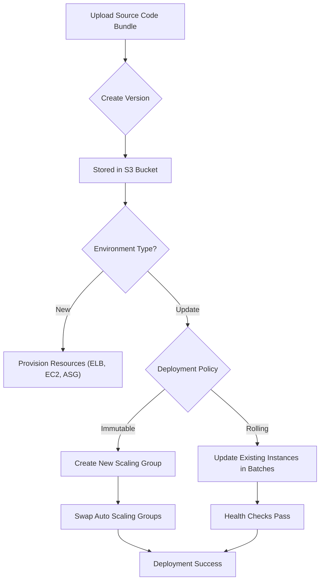

# AWS Elastic Beanstalk: Deployment and Lifecycle Management

This guide covers the core concepts of AWS Elastic Beanstalk, a Platform-as-a-Service (PaaS) that simplifies the deployment and scaling of web applications and services. 

## Learning Objectives

*   **Define** the primary components of an Elastic Beanstalk application.
*   **Compare and Contrast** various deployment strategies (All-at-once, Rolling, Immutable, Blue/Green).
*   **Explain** where Elastic Beanstalk stores persistent data like application versions and logs.
*   **Distinguish** between Web Server and Worker environment tiers.
*   **Identify** how to manage environment configuration and application versions.

## Key Terms & Glossary

*   **Application:** A logical collection of Elastic Beanstalk components, including environments, versions, and configurations.
*   **Application Version:** A specific, labeled iteration of deployable code (stored as a .zip or .war file in S3).
*   **Environment:** A specific instance of an application (e.g., "Production" or "Staging") consisting of AWS resources like EC2, ELB, and ASG.
*   **Platform:** A combination of an Operating System, runtime, and server configuration (e.g., "Java 17 on 64bit Amazon Linux 2023").
*   **CNAME Swap:** A DNS-level update used in Blue/Green deployments to redirect traffic from one environment to another.

## The "Big Idea"

Elastic Beanstalk is the "Easy Button" for AWS infrastructure. It automates the provisioning of the underlying stack—Load Balancer, Auto Scaling Group, and EC2 instances—so developers can focus solely on writing code. However, as a CloudOps Engineer, you must understand the **deployment lifecycle** and **storage persistence** to ensure zero downtime and data integrity during updates.

## Formula / Concept Box

### Deployment Strategy Matrix

| Strategy | Downtime | DNS Change? | Extra Cost? | Rollback Speed | Best For... |
| :--- | :--- | :--- | :--- | :--- | :--- |
| **All-at-Once** | High | No | No | Slow (Redeploy) | Dev/Test environments |
| **Rolling** | Partial | No | No | Slow | Production (balanced) |
| **Immutable** | None | No | Double (briefly) | Fast (Terminate) | Mission-critical apps |
| **Blue/Green** | None | Yes | Double | Instant (Swap back) | Major version shifts |

## Hierarchical Outline

*   **I. Elastic Beanstalk Architecture**
    *   **Management Layer:** Handles health monitoring and orchestration.
    *   **Data Persistence:** Uses **Amazon S3** for application bundles and server logs.
    *   **Compute/Networking:** Provisions VPC, Subnets, ELB, and ASG automatically.
*   **II. Environment Tiers**
    *   **Web Server Tier:** Handles HTTP(S) requests via a Load Balancer.
    *   **Worker Tier:** Decouples background tasks using **Amazon SQS** queues.
*   **III. Deployment Management**
    *   **Lifecycle Policies:** Clean up old application versions to stay within service quotas.
    *   **Configuration Files:** Use `.ebextensions/` (YAML/JSON) to customize the environment.

## Visual Anchors

### Deployment Flowchart

### Web vs. Worker Tier Architecture

\begin{tikzpicture}[node distance=2cm, every node/.style={rectangle, draw, minimum width=2.5cm, minimum height=1cm, align=center}]
    % Web Tier
    \node (User) [draw=none] {User};
    \node (ELB) [right of=User, xshift=1cm] {ELB};
    \node (WebASG) [right of=ELB, xshift=1cm] {Web Tier EC2s\\(Processing HTTP)};
    
    % Worker Tier
    \node (SQS) [below of=WebASG] {SQS Queue};
    \node (WorkerASG) [below of=SQS] {Worker Tier EC2s\\(Batch/Background)};
    
    % Connections
    \draw[->, thick] (User) -- (ELB);
    \draw[->, thick] (ELB) -- (WebASG);
    \draw[->, dashed] (WebASG) -- node[right] {\small{Async Task}} (SQS);
    \draw[->, thick] (SQS) -- (WorkerASG);
\end{tikzpicture}

## Definition-Example Pairs

*   **Immutable Deployment:** A strategy that launches a fresh set of instances in a separate Auto Scaling group for the new version. 
    *   *Example:* Updating a banking app where you cannot afford mixed versions in a cluster; you spin up "Group B" while "Group A" is live, then cut over once B passes health checks.
*   **Worker Tier:** An environment type specifically for background processing that pulls tasks from a SQS queue.
    *   *Example:* A photo sharing app where the Web Tier uploads the image, and a Worker Tier handles the CPU-intensive thumbnail resizing.
*   **Artifact Storage:** The location where the binary files and logs are kept.
    *   *Example:* Elastic Beanstalk automatically creates a bucket named `elasticbeanstalk-region-accountid` to store your `.war` files and `stdout` logs.

## Worked Examples

### Scenario: Migrating from All-at-Once to Blue/Green
**Problem:** A team is experiencing 5 minutes of downtime during every update because they use "All-at-Once" deployments. They need to switch to a zero-downtime strategy.

**Step-by-Step Solution:**
1.  **Clone the Environment:** Navigate to the Elastic Beanstalk console and select "Clone Environment" for the current production environment.
2.  **Deploy New Version:** Upload the new application version to the newly cloned environment (let's call it "Blue").
3.  **Validate:** Test the Blue environment's URL directly to ensure the application is functioning correctly.
4.  **Swap CNAMEs:** In the Actions menu, select "Swap Environment URLs." This points the production DNS (e.g., `myapp.elasticbeanstalk.com`) to the Blue environment.
5.  **Monitor & Terminate:** Watch CloudWatch metrics for errors. If stable, terminate the old "Green" environment to save costs.

## Checkpoint Questions

1.  Where does AWS Elastic Beanstalk store application version files and server log files?
2.  Which deployment strategy results in the fastest rollback if a failure occurs during the update?
3.  True or False: A Worker Tier environment uses a Load Balancer to distribute traffic to its instances.
4.  What is the purpose of the `.ebextensions/` folder in your application source code?

Click to see answers

1.  **Amazon S3.**
2.  **Blue/Green (via CNAME swap) or Immutable.**
3.  **False.** Worker tiers use a daemon to pull messages from an SQS queue; they do not have a Load Balancer.
4.  **To provide configuration files that allow you to customize the AWS resources provisioned by the environment.**

