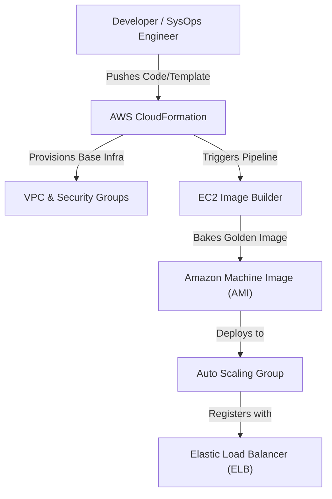
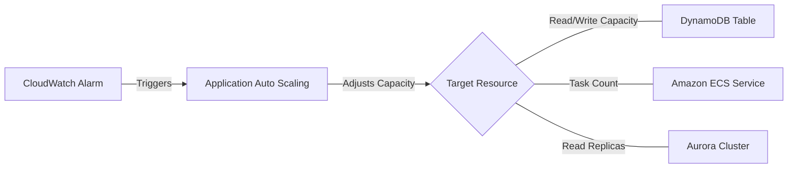

# AWS Resource Maintenance and Application Provisioning: Curriculum Overview

> This curriculum outline defines the learning path, objectives, and practical applications for deploying, maintaining, and automating cloud resources on AWS. It is tightly aligned with Domain 3 of the AWS Certified CloudOps Engineer Associate (SOA-C03) exam.

## Prerequisites

Before diving into this curriculum, learners must possess a foundational understanding of AWS architecture and basic system administration. Ensure you meet the following requirements:

* **Core AWS Services:** Working knowledge of Amazon EC2, VPCs, and basic storage solutions (Amazon S3, EBS).
* **Command Line Proficiency:** Familiarity with executing commands via the AWS CLI and navigating terminal environments.
* **Identity and Access Management (IAM):** Understanding of the principle of least privilege, roles, and identity-based policies.
* **Data Serialization Languages:** Basic ability to read and write JSON or YAML formats (crucial for CloudFormation and automated deployments).

## Module Breakdown

This curriculum progresses from base-level infrastructure deployment to advanced, automated container operations and serverless scaling.

| Module | Title | Primary Focus | Difficulty Progression |
| :--- | :--- | :--- | :--- |
| **Module 1** | Infrastructure as Code (IaC) | CloudFormation, AWS CDK, StackSets | ⭐ Intermediate |
| **Module 2** | Resource Maintenance & Image Building | EC2 Image Builder, AMIs, Patching | ⭐⭐ Intermediate-High |
| **Module 3** | Application Provisioning | AWS Elastic Beanstalk, Deployment Strategies | ⭐⭐ Intermediate-High |
| **Module 4** | Container Operations | Amazon ECS, Amazon EKS, ECR | ⭐⭐⭐ Advanced |
| **Module 5** | Automated Management & Scaling | Application Auto Scaling, AWS Lambda | ⭐⭐⭐ Advanced |

### Architectural Workflow: The Provisioning Pipeline

## Learning Objectives per Module

### Module 1: Infrastructure as Code (IaC)
* **Manage Stacks:** Create, update, and delete AWS CloudFormation stacks, nested stacks, and StackSets.
* **Drift Detection:** Identify and remediate manual changes to resources that deviate from the defined CloudFormation templates.
* **AWS CDK Integration:** Model cloud infrastructure programmatically using familiar programming languages via the Cloud Development Kit.

### Module 2: Resource Maintenance & Image Building
* **Automate AMIs:** Build, test, and distribute secure, up-to-date Amazon Machine Images using EC2 Image Builder.
* **Fleet Management:** Utilize AWS Systems Manager (SSM) Patch Manager to automate the patching of managed nodes across your fleet.
* **Remediation:** Identify and resolve deployment issues such as subnet sizing constraints or missing IAM permissions.

### Module 3: Application Provisioning
* **Platform Management:** Deploy and manage web applications using AWS Elastic Beanstalk.
* **Lifecycle Management:** Handle application versions, environments, and configuration updates.
* **Deployment Strategies:** Implement safe deployment methodologies (e.g., rolling, immutable, blue/green deployments).

### Module 4: Container Operations
* **Cluster Management:** Deploy and manage containerized workloads on Amazon ECS (Elastic Container Service) and Amazon EKS (Elastic Kubernetes Service).
* **Registry Operations:** Manage container images securely using Amazon Elastic Container Registry (ECR).
* **Health Monitoring:** Monitor task health and seamlessly update services without downtime.

### Module 5: Automated Management & Scaling
* **Application Auto Scaling:** Configure auto-scaling for non-EC2 resources (e.g., DynamoDB, ECS tasks, Aurora replicas).
* **Event-Driven Automation:** Implement automated remediation using AWS Lambda and Amazon EventBridge rules.

### Application Auto Scaling Strategy

## Success Metrics

How will you know you have mastered the curriculum? Look for these success indicators:

1. **Zero-Touch Provisioning:** You can deploy a highly available, multi-tier architecture using a single CloudFormation template or CDK script without using the AWS Management Console.
2. **Automated Remediation:** You successfully configure EventBridge and SSM to detect an out-of-compliance resource and automatically fix it without human intervention.
3. **Exam Readiness:** You consistently score 80% or higher on SOA-C03 practice questions related to Domain 3 (Deployment, Provisioning, and Automation).
4. **Drift Resolution:** You can successfully detect CloudFormation drift and execute the correct steps to align the physical infrastructure back with the declarative template.

## Real-World Application

In modern cloud operations, manual server configuration is considered an anti-pattern. This curriculum prepares you for the realities of enterprise cloud management:

> [!IMPORTANT]
> **Why this matters:** Human error is the leading cause of system outages. By automating resource maintenance and application provisioning, organizations achieve consistency, enhanced security, and rapid recovery times.

* **The "Golden Image" Pipeline:** In heavily regulated industries (finance, healthcare), deploying unvetted servers is a compliance violation. EC2 Image Builder allows teams to automatically bake security patches and agents into "Golden AMIs" on a schedule, ensuring every newly scaled instance is compliant from the second it boots.
* **Disaster Recovery (DR):** When an entire region goes down, CloudFormation StackSets allow a SysOps engineer to recreate the exact infrastructure in a secondary region in minutes, dramatically reducing the Recovery Time Objective (RTO).
* **Cost Control via Auto Scaling:** Provisioning workloads to handle peak traffic 24/7 wastes money. Mastering Application Auto Scaling means your DynamoDB tables and ECS containers scale up right before the morning traffic spike and scale down at night, saving organizations thousands of dollars.

## Estimated Timeline

* **Week 1-2:** Master IaC principles (CloudFormation & CDK).
* **Week 3:** Focus on EC2 Image Builder and Elastic Beanstalk.
* **Week 4:** Deep dive into Container Operations (ECS/EKS).
* **Week 5:** Implement automated scaling and event-driven automation (Lambda/EventBridge).
* **Week 6:** Practice labs, troubleshooting scenarios, and final assessments.

## Resource Links

* **AWS Documentation:** [AWS CloudFormation User Guide](https://docs.aws.amazon.com/cloudformation/)
* **AWS Workshops:** [Innovator Island (Serverless Learning)](https://serverlessland.com/learn/innovator-island)
* **Reference Material:** AWS Certified SysOps Administrator Associate Exam Guide (SOA-C03)