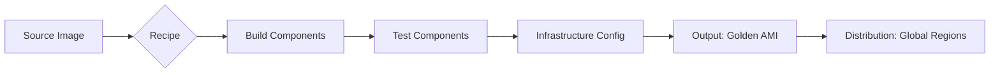

# Mastering Automation: EC2 Image Builder

This study guide covers the automation of Amazon Machine Image (AMI) and container image creation using **AWS EC2 Image Builder**. This is a core competency for the AWS Certified SysOps Administrator (SOA-C02/C03) exam, focusing on operational excellence and security.

---

## Learning Objectives
By the end of this guide, you should be able to:
- **Define** the role of EC2 Image Builder in creating a "Golden Image" pipeline.
- **Identify** the four primary configurations required for an Image Builder pipeline.
- **Configure** the necessary IAM roles and permissions for successful image builds.
- **Distinguish** between Build Components, Recipes, and Infrastructure Configurations.
- **Explain** the lifecycle of build and test instances during the automation process.

---

## Key Terms & Glossary
- **AMI (Amazon Machine Image):** A template that contains the software configuration (operating system, application server, and applications) required to launch an instance.
- **Golden Image:** A standardized, hardened, and pre-configured template for a virtual machine or container that meets an organization's security and compliance standards.
- **Component:** A set of steps to download, install, and configure software on your image (Build) or to validate that the image is working correctly (Test).
- **Recipe:** A document that defines the base image and the components to be applied to that image to produce the desired output configuration.
- **Pipeline:** The end-to-end automation mechanism that orchestrates the creation, testing, and distribution of images based on a schedule or manual trigger.

---

## The "Big Idea"
The **"Golden Image"** strategy is central to modern cloud operations. Instead of configuring every new EC2 instance from scratch (which is slow and error-prone), organizations use **EC2 Image Builder** to create a "factory" for images. This ensures that every server launched in the environment is pre-patched, secure, and contains the necessary monitoring agents, reducing the "attack surface" and ensuring consistency across global regions.

---

## Formula / Concept Box

| Pipeline Component | Purpose | Key Attributes |
| :--- | :--- | :--- |
| **Recipe** | The "Blueprint" | Base image choice + specific Build/Test components. |
| **Infrastructure Config** | The "Workshop" | Defines Instance Type, VPC, Subnet, and the IAM Role used for building. |
| **Distribution Config** | The "Shipping" | Defines which AWS Regions and Accounts receive the finished AMI. |
| **Component** | The "Instructions" | YAML/JSON scripts for specific tasks (e.g., `Install-Docker`). |

---

## Hierarchical Outline
- **I. Core Architecture**
    - **Automation Engine:** Replaces manual AMI snapshots.
    - **Cross-Platform Support:** Works for **EC2 AMIs**, **Docker Containers**, and local formats (VHDX, VMDK).
- **II. The Four Pillars of Configuration**
    - **Build/Test Components:** Powerful alternatives to User Data; they are modular and reusable.
    - **Image Recipes:** Version-controlled documents combining base images and components.
    - **Infrastructure Configuration:** Specifies the "where" and "how" (VPC, Security Groups, IAM).
    - **Distribution Settings:** Controls regional replication and cross-account sharing.
- **III. IAM Requirements**
    - **Instance Profile:** Must include `EC2InstanceProfileForImageBuilder` and `AmazonSSMManagedInstanceCore`.
- **IV. The Pipeline Lifecycle**
    - **Build Phase:** Launches a temporary instance to run build components.
    - **Test Phase:** Launches a second temporary instance to run validation tests.
    - **Cleanup:** Automatically terminates instances to minimize costs.

---

## Visual Anchors

### The Image Builder Workflow

### Infrastructure & Security Relationship
\begin{tikzpicture}[node distance=2cm, every node/.style={rectangle, draw, rounded corners, fill=blue!10, text centered, minimum width=3cm, minimum height=1cm}]
    \node (IAM) {IAM Role (SSM + IB)};
    \node (VPC) [below of=IAM] {Infrastructure Config (VPC/Subnet)};
    \node (Inst) [right of=VPC, xshift=3cm] {Build Instance};
    \node (AMI) [below of=Inst] {Target AMI};

    \draw[->, thick] (IAM) -- (Inst);
    \draw[->, thick] (VPC) -- (Inst);
    \draw[->, thick] (Inst) -- (AMI);
\end{tikzpicture}

---

## Definition-Example Pairs
- **Build Component**
    - *Definition:* A sequence of steps (usually YAML) that executes commands on the instance to install software or change settings.
    - *Example:* A script that runs `yum install -y amazon-cloudwatch-agent` and configures the agent's JSON file.
- **Test Component**
    - *Definition:* A script that verifies the image meets specific criteria before it is finalized and distributed.
    - *Example:* A command that checks if `service httpd status` returns "running" or if port 80 is open.
- **Distribution Configuration**
    - *Definition:* A setting that defines how the resulting AMI is shared globally.
    - *Example:* Automatically copying a newly built AMI from `us-east-1` to `eu-central-1` and `ap-southeast-1` to ensure disaster recovery readiness.

---

## Worked Examples

### Scenario: Creating a Hardened Linux Web Server
**Objective:** Automate the creation of an AMI that has Apache installed, SSH disabled for root, and the AWS Inspector agent active.

**Step-by-Step Breakdown:**
1.  **Define Components:** Create a Build Component named `Harden-OS` (script to disable root SSH) and `Install-Apache`.
2.  **Create Recipe:** Select the latest Amazon Linux 2 AMI as the base. Add the `Harden-OS`, `Install-Apache`, and the AWS-managed `AmazonInspector2-Agent` components.
3.  **Setup Infrastructure:** Select a `t3.medium` instance type. Assign an IAM role with the `EC2InstanceProfileForImageBuilder` and `AmazonSSMManagedInstanceCore` policies attached.
4.  **Configure Pipeline:** Set a schedule to run once a week (to include latest security patches from the base image).
5.  **Execution:** Image Builder launches a build instance, runs the scripts, creates a snapshot, launches a test instance to verify, and finally registers the new AMI.

---

## Checkpoint Questions
1.  **Which two IAM managed policies are required for the EC2 instance profile used by Image Builder?**
    - *Answer: EC2InstanceProfileForImageBuilder and AmazonSSMManagedInstanceCore.*
2.  **Does EC2 Image Builder charge for the temporary build/test instances it creates?**
    - *Answer: Yes, though fees are nominal as instances are automatically terminated upon completion.*
3.  **What is the difference between a Template and an AMI in the context of instance launching?**
    - *Answer: An AMI is a snapshot of the disk. A Launch Template defines the configuration (instance type, VPC, keys) AND which AMI to use.*
4.  **True or False: Image Builder can only be used for EC2 AMIs.**
    - *Answer: False. It also supports Docker container images and various virtual machine formats (VHDX, VMDK) via VM Import/Export.*

> [!IMPORTANT]
> **Cost Optimization:** Remember that you are charged for the storage of the AMI as long as it is registered. To stop billing, you must deregister the AMI and delete the underlying EBS snapshots.