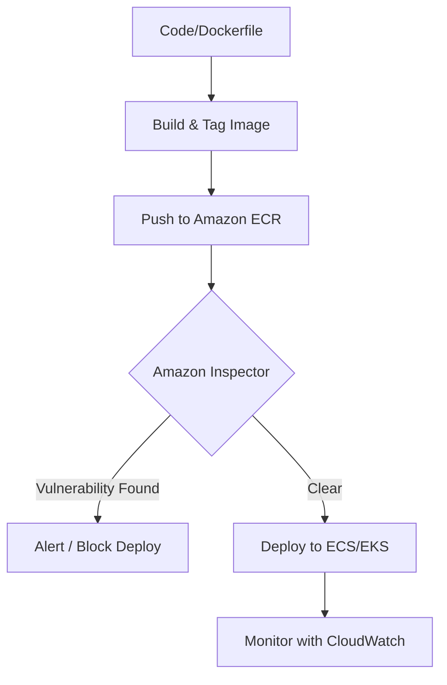

# Container Operations and Security

This guide covers the management, monitoring, and securing of containerized workloads using Amazon ECS, EKS, and ECR, with a focus on operational excellence and vulnerability management.

--- 

## Learning Objectives
After studying this module, you should be able to:
- Differentiate between **Amazon ECS** and **Amazon EKS** orchestration models.
- Manage container images and lifecycle policies within **Amazon ECR**.
- Implement automated vulnerability scanning using **Amazon Inspector**.
- Monitor container health and performance using the **CloudWatch Agent**.
- Apply the principle of least privilege using IAM roles for tasks and pods.

## Key Terms & Glossary
- **Orchestration**: The automated arrangement, coordination, and management of computer systems, software, and services (e.g., ECS, Kubernetes).
- **Control Plane**: The part of the container system that manages the state of the cluster (e.g., scheduling tasks).
- **Data Plane**: The actual capacity where containers run (e.g., EC2 instances or AWS Fargate).
- **Sidecar Container**: A secondary container that runs alongside the main application container within the same task or pod to provide supporting features like logging or proxying.
- **CVE (Common Vulnerabilities and Exposures)**: A list of publicly disclosed computer security flaws that Amazon Inspector checks against.

## The "Big Idea"
In traditional computing, we treat servers like "pets" (unique, manually maintained). In **Container Operations**, we treat them like "cattle." Containers are ephemeral, standardized, and easily replaced. AWS provides the "fences" (ECR) and the "ranchers" (ECS/EKS) to ensure these workloads stay healthy, secure, and scalable without manual intervention.

## Formula / Concept Box

| Feature | Amazon ECS | Amazon EKS |
| :--- | :--- | :--- |
| **Philosophy** | AWS-native, simple, integrated | Open-source Kubernetes compatible |
| **Unit of Work** | Task | Pod |
| **Configuration** | Task Definition (JSON) | Manifests (YAML/Helm) |
| **Learning Curve** | Low (Proprietary to AWS) | High (Standard Kubernetes) |
| **Security** | IAM Roles for Tasks | IAM Roles for Service Accounts (IRSA) |

## Hierarchical Outline
1. **Amazon Elastic Container Registry (ECR)**
    - **Image Storage**: Private and public repositories for Docker/OCI images.
    - **Lifecycle Policies**: Automate the cleanup of old or untagged images to save costs.
2. **Orchestration Services**
    - **Amazon ECS**: Managed service for running Docker containers; uses **Services** to maintain desired task counts.
    - **Amazon EKS**: Managed Kubernetes service; ideal for hybrid-cloud or multi-cloud consistency.
3. **Monitoring & Observability**
    - **Task Health**: Monitoring `RUNNING`, `PENDING`, and `STOPPED` states.
    - **CloudWatch Agent**: Deploying agents on containers to collect system-level metrics and logs.
4. **Security & Vulnerability Management**
    - **Amazon Inspector**: Continual scanning of ECR images and container workloads.
    - **IAM Policies**: Using resource-based policies for ECR and identity-based policies for orchestration.

## Visual Anchors

### The Container Lifecycle

### ECS Component Hierarchy
\begin{tikzpicture}[node distance=1.5cm, every node/.style={draw, rectangle, rounded corners, fill=blue!10, text centered, minimum width=3cm}]
    \node (cluster) {\textbf{ECS Cluster} \\ (Logical Grouping)};
    \node (service) [below of=cluster] {\textbf{ECS Service} \\ (Desired Count / ELB)};
    \node (task) [below of=service] {\textbf{ECS Task} \\ (Instantiation of Definition)};
    \node (container) [below of=task] {\textbf{Container(s)} \\ (Docker Runtime)};

    \draw[->, thick] (cluster) -- (service);
    \draw[->, thick] (service) -- (task);
    \draw[->, thick] (task) -- (container);
\end{tikzpicture}

## Definition-Example Pairs
- **Task Definition**: A blueprint that describes how a docker container should launch.
    - *Example*: Defining that an Nginx container needs 512MB of RAM and should open Port 80.
- **ECR Lifecycle Policy**: Rules to manage the expiration of images.
    - *Example*: A policy that automatically deletes images older than 30 days or keeps only the last 10 versions.
- **Continuous Scanning**: The process of re-scanning images whenever a new vulnerability is added to the database.
    - *Example*: Amazon Inspector automatically flags an existing ECR image because a new "Zero Day" exploit was discovered today.

## Worked Examples

### Example 1: Updating an ECS Service
**Scenario**: You have a web application running on ECS. You just pushed a new image version (`v2`) to ECR and need to update the running containers with zero downtime.
1. **Update Task Definition**: Create a new revision of the Task Definition pointing to the `v2` image URI.
2. **Update Service**: Run `aws ecs update-service --cluster MyCluster --service MyWebSvc --task-definition MyTask:2`.
3. **Rolling Update**: ECS starts a new task with `v2`. Once the health check passes, it stops an old `v1` task.
4. **Verification**: Check CloudWatch Logs to ensure the `v2` app is handling requests.

### Example 2: Configuring Amazon Inspector for ECR
**Scenario**: You need to ensure all images pushed to the `production` repo are scanned for vulnerabilities.
1. **Enable Inspector**: Turn on Amazon Inspector in the AWS Console for the account.
2. **Scan on Push**: Navigate to the ECR Repository and enable "Scan on push" in the settings.
3. **Review Findings**: After a push, check the "Findings" tab in ECR or the Inspector dashboard to see Critical/High/Medium risks.

## Checkpoint Questions
1. What is the main difference between how ECS and EKS handle the "Unit of Work"?
2. Why is Amazon Inspector preferred over manual vulnerability scanning for containers?
3. How can you automate the removal of untagged images in an ECR repository?
4. Which AWS service would you use to centralize logs from containerized applications running on Fargate?
5. What happens to an ECS service if the underlying container task consistently fails its health check?

> [!TIP]
> Always use **IAM Roles for Tasks** (ECS) or **IRSA** (EKS) instead of hardcoding credentials in your container images. This ensures the container only has the specific permissions it needs to access other AWS services like S3 or DynamoDB.