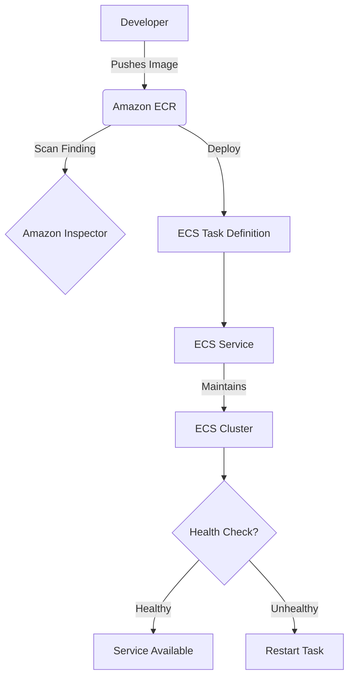

# Managing Workloads on Amazon ECS and EKS

This study guide covers the operational aspects of container orchestration on AWS, focusing on Amazon Elastic Container Service (ECS), Amazon Elastic Kubernetes Service (EKS), and the supporting ecosystem of Elastic Container Registry (ECR), security scanning, and persistent storage.

## Learning Objectives

By the end of this guide, you should be able to:
*   **Differentiate** between the orchestration models of Amazon ECS and Amazon EKS.
*   **Manage** container life cycles including service updates, task health monitoring, and image storage in ECR.
*   **Implement** security best practices using Amazon Inspector for vulnerability scanning and Amazon GuardDuty for EKS auditing.
*   **Configure** persistent shared storage for containers using Amazon Elastic File System (EFS).
*   **Execute** automated remediation and scaling strategies for containerized workloads.

## Key Terms & Glossary

*   **Orchestrator**: A system (like ECS or EKS) that automates the deployment, scaling, and management of containerized applications.
*   **Control Plane**: The "brains" of the orchestrator that manages the state of the cluster and schedules workloads.
*   **Data Plane**: The actual compute resources (EC2 instances or Fargate) where containers run.
*   **Task (ECS)**: The instantiation of a task definition; a group of containers that run together on a host.
*   **Pod (EKS)**: The smallest deployable unit in Kubernetes, consisting of one or more containers.
*   **Fargate**: A serverless compute engine for containers that works with both ECS and EKS.
*   **Vulnerability Scanning**: The process of identifying security weaknesses in container images stored in ECR.

## The "Big Idea"

Containerization allows developers to package applications with all their dependencies, ensuring consistency across environments. However, running containers at scale requires an **Orchestrator**. AWS provides two paths: **ECS** for users who want a deeply integrated, AWS-native experience with simplified configuration, and **EKS** for those who require the flexibility and open-source standard of Kubernetes. Both rely on **ECR** for image management and **IAM** for granular security, ensuring that workloads are not just scalable, but secure and observable.

## Formula / Concept Box

| Feature | Amazon ECS | Amazon EKS |
| :--- | :--- | :--- |
| **Core Unit** | Task | Pod |
| **Configuration** | Task Definition (JSON) | Manifest (YAML) |
| **Ecosystem** | AWS Native | Kubernetes / CNCF |
| **Complexity** | Lower (Opinionated) | Higher (Configurable) |
| **Security** | IAM Roles for Tasks | IAM Roles for Service Accounts (IRSA) |
| **Storage** | EFS, EBS, Docker Volumes | EFS, EBS (CSI Drivers) |

## Hierarchical Outline

*   **I. Container Registry Operations (ECR)**
    *   **Repository Management**: Organizing images and lifecycle policies.
    *   **Vulnerability Scanning**: Using **Amazon Inspector** for automated, continual scanning of ECR images.
*   **II. Amazon ECS Management**
    *   **Task Definitions**: Defining CPU, memory, and networking (awsvpc).
    *   **Service Updates**: Managing rolling updates and blue/green deployments via CodeDeploy.
    *   **Health Monitoring**: Integrating with Route 53 and ELB for container health checks.
*   **III. Amazon EKS Management**
    *   **Control Plane Logging**: Enabling logs for the API server, scheduler, and controller manager.
    *   **Auditing with GuardDuty**: Monitoring Kubernetes audit logs for suspicious activity.
    *   **Persistent Data**: Utilizing **Amazon EFS** for multi-AZ, concurrent file access.
*   **IV. Security & Compliance**
    *   **Principle of Least Privilege**: Applying IAM roles specifically to the container level rather than the host level.
    *   **Compliance**: Using **AWS Config** to ensure containers meet organizational standards.

## Visual Anchors

### ECS Workload Workflow


### Persistent Storage Architecture (EFS)
```tikz
\begin{tikzpicture}[node distance=2cm, every node/.style={rectangle, draw, minimum width=2.5cm, minimum height=1cm, align=center}]

% Define the EFS Storage
\node (EFS) [fill=blue!10] {Amazon EFS \\ (Shared File System)};

% Define Container Nodes
\node (C1) [above left of=EFS, xshift=-1cm] {Container 1 \\ (AZ-A)};
\node (C2) [above of=EFS] {Container 2 \\ (AZ-B)};
\node (C3) [above right of=EFS, xshift=1cm] {Container 3 \\ (AZ-C)};

% Draw connections
\draw[<->, thick] (C1) -- (EFS) node[midway, left, font=\scriptsize] {NFS v4};
\draw[<->, thick] (C2) -- (EFS) node[midway, right, font=\scriptsize] {NFS v4};
\draw[<->, thick] (C3) -- (EFS) node[midway, right, font=\scriptsize] {NFS v4};

% Legend
\node (L) [below of=EFS, yshift=0.5cm, draw=none, font=\itshape] {Concurrent access across Multiple AZs};

\end{tikzpicture}
```

## Definition-Example Pairs

*   **Rolling Update**: A deployment strategy that replaces old versions of containers with new ones gradually to ensure zero downtime.
    *   *Example*: An ECS service with 4 desired tasks updates 2 at a time, keeping at least 2 running while the new versions spin up.
*   **IAM Roles for Tasks**: A security mechanism that allows a specific container to access other AWS services (like S3) without using long-term credentials.
    *   *Example*: A containerized Python app on ECS needs to upload logs to S3; you assign a Task Role with `s3:PutObject` permissions specifically to that task.
*   **Kubernetes Audit Logs**: A record of all activities within an EKS cluster, documenting who did what and when.
    *   *Example*: Using **Amazon GuardDuty** to analyze these logs to detect an unauthorized user attempting to create a privileged pod.

## Worked Examples

### Example 1: Updating an ECS Service via CLI
When a new image is pushed to ECR, the ECS service must be notified to pull the latest version.

1.  **Tag the image**: `docker tag my-app:latest <account_id>.dkr.ecr.<region>.amazonaws.com/my-repo:v2`
2.  **Push to ECR**: `docker push <account_id>.dkr.ecr.<region>.amazonaws.com/my-repo:v2`
3.  **Update Service**: 
```bash
aws ecs update-service --cluster my-cluster --service my-service --force-new-deployment
```
> [!NOTE]
> The `--force-new-deployment` flag triggers a new rollout even if the task definition hasn't changed, ensuring the latest image tag is pulled.

### Example 2: Configuring EFS for EKS Pods
To provide persistent storage for a stateful app (like a database or CMS) on EKS:
1.  **Create EFS File System**: Via the EFS console or CLI.
2.  **Install CSI Driver**: Install the Amazon EFS CSI (Container Storage Interface) driver in the EKS cluster.
3.  **Create StorageClass**: Define a Kubernetes StorageClass that points to EFS.
4.  **Claim Storage**: Use a `PersistentVolumeClaim` (PVC) in your Pod manifest to request space on EFS.

## Checkpoint Questions

1.  Which AWS service would you use to automatically scan container images in ECR for software vulnerabilities?
2.  What is the main difference between an ECS "Task" and an EKS "Pod"?
3.  A team needs a shared file system that thousands of EC2 instances and ECS containers can access concurrently. Which service is best suited for this?
4.  True or False: Amazon GuardDuty automatically enables EKS control plane logging in CloudWatch when it starts monitoring a cluster.
5.  How does the "Principle of Least Privilege" apply to ECS Task Roles versus EC2 Instance Roles?

<details>
<summary>Click to see answers</summary>

1. **Amazon Inspector** (specifically its container scanning feature).
2. They are functionally similar as the smallest deployable unit, but a **Task** is AWS-native (JSON definition), while a **Pod** is the Kubernetes standard (YAML/Manifest).
3. **Amazon EFS** (Elastic File System).
4. **False**. GuardDuty consumes the logs, but it does *not* manage the logging configuration or make them viewable in your account if you haven't enabled them.
5. Task Roles ensure that permissions are restricted to the **specific container application**, whereas Instance Roles grant permissions to **every container** running on that host.

</details>