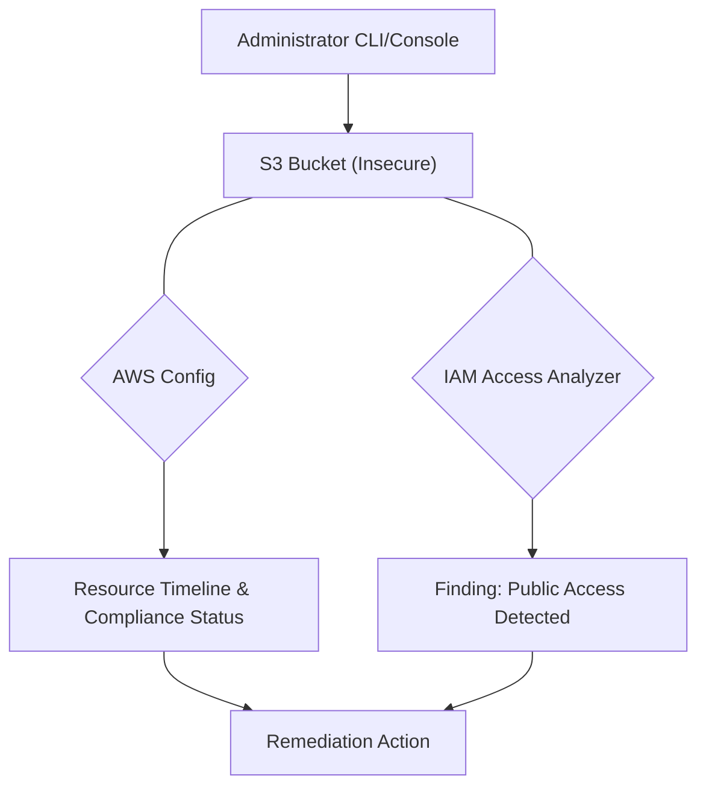

# Lab: Hardening AWS Infrastructure with AWS Config and IAM Access Analyzer

In this lab, you will take on the role of a SysOps Administrator responsible for enforcing security best practices. You will learn how to automate security auditing using AWS Config and identify public resource exposure using IAM Access Analyzer.

> [!WARNING] 
> This lab involves creating AWS resources. To avoid unexpected charges, follow the **Clean-Up / Teardown** instructions at the end.

## Prerequisites

- An **AWS Account** with administrative privileges.
- **AWS CLI** installed and configured (`aws configure`) with access keys for your account.
- Basic knowledge of **S3** and **IAM** policies.
- Region: Ensure you are working in a single region (e.g., `us-east-1`).

## Learning Objectives

- Enable and configure **AWS Config** to track resource changes.
- Deploy an **IAM Access Analyzer** to detect public access to resources.
- Identify and remediate a security misconfiguration (Public S3 Bucket) using both the **AWS CLI** and **AWS Management Console**.
- Validate security findings against the **AWS Well-Architected** security pillar.

## Architecture Overview



## Step-by-Step Instructions

### Step 1: Initialize AWS Config

AWS Config provides a detailed view of the configuration of AWS resources in your account. This includes how the resources are related to one another and how they were configured in the past.

```bash
# Check if a configuration recorder already exists
aws configservice describe-configuration-recorders
```

> [!TIP]
> If no recorder exists, you would typically use `aws configservice subscribe` but for this lab, we will ensure the recorder is started if it's already defined.

<details><summary>Console alternative</summary>
1. Navigate to <b>AWS Config</b> in the console.
2. Click <b>1nd-step setup</b> if it's your first time.
3. Ensure "Record all resources supported in this region" is checked.
4. Create an S3 bucket for logs as prompted and click <b>Next</b> and <b>Confirm</b>.
</details>

### Step 2: Create an Insecure S3 Bucket

To test our security tools, we need a resource that violates a policy. We will create a bucket and intentionally disable public access blocks.

```bash
# Replace <YOUR_UNIQUE_ID> with a random string
aws s3api create-bucket --bucket brainybee-security-lab-<YOUR_UNIQUE_ID> --region us-east-1

# Disable Public Access Block (Simulating a misconfiguration)
aws s3api delete-public-access-block --bucket brainybee-security-lab-<YOUR_UNIQUE_ID>
```

### Step 3: Create an IAM Access Analyzer

IAM Access Analyzer helps you identify the resources in your account, such as S3 buckets or IAM roles, that are shared with an external entity.

```bash
aws accessanalyzer create-analyzer --analyzer-name LabAnalyzer --type ACCOUNT
```

### Step 4: Analyze Findings

Once the analyzer is active, it will scan your resources. It may take 5-10 minutes to populate. 

```bash
# List findings from the analyzer
aws accessanalyzer list-findings --analyzer-arn <YOUR_ANALYZER_ARN>
```

<details><summary>Console alternative</summary>
1. Navigate to <b>IAM > Access Analyzer</b>.
2. Look under <b>Active Findings</b>.
3. You should see a finding for the S3 bucket created in Step 2 with an "Access Type" of <b>Public</b>.
</details>

## Checkpoints

| Checkpoint | Action | Expected Result |
| :--- | :--- | :--- |
| **AWS Config** | Run `aws configservice get-status` | `recording: true` |
| **S3 State** | Run `aws s3api get-public-access-block` | An error or empty block (indicating no protection) |
| **Access Analyzer** | Check Findings list | A finding indicating the bucket is public |

## Visual Concept: Security Guardrails

Below is a representation of how AWS Config and Access Analyzer act as layers of protection (Guardrails) around your data.

\begin{tikzpicture}[scale=0.8]
    \draw[thick, fill=blue!10] (0,0) circle (1.5cm);
    \node at (0,0) {\textbf{Your Data}};
    \draw[red, ultra thick] (0,0) circle (2.2cm);
    \node[red] at (0,2.5) {\textbf{Public Exposure Zone}};
    \draw[dashed, thick] (-3,-3) rectangle (3,3);
    \node at (0,3.3) {\textbf{AWS Account Boundary}};
    \draw[<->, blue, thick] (1.6,0) -- (2.1,0) node[midway, above, sloped] {\tiny Found by Access Analyzer};
\end{tikzpicture}

## Troubleshooting

| Error | Cause | Fix |
| :--- | :--- | :--- |
| `BucketAlreadyExists` | Name is not globally unique | Append a random string of numbers to the bucket name. |
| `AccessDenied` | Missing IAM permissions | Ensure your user has `IAMFullAccess` and `ConfigFullAccess`. |
| `No findings shown` | Scanning delay | IAM Access Analyzer scan is not instant. Wait 5-10 minutes and refresh. |

## Clean-Up / Teardown

To avoid ongoing costs, you must delete the resources created in this lab.

```bash
# 1. Delete the S3 Bucket (Empty it first if you added files)
aws s3 rb s3://brainybee-security-lab-<YOUR_UNIQUE_ID> --force

# 2. Delete the Analyzer
aws accessanalyzer delete-analyzer --analyzer-name LabAnalyzer

# 3. Stop Config Recording (Optional but recommended for cost)
aws configservice stop-configuration-recorder --configuration-recorder-name default
```

## Cost Estimate

- **AWS Config**: $0.003 per configuration item recorded. (Very low for this lab).
- **IAM Access Analyzer**: Free of charge in most regions.
- **S3**: Standard storage rates apply, but minimal if deleted immediately.