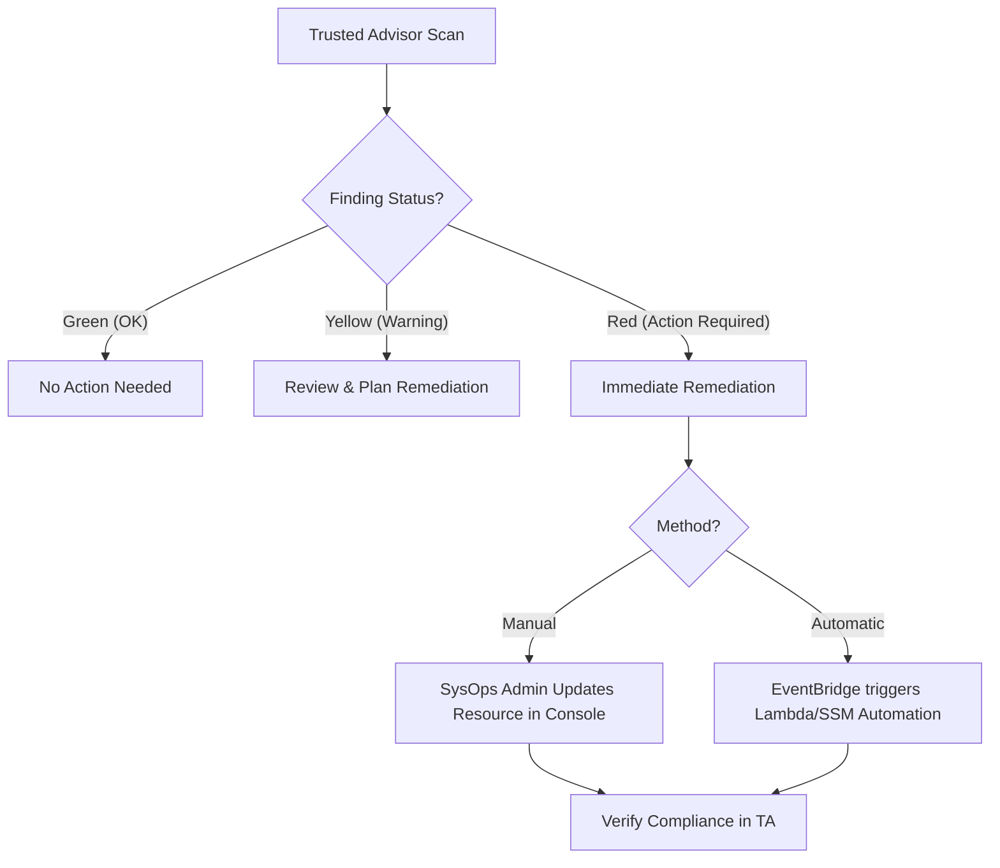

# AWS Trusted Advisor: Security Remediation and Best Practices

AWS Trusted Advisor (TA) acts as a customized cloud consultant, providing real-time guidance to help you provision your resources following AWS best practices. This guide focuses on interpreting security findings and implementing both manual and automated remediation strategies.

## Learning Objectives

By the end of this guide, you will be able to:
*   Identify the five main categories of AWS Trusted Advisor checks.
*   Distinguish between core security checks available to all accounts and full checks available to premium support tiers.
*   Describe the process of manual remediation via the AWS Console.
*   Implement automated remediation strategies using AWS Config, EventBridge, and Systems Manager.
*   Understand the role of AWS Firewall Manager in cross-account security group remediation.

## Key Terms & Glossary

*   **Trusted Advisor (TA):** An AWS service that inspects your environment and makes recommendations for saving money, improving system performance, and closing security gaps.
*   **Core Checks:** A limited set of checks available to all AWS customers regardless of support plan (e.g., S3 Bucket Permissions, MFA on Root Account).
*   **Full Suite:** Access to all 100+ checks across all categories, requiring Business, Enterprise On-Ramp, or Enterprise Support.
*   **Auto-Remediation:** The use of automated scripts or services (like AWS Config Rules or Lambda) to fix a non-compliant resource without human intervention.
*   **Drift:** When the actual configuration of a resource deviates from its intended or desired state.

## The "Big Idea"

Trusted Advisor is the **"Diagnostic Engine"** of the AWS environment. It does not fix problems itself; rather, it flags deviations from the **Well-Architected Framework**. Remediation is the "Treatment" phase, where a SysOps Administrator uses the TA report to trigger manual updates or automated workflows to bring the infrastructure back into a secure, optimized state.

## Formula / Concept Box

| Support Plan | Trusted Advisor Access Level | Security Checks Included |
| :--- | :--- | :--- |
| **Basic / Developer** | Core Checks Only | IAM Use, MFA on Root, Unrestricted Security Groups, S3 Permissions |
| **Business / Enterprise** | Full Suite (100+) | All Security checks (e.g., EBS Public Snapshots, RDS Public Snapshots, etc.) |

> [!IMPORTANT]
> If you are on a Basic support plan, you can see all **Service Limit** checks, but your **Security** checks are restricted to the 4 "Core" items listed above.

## Hierarchical Outline

*   **I. Trusted Advisor Categories**
    *   **Cost Optimization:** Identifies idle resources (e.g., unassociated Elastic IPs).
    *   **Performance:** Checks for high-utilization instances and service limits.
    *   **Security:** Focuses on permissions, encryption, and account-level safety.
    *   **Fault Tolerance:** Evaluates redundancy (e.g., Multi-AZ RDS).
    *   **Service Limits:** Tracks usage against account quotas.
*   **II. Remediation Workflows**
    *   **Manual Remediation:** Navigating to the specific resource (e.g., S3 console) to change settings based on a TA "Red" or "Yellow" status.
    *   **Automated Remediation:**
        *   **EventBridge + Lambda:** TA triggers an event $\rightarrow$ EventBridge catches it $\rightarrow$ Lambda runs code to fix it.
        *   **AWS Config:** Continuous monitoring and automated "Remediation Actions" via Systems Manager Automation documents.
*   **III. Multi-Account Remediation**
    *   **AWS Firewall Manager:** Centralized management of security groups across an Organization. Can automatically delete unused security groups if "Auto-remediation" is enabled.

## Visual Anchors

### Trusted Advisor Remediation Flow

### Security Group Remediation Logic

\begin{tikzpicture}[node distance=2cm, every node/.style={rectangle, draw, rounded corners, minimum height=1cm, text width=3.5cm, align=center}]

% Nodes
\node (finding) {TA Security Group Finding (Port 22 Open to 0.0.0.0/0)};
\node (eval) [below of=finding] {Evaluate Risk};
\node (fix) [below left of=eval, xshift=-1cm] {Manual Fix: Update SG Inbound Rules};
\node (auto) [below right of=eval, xshift=1cm] {Auto-Fix: AWS Config + SSM Document};
\node (result) [below of=eval, yshift=-2.5cm] {Compliant State};

% Paths
\draw [->, thick] (finding) -- (eval);
\draw [->, thick] (eval) -| (fix);
\draw [->, thick] (eval) -| (auto);
\draw [->, thick] (fix) |- (result);
\draw [->, thick] (auto) |- (result);

\end{tikzpicture}

## Definition-Example Pairs

*   **Unrestricted Security Groups:** A security group rule that allows traffic from any IP address (0.0.0.0/0) on sensitive ports.
    *   *Example:* A security group allowing SSH (Port 22) from the entire internet. TA flags this as a high-risk security finding.
*   **S3 Bucket Permissions:** A check that identifies buckets with public read or write access.
    *   *Example:* An S3 bucket containing customer logs that is accidentally set to "Public." TA identifies this so you can enable "Block Public Access."
*   **MFA on Root Account:** Verifies if the root user has multi-factor authentication enabled.
    *   *Example:* If a root account only uses a password, TA displays a red status. Remediation involves logging in as root and attaching a virtual or hardware MFA device.

## Worked Examples

### Problem: Remediating an Unrestricted S3 Bucket finding

1.  **Detection:** Open the **Trusted Advisor Console**. Under the "Security" tab, you see a Red check for "Amazon S3 Bucket Permissions."
2.  **Investigation:** Expand the finding to see the specific bucket name (e.g., `prod-data-12345`).
3.  **Manual Remediation:**
    *   Navigate to the **S3 Console**.
    *   Select the identified bucket.
    *   Go to the **Permissions** tab.
    *   Edit "Block public access (bucket settings)" and ensure all boxes are checked.
    *   Save changes.
4.  **Verification:** Return to Trusted Advisor and click the **Refresh** icon (circular arrow) next to the S3 check. The status should turn Green after a few minutes.

### Problem: Automating Security Group Fixes

1.  **Scenario:** You want to ensure that no developer can create a security group that allows port 3389 (RDP) from the world.
2.  **Implementation:**
    *   Enable **AWS Config**.
    *   Deploy the managed rule `restricted-common-ports`.
    *   Configure a **Remediation Action** using the Systems Manager document `AWS-CloseSecurityGroup`.
    *   Set the parameter `Port: 3389`.
3.  **Result:** As soon as Trusted Advisor/Config detects the open port, Systems Manager will automatically remove the offending rule.

## Checkpoint Questions

1.  Which Trusted Advisor category includes the "MFA on Root Account" check?
2.  What support plan is required to access the check for "Exposed Access Keys"?
3.  How does AWS Firewall Manager handle an unused security group if auto-remediation is enabled?
4.  Can Trusted Advisor automatically fix a missing DNS Firewall association? (Yes/No)
5.  What is the main advantage of using AWS Config remediation over manual fixes from the TA console?

Click to see Answers

1. **Security**.
2. **Business or Enterprise** (This is part of the full suite, not core checks).
3. It will remediate the issue by **removing the unused security group**.
4. **No**. According to the source, remediation efforts for DNS Firewall findings are manual.
5. **Speed and consistency**. It eliminates human error and reduces the "Mean Time to Repair" (MTTR) by fixing the issue the moment it is detected.

