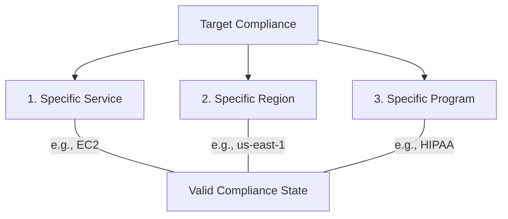
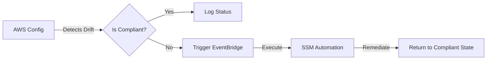

# Curriculum Overview: Enforcing AWS Compliance Requirements

Welcome to the curriculum overview for **Enforcing AWS Compliance Requirements**. As a CloudOps Engineer or SysOps Administrator, you are tasked with ensuring that your organization's cloud infrastructure adheres to industry frameworks and internal policies. This curriculum is designed to map to the AWS Certified SysOps Administrator (SOA-C03) exam domains, specifically focusing on Security and Compliance.

## Prerequisites

Before diving into this curriculum, learners should have a solid foundation in the following areas:

*   **Cloud Computing Fundamentals:** Understanding of basic cloud concepts, including IaaS, PaaS, and SaaS.
*   **AWS Global Infrastructure:** Familiarity with AWS Regions, Availability Zones (AZs), and edge locations.
*   **Basic Security Concepts:** Understanding of the Principle of Least Privilege, encryption at rest versus in transit, and multi-factor authentication (MFA).
*   **IAM Basics:** Hands-on experience creating IAM users, groups, roles, and applying identity-based policies.

> [!IMPORTANT]
> **Out of Scope for SysOps:** You are *not* expected to define security, compliance, or governance requirements from scratch, nor are you expected to design complex hybrid networking. Your role is to **implement and enforce** the requirements handed down by security and compliance teams.

## Module Breakdown

This curriculum is divided into three progressive modules that take you from foundational concepts to automated enforcement mechanisms.

| Module | Title | Difficulty | Core Services Focus |
| :--- | :--- | :--- | :--- |
| **Module 1** | The Dimensions of Cloud Compliance | Beginner | Shared Responsibility Model, AWS Artifact |
| **Module 2** | Auditing and Visibility | Intermediate | CloudTrail, Audit Manager, Trusted Advisor |
| **Module 3** | Automated Enforcement & Remediation | Advanced | AWS Config, Security Hub, Systems Manager |

## Learning Objectives per Module

### Module 1: The Dimensions of Cloud Compliance

Compliance in the cloud is not a simple binary state. It relies heavily on the **Shared Responsibility Model** and requires alignment across specific dimensions.

*   **Analyze the Shared Responsibility Model:** Clearly delineate between "Security OF the Cloud" (AWS's responsibility) and "Security IN the Cloud" (Customer's responsibility).
*   **Evaluate the Three Dimensions of Compliance:** Recognize that compliance is certified by **Region**, by **Service**, and by **Program**.
*   **Retrieve Compliance Documentation:** Use AWS Artifact to download third-party auditor reports, certifications, and attestations.

### Module 2: Auditing and Visibility

You cannot enforce what you cannot see. This module focuses on gaining deep visibility into account activity and resource configurations.

*   **Track User and API Activity:** Implement and query AWS CloudTrail logs to track who made changes, when, and from where.
*   **Implement Continuous Auditing:** Utilize AWS Audit Manager to continuously map AWS usage to specific compliance frameworks (e.g., GDPR, PCI DSS).
*   **Assess Security Posture:** Run AWS Trusted Advisor security checks and implement immediate remediation based on its findings.

> [!WARNING] 
> **Common Pitfall:** Assuming that because a service like Amazon S3 is HIPAA-compliant in `us-east-1`, it is automatically compliant in a newer region like `af-south-1`. You must verify compliance on a per-region, per-service basis.

### Module 3: Automated Enforcement & Remediation

Manual compliance checks do not scale. This final module focuses on leveraging event-driven architectures to enforce compliance autonomously.

*   **Detect Configuration Drift:** Deploy AWS Config to monitor resource configurations against desired state rules.
*   **Automate Remediation:** Link AWS Config rule violations to AWS Systems Manager (SSM) Automation runbooks to auto-remediate non-compliant resources.
*   **Centralize Security Alerts:** Use AWS Security Hub and Amazon GuardDuty to aggregate security findings across multiple accounts.

## Success Metrics

To ensure mastery of this curriculum, learners will be evaluated against the following success metrics:

1.  **Conceptual Accuracy:** Successfully map 100% of a given list of tasks to either the Customer or AWS under the Shared Responsibility Model.
2.  **Implementation Proficiency:** Successfully deploy an AWS Config rule that restricts resource deployment to specific, compliant AWS Regions (e.g., `eu-central-1` for GDPR boundaries).
3.  **Automation Readiness:** Build a working EventBridge and Systems Manager workflow that automatically encrypts an unencrypted S3 bucket within 60 seconds of its creation.

Conceptually, total security posture can be represented by ensuring controls exist at every layer:

$$ \text{Total Compliance Posture} = \sum_{i=1}^{n} (\text{Service Config}_i \times \text{Regional Policy}_i \times \text{Framework Alignment}_i) $$

## Real-World Application

Understanding how to enforce compliance requirements is critical for large international corporations navigating complex regulatory environments.

For example, if an enterprise must comply with the **General Data Protection Regulation (GDPR)**, they are legally required to maintain data sovereignty (ensuring European citizen data does not leave Europe). As a CloudOps Engineer, you won't write the legal policy, but you *will* implement Service Control Policies (SCPs) and AWS Config rules that mathematically enforce the policy by physically preventing developers from spinning up EC2 instances or S3 buckets outside of authorized European AWS Regions.

By mastering these tools, you transform abstract legal and compliance requirements into tangible, unbreakable technical guardrails.