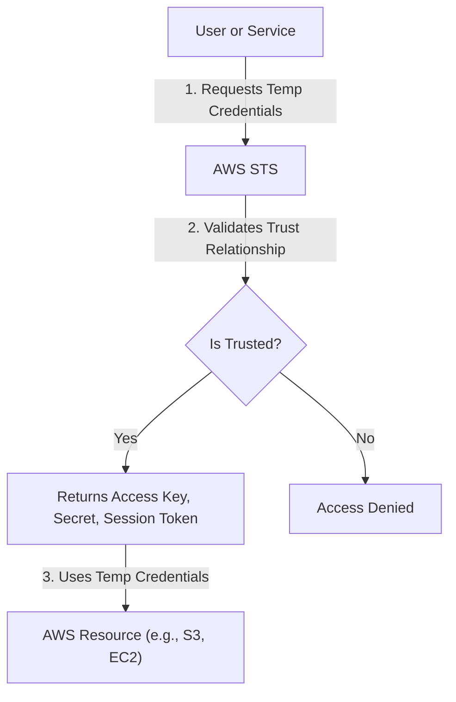

# Mastering AWS Identity and Access Management (IAM)

This study guide focuses on implementing core security controls within AWS, covering user authentication, authorization logic, and identity federation as required for the SysOps Administrator exam.

## Learning Objectives

By the end of this guide, you should be able to:
- Implement **Multi-Factor Authentication (MFA)** and account-level **password policies**.
- Distinguish between **Root user** tasks and standard administrator tasks.
- Configure **IAM Roles** and understand the role of the **Security Token Service (STS)**.
- Implement **Identity Federation** using SAML 2.0 and OIDC.
- Apply **Resource-based policies** and **Policy Conditions** to enforce security constraints.

## Key Terms & Glossary

- **Root User:** The single identity created when the AWS account is first opened. It has complete, unrestricted access to all resources.
- **MFA (Multi-Factor Authentication):** A security requirement that adds an extra layer of protection (something you know + something you have) to the sign-in process.
- **STS (Security Token Service):** A web service that enables you to request temporary, limited-privilege credentials for users.
- **Identity Federation:** A mechanism that allows users from one organization to access resources in another organization (or AWS) without creating local IAM users.
- **Least Privilege:** The security principle of granting only the minimum permissions necessary to perform a task.

## The "Big Idea"

IAM is the **foundation of security** in AWS. It is not just about passwords; it is the central mechanism that governs how every entity (human or machine) interacts with AWS resources. The goal is to move away from long-term credentials (passwords/access keys) toward **temporary, role-based access** governed by strict conditions.

## Formula / Concept Box

### IAM Policy Structure

An IAM Policy is a JSON document defined by these core elements:

| Element | Description | Example |
| :--- | :--- | :--- |
| **Effect** | Whether the policy allows or denies access. | `"Effect": "Allow"` |
| **Action** | The specific API calls permitted. | `"Action": "s3:ListBucket"` |
| **Resource** | The specific AWS resources the action applies to. | `"Resource": "arn:aws:s3:::my-bucket"` |
| **Condition** | Optional: When the policy is in effect. | `"Condition": {"IpAddress": {"aws:SourceIp": "1.2.3.4/32"}}` |

## Hierarchical Outline

- **Account Security & Root Management**
    - **Root Account Best Practices:** Avoid daily use; enable MFA; secure the "break-glass" credentials.
    - **Tasks Requiring Root:** Closing account, changing support plans, editing billing access, and changing account settings.
    - **Password Policies:** Setting complexity requirements (length, character types) at the account level.
- **Identity Management**
    - **IAM Users vs. Groups:** Assigning permissions to groups to simplify management.
    - **IAM Roles:** Used for temporary access by EC2 instances, Lambda, or cross-account users.
    - **IAM Roles Anywhere:** Extending IAM trust to workloads running outside of AWS (on-premises).
- **Advanced Access Control**
    - **Resource-Based Policies:** Attaching permissions directly to a resource (e.g., S3 Bucket Policies).
    - **Policy Evaluation Logic:** Explicit Deny > Explicit Allow > Default Deny.
    - **Federation:** Using **SAML 2.0** for corporate directories or **OIDC** for web identities (Google/Facebook).

## Visual Anchors

### IAM Role Assumption Flow



### Policy Logic Evaluation

```tikz
\begin{tikzpicture}[node distance=2cm, every node/.style={draw, rectangle, fill=blue!10, text centered, minimum height=1em}]
\node (start) {Start Request};
\node (deny) [below of=start] {Any Explicit Deny?};
\node (allow) [below of=deny] {Any Explicit Allow?};
\node (final_deny) [right of=deny, xshift=3cm, fill=red!20] {DENY ACCESS};
\node (final_allow) [below of=allow, fill=green!20] {ALLOW ACCESS};

\draw [->] (start) -- (deny);
\draw [->] (deny) -- node[anchor=south] {Yes} (final_deny);
\draw [->] (deny) -- node[anchor=right] {No} (allow);
\draw [->] (allow) -- node[anchor=south] {No} (final_deny);
\draw [->] (allow) -- node[anchor=right] {Yes} (final_allow);
\end{tikzpicture}
```

## Definition-Example Pairs

- **Condition Keys:** Variables used in policies to restrict access based on context.
    - *Example:* Restricting an administrator's ability to delete S3 objects unless they have authenticated via MFA (`"aws:MultiFactorAuthPresent": "true"`).
- **Trust Relationship:** A policy attached to a Role that defines *who* can assume it.
    - *Example:* An EC2 Role has a trust policy allowing the `ec2.amazonaws.com` service to call `sts:AssumeRole`.
- **Service-Linked Role:** A predefined IAM role that includes all permissions required by an AWS service to call other AWS services on your behalf.
    - *Example:* `AWSServiceRoleForAutoScaling` allows Auto Scaling to manage EC2 instances for you.

## Worked Examples

### Example 1: Enforcing MFA for S3 Deletion
**Problem:** You want to ensure that no one can delete objects in a production S3 bucket unless they are logged in with MFA.
**Solution:** Apply a Bucket Policy with a `Deny` effect and a condition.

```json
{
  "Version": "2012-10-17",
  "Statement": [
    {
      "Sid": "DenyDeleteWithoutMFA",
      "Effect": "Deny",
      "Action": "s3:DeleteObject",
      "Resource": "arn:aws:s3:::prod-data-bucket/*",
      "Condition": {
        "BoolIfExists": {"aws:MultiFactorAuthPresent": "false"}
      }
    }
  ]
}
```

### Example 2: IAM Role for EC2
**Problem:** An application on EC2 needs to read from a DynamoDB table. 
**Steps:**
1.  **Create Policy:** Define a policy with `dynamodb:GetItem` and `dynamodb:Query` permissions.
2.  **Create Role:** Create an IAM Role and attach the policy.
3.  **Trust Entity:** Ensure the Role allows `ec2.amazonaws.com` to assume it.
4.  **Attach Profile:** Attach the IAM Instance Profile to the EC2 instance. The application can now use the AWS SDK to get credentials automatically from the Instance Metadata Service (IMDS).

## Checkpoint Questions

1.  Which tasks **require** the use of the AWS Root user? 
    - *Answer: Closing the account, changing account settings, modifying billing access, and registering as a seller in the EC2 Reserved Instance marketplace.*
2.  If an IAM policy has an `Allow` for `s3:*` but a Resource-based policy has a `Deny` for `s3:DeleteBucket`, can the user delete the bucket?
    - *Answer: No. An explicit Deny always overrides an Allow.*
3.  What is the main advantage of using CloudShell for CLI commands?
    - *Answer: It provides a pre-authenticated CLI environment, removing the need to store long-term Access Keys on a local machine.*
4.  True or False: IAM Password Policies apply to the Root User.
    - *Answer: False. The Root account falls outside the scope of IAM management.*