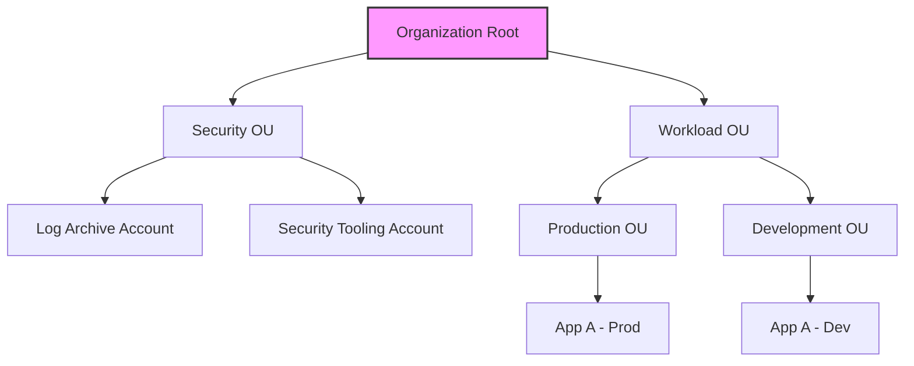

# Secure Multi-Account Strategies in AWS

This guide covers the essential strategies for managing multiple AWS accounts securely, focusing on centralized governance, policy enforcement, and auditing as required for the AWS Certified SysOps Administrator Associate (SOA-C03) exam.

## Learning Objectives

*   **Define AWS Organizations** and its role in centralizing account management.
*   **Implement Service Control Policies (SCPs)** to establish security guardrails across an entire organization.
*   **Explain AWS Control Tower** and the concept of a "Landing Zone."
*   **Audit Cross-Account Access** using IAM Access Analyzer to identify resources shared outside the zone of trust.
*   **Apply Best Practices** for root account protection and multi-factor authentication (MFA) in a multi-account environment.

## Key Terms & Glossary

*   **AWS Organizations**: An account management service that enables you to consolidate multiple AWS accounts into an organization that you create and centrally manage.
*   **Service Control Policy (SCP)**: A type of organization policy used to manage permissions in your organization, offering central control over the maximum available permissions for all accounts.
*   **Organizational Unit (OU)**: A container for accounts within an organization. OUs can contain other OUs, creating a hierarchy.
*   **Management Account**: The account used to create the organization. it has administrative control and handles consolidated billing.
*   **Landing Zone**: A well-architected, multi-account AWS environment that is a starting point from which you can deploy workloads and applications.
*   **Zone of Trust**: In IAM Access Analyzer, the boundary (account or organization) within which resource access is considered internal and trusted.

## The "Big Idea"

Scaling in the cloud inevitably leads to a multi-account environment. Using a single account for everything creates a massive "blast radius"—if that account is compromised, everything is lost. **Secure multi-account strategies** shift the focus from protecting a single perimeter to creating a structured hierarchy where security, billing, and compliance are managed centrally, while workloads are isolated into specific accounts based on their function (e.g., Production, Development, Logging).

## Formula / Concept Box

### SCP Permission Evaluation

Permissions for a user in a member account are the **intersection** of what is allowed by the SCP and what is allowed by the IAM policy.

| Policy Type | Logic | Effect on User |
| :--- | :--- | :--- |
| **IAM Policy** | Allow S3:PutObject | User can upload to S3. |
| **SCP** | Deny S3:* | User **cannot** access S3 at all (Deny overrides Allow). |
| **SCP** | Allow EC2:* | User still needs an **IAM Allow** to actually use EC2. |

> [!IMPORTANT]
> SCPs act as a filter. They do not grant permissions; they define the maximum ceiling of permissions available to accounts or OUs.

## Hierarchical Outline

*   **AWS Organizations Fundamentals**
    *   **Management Account**: Controls billing and policy distribution; should be highly restricted.
    *   **Member Accounts**: Where workloads reside; governed by the Management account.
    *   **Consolidated Billing**: All member account costs are rolled up to the Management account for volume discounts.
*   **Governance via Service Control Policies (SCPs)**
    *   **Inheritance**: Policies applied to the Root apply to all OUs/Accounts; policies applied to an OU apply to all child accounts.
    *   **The FullAWSAccess Rule**: By default, Organizations attaches this to every node. Secure strategies often involve replacing this with specific Allow/Deny lists.
*   **AWS Control Tower**
    *   **Automation**: Automates the setup of a new Landing Zone using AWS best practices.
    *   **Guardrails**: Implements SCPs (Preventive) and AWS Config Rules (Detective) automatically.
*   **Auditing and Access Analysis**
    *   **IAM Access Analyzer**: Uses automated reasoning to find resources (S3 buckets, IAM roles) shared with external entities.
    *   **CloudTrail**: Must be enabled at the Organization level to capture activity across all accounts in a single S3 bucket.

## Visual Anchors

### Organizational Hierarchy



### The Intersection of Permissions

This diagram illustrates how SCPs and IAM policies interact to determine the effective permissions of a user.

\begin{tikzpicture}
    \draw[fill=blue, opacity=0.3] (0,0) circle (2cm);
    \draw[fill=red, opacity=0.3] (2,0) circle (2cm);
    \node at (-0.8,0) {\textbf{SCP Allow}};
    \node at (2.8,0) {\textbf{IAM Allow}};
    \node at (1,0) [align=center] {\textbf{Effective}\\ \textbf{Access}};
    \draw[thick] (0,0) circle (2cm);
    \draw[thick] (2,0) circle (2cm);
\end{tikzpicture}

## Definition-Example Pairs

*   **Preventive Guardrail**: A control that prevents an action from happening in the first place.
    *   *Example*: Using an SCP to prevent any member account from disabling CloudTrail or deleting the Log Archive S3 bucket.
*   **Detective Guardrail**: A control that monitors for non-compliance and alerts an administrator.
    *   *Example*: An AWS Config rule that flags any EC2 instance that does not have an "Owner" tag.
*   **Zone of Trust**: The logical boundary used by IAM Access Analyzer to differentiate between internal and external access.
    *   *Example*: Setting the Zone of Trust to the **Organization** ID so that access between Account A and Account B (both in the same Org) is ignored, but access from an unknown Account C is flagged.

## Worked Examples

### Example 1: Restricting AWS Regions
**Scenario**: A company only operates in `us-east-1`. They want to ensure no resources are accidentally launched in other regions to save costs and maintain compliance.

**Solution**: Apply the following SCP to the Organization Root:

```json
{
  "Version": "2012-10-17",
  "Statement": [
    {
      "Sid": "DenyAllOutsideUSEast1",
      "Effect": "Deny",
      "NotAction": [
        "iam:*",
        "organizations:*",
        "route53:*",
        "budgets:*"
      ],
      "Resource": "*",
      "Condition": {
        "StringNotEquals": {
          "aws:RequestedRegion": ["us-east-1"]
        }
      }
    }
  ]
}
```
*Note: Global services like IAM and Route 53 must be excluded from the regional restriction.*

### Example 2: IAM Access Analyzer Findings
**Scenario**: You run an Access Analyzer in the Security account. It reports that an S3 bucket in a Dev account has `"Principal": "*"` in its bucket policy.

**Steps**:
1.  **Analyze**: Access Analyzer uses mathematical proofs to determine this allows anyone on the internet to read the data.
2.  **Verify**: Log into the Dev account and check the bucket policy.
3.  **Remediate**: Update the policy to restrict access to specific IAM roles or the Organization ID using the `aws:PrincipalOrgID` condition.

## Checkpoint Questions

1.  **If an SCP denies `s3:PutObject` but an IAM policy allows it, can the user upload a file?**
    *   *Answer*: No. An explicit Deny in an SCP always overrides an Allow in an IAM policy.
2.  **What is the minimum number of accounts recommended for a basic AWS Landing Zone?**
    *   *Answer*: Usually three: Management, Log Archive, and Security Tooling.
3.  **Does an SCP apply to the Root User of a member account?**
    *   *Answer*: Yes. Unlike IAM policies, SCPs affect all users in a member account, including the root user.
4.  **Which service should you use to automate the creation of new accounts with pre-configured VPCs and security settings?**
    *   *Answer*: AWS Control Tower.
5.  **How is IAM Access Analyzer priced?**
    *   *Answer*: It is offered at no additional charge; you only pay for the underlying resources it may interact with (like CloudTrail if integrated).