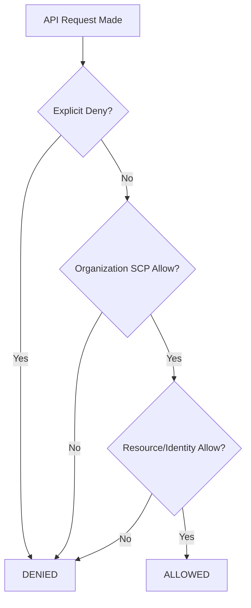

# Mastering AWS Security and Compliance: SysOps Administrator Guide

This guide covers Domain 4 of the AWS Certified SysOps Administrator - Associate (SOA-C03) exam, focusing on implementing and managing security tools, identity, and compliance policies across single and multi-account environments.

## Learning Objectives

By the end of this module, you will be able to:
*   Implement granular access control using **IAM policies**, **roles**, and **MFA**.
*   Audit and troubleshoot access issues using **IAM Policy Simulator** and **CloudTrail**.
*   Manage security at scale using **AWS Organizations** and **Service Control Policies (SCPs)**.
*   Monitor resource compliance via **AWS Config**, **Security Hub**, and **AWS Trusted Advisor**.
*   Protect sensitive data using **AWS KMS** and **Secrets Manager**.

## Key Terms & Glossary

*   **IAM Role**: An identity with specific permissions that can be assumed by users, applications, or services. Unlike a user, it does not have long-term credentials.
*   **Service Control Policy (SCP)**: A type of organization policy used to manage permissions in your organization, acting as a guardrail rather than granting permissions.
*   **AWS Config**: A service that enables you to assess, audit, and evaluate the configurations of your AWS resources.
*   **IAM Access Analyzer**: A tool that helps identify the resources in your account that are shared with an external entity.
*   **Least Privilege**: The security practice of providing a user or service only the minimum levels of access necessary to perform its job.

## The "Big Idea"

In AWS, security is a **Shared Responsibility**. While AWS manages the security *of* the cloud, the SysOps Administrator is responsible for security *in* the cloud. The "Big Idea" here is the shift from manual perimeter security to **automated, policy-driven governance**. Instead of checking boxes, you implement code-based guardrails (SCPs) and continuous monitoring (AWS Config) to ensure the environment remains compliant even as it scales.

## Formula / Concept Box

### IAM Policy Evaluation Logic

When a request is made, AWS evaluates policies in the following order of precedence. **Important:** An explicit "Deny" always overrides an "Allow."

| Order | Policy Type | Description |
| :--- | :--- | :--- |
| 1 | **Explicit Deny** | If any policy has a Deny statement, the request is rejected immediately. |
| 2 | **SCP** | Guardrail for the account; if it doesn't allow the action, it is denied. |
| 3 | **Resource-based Policy** | (e.g., S3 Bucket Policy) Can allow access to a specific resource. |
| 4 | **Identity-based Policy** | Permissions attached to the User/Role making the request. |
| 5 | **Implicit Deny** | The default state. If no explicit "Allow" is found, access is denied. |

## Hierarchical Outline

*   **Identity and Access Management (IAM)**
    *   **MFA (Multi-Factor Authentication)**: Mandatory for privileged accounts (Root/Admin).
    *   **Roles & Federation**: Use SAML or OIDC to provide temporary access to external identities.
    *   **Policy Conditions**: Use `Condition` blocks to restrict access by IP, Time, or Tag (e.g., `aws:SourceIp`).
*   **Multi-Account Management**
    *   **AWS Organizations**: Centralized billing and account grouping (OUs).
    *   **Service Control Policies (SCPs)**: Restrict actions (like preventing an account from leaving the org) regardless of IAM permissions.
    *   **Control Tower**: Orchestrates multiple accounts with "Guardrails" (pre-configured SCPs).
*   **Auditing and Compliance Tools**
    *   **AWS CloudTrail**: The "Who, What, When, Where" of API calls.
    *   **AWS Config Rules**: Automatic remediation (e.g., if an S3 bucket is public, Config triggers a Lambda to make it private).
    *   **AWS Trusted Advisor**: Checks for security gaps (open ports, MFA not enabled on root).
*   **Data Protection**
    *   **KMS**: Encryption at rest; manages Customer Master Keys (CMKs).
    *   **Secrets Manager**: Securely stores and **automatically rotates** database credentials.

## Visual Anchors

### IAM Request Flow



### Organizational Hierarchy

```tikz
\usetikzlibrary{trees, positioning, shapes.geometric}
\begin{tikzpicture}[level distance=1.5cm, 
  level 1/.style={sibling distance=4cm}, 
  level 2/.style={sibling distance=2cm}]
  \node[draw, rectangle] {Organization Root (Master)} 
    child {node[draw, rectangle] {Production OU}
      child {node[draw, circle] {App Account 1}}
      child {node[draw, circle] {App Account 2}}
    }
    child {node[draw, rectangle] {Sandbox OU}
      child {node[draw, circle] {Dev Account}}
    };
\end{tikzpicture}
```

## Definition-Example Pairs

*   **Term**: **IAM Policy Condition**
    *   **Definition**: A field in an IAM policy that specifies when the policy is in effect.
    *   **Example**: Allowing an administrator to terminate EC2 instances *only* if they are connected via the corporate VPN (matching `aws:SourceIp`).

*   **Term**: **Remediation Action**
    *   **Definition**: An automated task triggered by a compliance violation.
    *   **Example**: If **AWS Config** detects an EBS volume is not encrypted, it triggers an **SSM Automation Runbook** to stop the instance and alert the owner.

*   **Term**: **Cross-Account Role**
    *   **Definition**: A role in Account B that trusts Account A, allowing users in A to perform actions in B.
    *   **Example**: A centralized Security Account using a role to pull **CloudTrail** logs from all child accounts in the organization.

## Worked Examples

### Troubleshooting "Access Denied" with IAM Policy Simulator

**Scenario**: A developer cannot upload objects to an S3 bucket even though they have an `S3FullAccess` policy.

1.  **Open IAM Policy Simulator**: Select the User and the S3 `PutObject` action.
2.  **Run Simulation**: The simulator returns "Denied by Resource-based Policy."
3.  **Analysis**: You check the S3 Bucket Policy and find an explicit `Deny` for any request not using HTTPS.
4.  **Resolution**: Update the developer's CLI configuration to use SSL or update the bucket policy if necessary.

### Implementing Automatic Secret Rotation

**Scenario**: You need to ensure RDS database passwords are changed every 30 days.

1.  **Store Secret**: Add the RDS credentials to **AWS Secrets Manager**.
2.  **Enable Rotation**: Select "Rotation" in the console and choose a 30-day window.
3.  **Lambda Function**: AWS creates a Lambda function that logs into the RDS instance, changes the password, and updates the secret simultaneously.
4.  **Application Access**: The application code calls `get_secret_value` rather than hardcoding the password, ensuring zero downtime during rotation.

## Checkpoint Questions

1.  Which service would you use to find out which IAM user deleted an EC2 instance at 3:00 PM yesterday?
2.  Does an IAM user with `AdministratorAccess` have permission to perform actions forbidden by a Service Control Policy (SCP) at the root level?
3.  How does **AWS Config** differ from **AWS CloudTrail** in terms of tracking changes?
4.  You need to share an unencrypted Amazon Machine Image (AMI) with another AWS account. What service helps you manage the cross-account permissions?

<details>
<summary>Click to see answers</summary>

1.  **AWS CloudTrail** (it records API event history).
2.  **No**. SCPs act as a filter; if an action is denied by the SCP, no user in that account (not even Root) can perform it.
3.  **CloudTrail** tracks *who* did it (events), whereas **AWS Config** tracks the *resulting state* of the resource (configuration history).
4.  **IAM** (Resource-based policy on the AMI) and potentially **AWS RAM** (Resource Access Manager) for broader sharing.

</details>