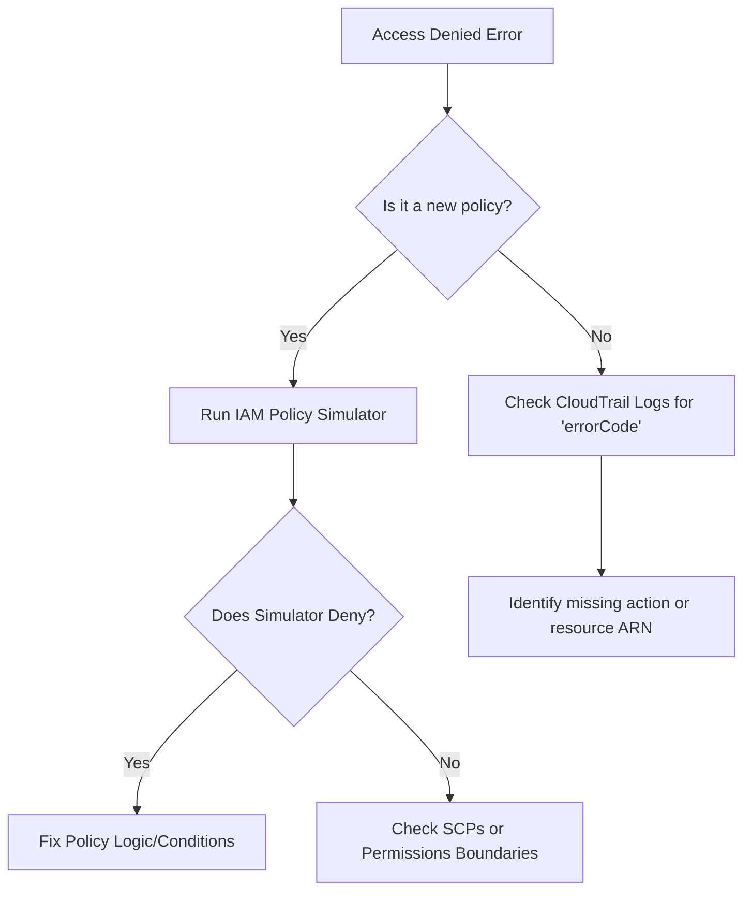

# Troubleshooting and Auditing AWS Access

This guide focuses on the critical tools and methodologies used to secure, audit, and troubleshoot identity and access management within AWS environments, specifically for the SysOps Administrator Associate (SOA-C03) exam.

## Learning Objectives
After studying this guide, you should be able to:
* **Differentiate** between proactive (Access Analyzer) and reactive (CloudTrail) auditing tools.
* **Utilize** the IAM Policy Simulator to diagnose specific "Access Denied" errors.
* **Explain** the concept of "Automated Reasoning" used by IAM Access Analyzer.
* **Audit** resource-based policies for external or unintended access using Zones of Trust.

## Key Terms & Glossary
* **Zone of Trust**: The boundary (either an AWS Account or an Organization) within which IAM Access Analyzer considers access to be "trusted."
* **Automated Reasoning**: A mathematical technique used by Access Analyzer to prove all possible paths of access allowed by a policy.
* **Trail**: A configuration that enables delivery of CloudTrail events to an Amazon S3 bucket.
* **Finding**: A specific instance identified by Access Analyzer where a resource is accessible by a principal outside the Zone of Trust.
* **Principal**: An entity (user, role, or service) that is allowed or denied access to a resource.

## The "Big Idea"
In AWS, security is not just about writing policies; it is about **continuous validation**. Effective administration requires a two-pronged approach: **Auditing** (verifying who *can* access resources) and **Troubleshooting** (identifying why a specific request *failed* or *succeeded*). By moving from reactive logs (CloudTrail) to proactive proofs (Access Analyzer), administrators can achieve a state of "Least Privilege" with mathematical certainty.

## Formula / Concept Box
| Tool | Primary Function | Logic Type | Best Used For... |
| :--- | :--- | :--- | :--- |
| **AWS CloudTrail** | API Auditing | Historical / Event-based | "Who deleted this S3 bucket at 2 PM?" |
| **IAM Access Analyzer** | Resource Auditing | Mathematical Proofs | "Is this KMS key accessible by anyone outside my org?" |
| **IAM Policy Simulator** | Permission Testing | Rule-based Simulation | "Why can't this user start an EC2 instance?" |

## Hierarchical Outline
* **I. Proactive Auditing: IAM Access Analyzer**
    * **Core Function**: Identifies resources shared outside the **Zone of Trust**.
    * **Mechanism**: Uses **Automated Reasoning** to turn policies into mathematical proofs.
    * **Regional Scope**: Analyzers are **Region-specific**; you must create one in every region you wish to monitor.
    * **Supported Resources**: S3 Buckets, IAM Roles, KMS Keys, Lambda functions, SQS queues, and Secrets Manager secrets.
* **II. Reactive Auditing: AWS CloudTrail**
    * **Visibility**: Records API calls made via the Management Console, CLI, and SDKs.
    * **Management Events**: Operations on resources (e.g., `RunInstances`).
    * **Data Events**: High-volume operations *within* resources (e.g., `GetObject`).
* **III. Troubleshooting: IAM Policy Simulator**
    * **Testing Environment**: Tests policies without actually performing the actions.
    * **Logic**: Evaluates Identity-based, Resource-based, and Permissions Boundaries simultaneously.
    * **Best Practice**: Use it to validate complex `Condition` blocks in policies.

## Visual Anchors

### Access Troubleshooting Flow

### The Zone of Trust Concept
\begin{tikzpicture}
[outline/.style={draw=black, thick, fill=blue!10, rounded corners}, 
external/.style={draw=red, thick, fill=red!10, dashed, circle}]

\draw[outline] (0,0) rectangle (6,4);
\node at (3,3.5) {\textbf{Zone of Trust (Account/Org)}};

\node[draw, fill=white] (res1) at (1.5,1.5) {S3 Bucket};
\node[draw, fill=white] (res2) at (4.5,1.5) {KMS Key};

\node[external] (ext) at (8,2) {External Entity};

\draw[->, red, ultra thick] (ext) -- (res2) node[midway, above, sloped] {\textbf{Finding!}};
\draw[->, green, thick] (1.5,3) -- (res1) node[midway, right] {Internal Access (OK)};

\end{tikzpicture}

## Definition-Example Pairs
* **Policy Validation**: The process of checking policy syntax and AWS best practices during creation.
    * *Example*: Access Analyzer flags a policy because it uses a wildcard `*` for a sensitive action like `iam:PassRole` without a condition.
* **Service Control Policy (SCP)**: An organization-level policy used to manage the maximum available permissions for accounts.
    * *Example*: An SCP denies all access to `us-west-1`. Even if a user has an `AdministratorAccess` policy, they cannot launch resources in that region.
* **Permissions Boundary**: A managed policy that sets the maximum permissions an identity-based policy can grant to an IAM entity.
    * *Example*: A junior admin is given a boundary that prevents them from deleting S3 buckets, even if their main role allows `s3:*`.

## Worked Examples

### Scenario: The "Invisible" S3 Access
**Problem**: A SysOps admin discovers an S3 bucket is public, but looking at the IAM user policies shows no one has `s3:PutBucketPolicy` rights.

**Troubleshooting Step 1 (CloudTrail)**:
* Search CloudTrail events for `PutBucketPolicy` for the last 7 days.
* **Finding**: The action was performed by an EC2 Instance Role using temporary credentials.

**Troubleshooting Step 2 (Access Analyzer)**:
* Check the Access Analyzer findings for the S3 bucket.
* **Insight**: The analyzer marks the bucket as "Public" and shows the specific statement in the Resource-based policy (Bucket Policy) allowing `Principal: *`.

**Resolution**:
* Modify the Bucket Policy to restrict access to a specific VPC Endpoint and update the EC2 Role to use the principle of least privilege.

## Checkpoint Questions
1. True or False: IAM Access Analyzer requires you to enable CloudTrail to generate findings.
2. In the IAM Policy Simulator, if a request is denied, does it tell you which specific policy (Identity, SCP, or Boundary) caused the denial?
3. Why is IAM Access Analyzer considered a "regional" tool if IAM itself is global?
4. What is the typical latency for an S3 Public Access finding to appear in Access Analyzer?

Click to see Answers

1. **False**. It uses automated reasoning (mathematical logic) on the policies themselves, not log files.
2. **Yes**. The simulator explicitly lists which policy and which statement within that policy resulted in a 'Deny'.
3. **Because it monitors regional resources** (like S3 buckets and KMS keys) and creates findings per region, even though the IAM identities are global.
4. It normally generates findings in **30 minutes**, but S3 block public access settings can take **up to six hours** to update.

