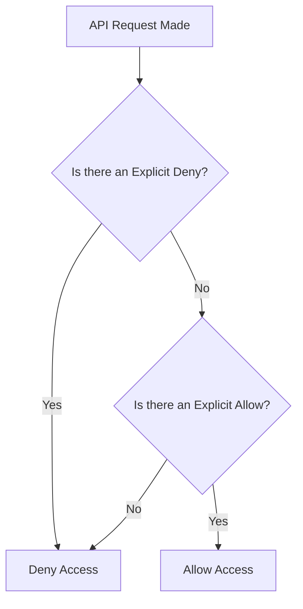

# Identity and Access Management (IAM) 

AWS Identity and Access Management (IAM) is a foundational service that provides fine-grained control over access to AWS resources. It is the gatekeeper of the AWS Cloud, processing approximately 500 million API requests per second to determine who can access what, and under which conditions.

## Learning Objectives
After studying this guide, you should be able to:
*   **Distinguish** between authentication (identity) and authorization (permissions).
*   **Implement** the Principle of Least Privilege using identity-based and resource-based policies.
*   **Manage** IAM identities including Users, Groups, and Roles for different use cases.
*   **Troubleshoot** permission issues using the IAM Policy Simulator and Access Analyzer.
*   **Secure** accounts using Multi-Factor Authentication (MFA) and strong password policies.

## Key Terms & Glossary
*   **IAM User**: An entity that you create in AWS to represent the person or application that uses it to interact with AWS.
*   **IAM Group**: A collection of IAM users. You can specify permissions for a group, which makes those permissions easier to manage for multiple users.
*   **IAM Role**: An identity you can create in your account that has specific permissions. Unlike a user, a role does not have unique long-term credentials; instead, it provides temporary security credentials.
*   **Policy**: A JSON document that defines permissions. Policies can be attached to identities (users, groups, roles) or resources (like S3 buckets).
*   **Principal**: A person or application that can make a request for an action or operation on an AWS resource.
*   **Least Privilege**: The security practice of granting only the minimum permissions necessary to perform a task.

## The "Big Idea"
IAM is the **central nervous system** of AWS security. Because every single action in AWS is an API call, and every API call must be authenticated and authorized, IAM is involved in every interaction. Understanding IAM is not just a "security task"—it is the prerequisite for operating any service (EC2, S3, RDS) effectively and securely within the Shared Responsibility Model.

## Formula / Concept Box

### IAM Policy Structure (JSON)
| Element | Description | Example |
| :--- | :--- | :--- |
| **Effect** | Whether the policy allows or denies access. | `"Effect": "Allow"` |
| **Action** | The specific API call/operation being permitted. | `"Action": "s3:ListBucket"` |
| **Resource** | The specific AWS resource the action applies to. | `"Resource": "arn:aws:s3:::my-bucket"` |
| **Condition** | (Optional) When the policy is in effect. | `"Condition": {"IpAddress": {"aws:SourceIp": "1.2.3.4/32"}}` |

> [!IMPORTANT]
> **Evaluation Logic Rule**: An **Explicit Deny** always overrides an **Explicit Allow**. If no explicit allow exists, the default is an **Implicit Deny**.

## Hierarchical Outline
*   **I. IAM Identities**
    *   **Users**: Long-term credentials (Password/Access Keys).
    *   **Groups**: Logical containers for users; cannot be identified as a `Principal` in a policy.
    *   **Roles**: Used by Services (EC2, Lambda) or Federated Users; uses Security Token Service (STS) for temporary credentials.
*   **II. Policy Types**
    *   **Identity-based**: Attached to Users/Roles.
    *   **Resource-based**: Attached to resources (e.g., S3 Bucket Policy, KMS Key Policy).
    *   **Permissions Boundaries**: Used to set the maximum permissions an identity can have.
*   **III. Security Governance**
    *   **Multi-Factor Authentication (MFA)**: Adds a second layer of security beyond passwords.
    *   **IAM Identity Center**: Recommended for multi-account environments (formerly AWS SSO).
    *   **IAM Access Analyzer**: Identifies resources shared with external entities.

## Visual Anchors

### IAM Request Evaluation Flow

### IAM Identity Relationship
\begin{tikzpicture}
    \draw[thick, fill=blue!10] (0,0) circle (1.5cm) node[below=1.6cm] {\mbox{IAM Group}};
    \node[draw, rectangle, fill=white] (U1) at (0,0.5) {\mbox{User A}};
    \node[draw, rectangle, fill=white] (U2) at (0,-0.5) {\mbox{User B}};
    
    \node[draw, cylinder, fill=green!10, minimum height=1cm, minimum width=1.5cm] (R) at (4,0) {\mbox{IAM Role}};
    \node[draw, circle, fill=orange!10] (S) at (7,0) {\mbox{Service}};
    
    \draw[->, thick] (S) -- (R) node[midway, above] {\mbox{Assumes}};
    \draw[->, dashed] (R) -- (4,-2) node[below] {\mbox{Temporary Creds}};
\end{tikzpicture}

## Definition-Example Pairs
*   **Account Alias**: A user-friendly name that replaces your AWS Account ID in the sign-in URL.
    *   *Example*: Instead of `https://123456789012.signin.aws.amazon.com/console`, you use `https://my-company-prod.signin.aws.amazon.com/console` to protect the account ID from public exposure.
*   **Trust Policy**: A resource-based policy attached to an IAM Role that defines which principals can assume the role.
    *   *Example*: An EC2 service role has a trust policy allowing the `ec2.amazonaws.com` service to assume it to gain permissions to access S3.

## Worked Examples

### Example 1: Provisioning an Admin User
1.  **Requirement**: Create a new administrator while following security best practices.
2.  **Step 1**: Log into the console and navigate to the IAM Dashboard.
3.  **Step 2**: Create an **IAM Group** named `Admins` and attach the `AdministratorAccess` managed policy.
4.  **Step 3**: Create the **IAM User**, enable console access, and require a password reset.
5.  **Step 4**: Add the User to the `Admins` group. Do **not** attach the policy directly to the user (inline).
6.  **Step 5**: Enable **MFA** for the new user immediately.

### Example 2: Using IAM Policy Simulator
1.  **Problem**: A developer reports they cannot upload files to an S3 bucket despite having an "Allow" policy.
2.  **Action**: Open the IAM Policy Simulator. Select the developer's IAM user and the S3 service.
3.  **Discovery**: The simulator shows a "Deny" result. You check the Resource-based policy on the S3 bucket and find an `Explicit Deny` for the developer's IP range. 
4.  **Resolution**: Modify the bucket policy to include the correct CIDR block.

## Checkpoint Questions
1.  **What is the difference between an IAM Group and an IAM Role?**
    *   *Answer*: A Group is a collection of Users; a Role is an identity intended to be assumed by anyone (service or user) who needs it, providing temporary credentials.
2.  **True or False: IAM is a regional service.**
    *   *Answer*: False. IAM is a global service; users, groups, and roles are available across all regions.
3.  **If a user has an 'Allow' policy for S3 but the S3 bucket has a 'Deny' policy for that user, can they access the bucket?**
    *   *Answer*: No. An explicit deny in a resource-based policy always overrides an explicit allow in an identity-based policy.
4.  **Why should you create an Account Alias?**
    *   *Answer*: To provide a friendly URL for logins and to mask your 12-digit AWS Account ID from public exposure.