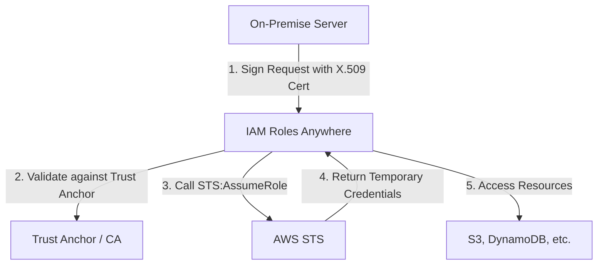

# Identity Security & External Trust: IAM Roles Anywhere and MFA

This guide explores how to extend AWS's robust security model beyond the boundaries of the cloud using **IAM Roles Anywhere** and how to fortify individual access using **Multi-Factor Authentication (MFA)**.

## Learning Objectives

By the end of this guide, you should be able to:
- **Explain** the purpose and mechanism of IAM Roles Anywhere for on-premises workloads.
- **Identify** the supported MFA device types and their specific use cases.
- **Configure** MFA for root accounts and IAM users to enhance security posture.
- **Distinguish** between hardware, virtual, and U2F security keys for authentication.
- **Understand** the best practices for root account management and password policies.

## Key Terms & Glossary

*   **IAM Roles Anywhere**: A service that allows workloads running outside of AWS (e.g., on-premises servers, containers, or other clouds) to use X.509 digital certificates to obtain temporary AWS credentials.
*   **Trust Anchor**: In IAM Roles Anywhere, this represents your Certificate Authority (CA) which AWS trusts to validate external identities.
*   **Profile**: A configuration in Roles Anywhere that defines which roles an external entity can assume and what session policies apply.
*   **Multi-Factor Authentication (MFA)**: A security system that requires more than one method of authentication from independent categories of credentials to verify the user's identity.
*   **U2F (Universal 2nd Factor)**: An open authentication standard that strengthens and simplifies two-factor authentication (2FA) using specialized USB or NFC devices.
*   **Permissions Boundary**: An advanced feature where you use a managed policy to set the maximum permissions that an identity-based policy can grant to an IAM entity.

## The "Big Idea"

The core philosophy of modern AWS security is **Identity-Centric Perimeter Defense**. Traditionally, security was defined by network boundaries (firewalls). Today, identity is the new perimeter. **MFA** ensures that even if a password is stolen, the identity remains safe. **IAM Roles Anywhere** completes the picture by allowing us to treat "outside" servers exactly like "inside" EC2 instances, providing a consistent, keyless security model everywhere.

## Formula / Concept Box

| Feature | IAM Roles Anywhere | Multi-Factor Authentication (MFA) |
| :--- | :--- | :--- |
| **Primary Goal** | Trust for external workloads/servers | Trust for human users/identities |
| **Mechanism** | X.509 Certificates / PKI | Virtual, U2F, or Hardware tokens |
| **Credential Type** | Temporary (STS) | Long-term (Pwd) + Short-term (OTP) |
| **Key Constraint** | Requires a Certificate Authority (CA) | Must be enabled manually per user |

## Hierarchical Outline

*   **I. IAM Roles Anywhere**
    *   **External Workload Trust**: Extends IAM roles to on-premise, IoT, and other cloud providers.
    *   **Components**: 
        *   **Trust Anchor**: Establishes trust with your CA.
        *   **Roles**: Standard IAM roles with a trust policy allowing `rolesanywhere.amazonaws.com`.
        *   **Profiles**: Defines permissions for the assumed role.
*   **II. Multi-Factor Authentication (MFA)**
    *   **Supported Types**:
        *   **Virtual MFA**: Apps like Google Authenticator or Authy (Software-based).
        *   **U2F Security Keys**: YubiKey or similar physical hardware (USB/NFC).
        *   **Hardware TOTP Tokens**: Dedicated physical key fobs.
    *   **Deprecated Methods**: SMS-based MFA is no longer supported for new configurations.
*   **III. Root Account Management**
    *   **Protection**: Root should always have MFA enabled immediately.
    *   **Usage**: Only use for tasks requiring root (Billing, closing account, changing support plans).
    *   **Delegation**: Create IAM users for day-to-day administration.

## Visual Anchors

### IAM Roles Anywhere Authentication Flow



### The Layers of MFA Security

```tikz
\begin{tikzpicture}
    % Draw the layers
    \draw[fill=red!20, thick] (0,0) circle (3cm);
    \draw[fill=yellow!20, thick] (0,0) circle (2cm);
    \draw[fill=green!20, thick] (0,0) circle (1cm);
    
    % Labels
    \node at (0,2.5) {\mbox{Layer 1: Something You Know (Password)}};
    \node at (0,1.5) {\mbox{Layer 2: Something You Have (MFA)}};
    \node at (0,0) {\mbox{Secure Access}};
    
    % Arrow pointing in
    \draw[->, line width=1.5pt] (-4,0) -- (-0.5,0);
    \node[left] at (-4,0) {\mbox{User Login}};
\end{tikzpicture}
```

## Definition-Example Pairs

*   **Virtual MFA Device**
    *   **Definition**: A software application that runs on a mobile device and generates a six-digit authentication code based on the Time-based One-Time Password (TOTP) algorithm.
    *   **Example**: An administrator installs **Google Authenticator** on their smartphone to generate codes for logging into the AWS Production account.
*   **Trust Anchor**
    *   **Definition**: The root or intermediate certificate of your own Certificate Authority (CA) that you upload to AWS to verify your external servers.
    *   **Example**: A company uses its **Windows Enterprise CA** to issue certificates to on-prem servers; the CA's public root certificate is uploaded to IAM Roles Anywhere as the Trust Anchor.
*   **Root Account Task**
    *   **Definition**: Specific actions that can *only* be performed by the root user, bypassing even full administrator IAM permissions.
    *   **Example**: **Closing an AWS account** or changing the support plan level requires logging in as the root user.

## Worked Examples

### Step-by-Step: Enabling MFA for a User
1.  **Navigate to IAM**: Log into the AWS Management Console and open the IAM dashboard.
2.  **Select User**: Click on "Users" and select the specific user name (e.g., `ops-manager`).
3.  **Security Credentials**: Click the **Security Credentials** tab.
4.  **Assign Device**: Find the "Multi-factor authentication (MFA)" section and click **Assign MFA device**.
5.  **Device Type**: Choose "Virtual MFA device" and click Continue.
6.  **Sync**: Use an app like Authy to scan the QR code displayed. Enter two consecutive six-digit codes generated by the app to synchronize the timing.
7.  **Finalize**: Click "Assign MFA".

### Scenario: Configuring Roles Anywhere (Conceptual)
To allow an on-premises backup server to upload to S3 without using long-term access keys:
- **On-Prem**: Generate a Certificate Signing Request (CSR) and have your internal CA sign it.
- **AWS**: Create a **Trust Anchor** by uploading your CA's root certificate.
- **AWS**: Create a **Role** with a trust policy allowing the principal `rolesanywhere.amazonaws.com`.
- **AWS**: Create a **Profile** mapping the role to the Trust Anchor.
- **On-Prem**: Use the `aws_signing_helper` tool to exchange the certificate for temporary credentials.

## Checkpoint Questions

1.  **True or False?** You can use SMS as a multi-factor authentication method for new AWS IAM users.
2.  **Scenario**: You have a server in a private data center that needs to call the AWS Rekognition API. What is the most secure way to provide credentials without managing long-term secret keys?
3.  What are two specific tasks that *require* the use of the AWS Root account?
4.  How many consecutive codes must you enter when first synchronizing a virtual MFA device?
5.  Which component of IAM Roles Anywhere defines *which* roles an external entity is allowed to assume?

<details>
<summary>Click to see Answers</summary>

1. **False**. SMS is no longer supported for MFA in AWS.
2. **IAM Roles Anywhere**. This allows the server to use its X.509 certificate to get temporary credentials.
3. Changing account settings, closing the account, changing support plans, or registering as a seller in the Reserved Instance Marketplace.
4. **Two** consecutive codes.
5. The **Profile**.
</details>

> [!IMPORTANT]
> Always enable MFA on the **Root Account** immediately after creating an AWS account. This is the single most important step in securing your cloud environment.