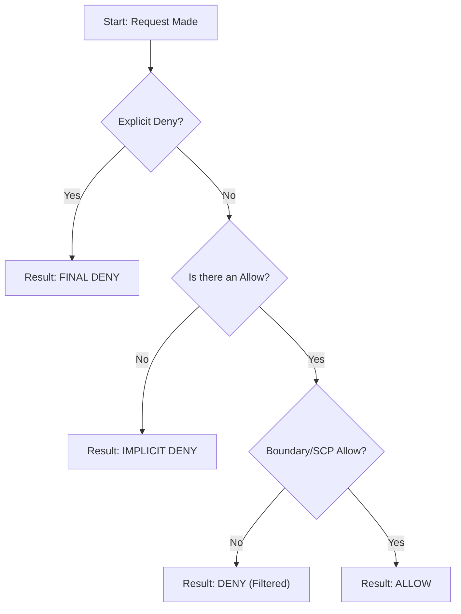

# Mastering the IAM Policy Simulator

## Learning Objectives
After studying this guide, you will be able to:
* Explain the purpose and primary use cases of the **IAM Policy Simulator**.
* Identify which types of policies (Identity-based, Resource-based, SCPs, Boundaries) can be tested.
* Interpret simulation results to distinguish between **Implicit Denies** and **Explicit Denies**.
* Perform safe troubleshooting of access issues without affecting live production environments.

## Key Terms & Glossary
* **IAM Policy Simulator**: A web-based tool used to test and debug IAM policies by simulating real-world API requests.
* **Identity-based Policy**: JSON policy documents attached to users, groups, or roles defining what that identity can do.
* **Service Control Policy (SCP)**: Organization-level filters that limit the maximum available permissions for accounts in an AWS Organization.
* **Permissions Boundary**: A managed policy that sets the maximum permissions that an identity-based policy can grant to an IAM entity.
* **Implicit Deny**: The default state where access is denied unless an explicit `Allow` statement is found.
* **Explicit Deny**: A specific `Deny` statement in a policy that overrides any `Allow` statements.

## The "Big Idea"
The IAM Policy Simulator acts as a **"Permission Sandbox."** In complex AWS environments, a user's ability to perform an action (like `s3:PutObject`) might be governed by five or more different policy types simultaneously. The simulator allows administrators to input a specific scenario—"Can User A perform Action B on Resource C?"—and see exactly which policy is causing a "Deny" without ever making a real API call or risking accidental data exposure.

## Formula / Concept Box

| Evaluation Element | Logic Rule |
| :--- | :--- |
| **Default Start** | Every request starts with an **Implicit Deny**. |
| **Explicit Deny** | If any policy (IAM, SCP, Boundary) has a `Deny`, the result is **always Deny**. |
| **The "Allow" Requirement** | To get an `Allow`, there must be at least one explicit `Allow` and **zero** explicit `Deny`s. |
| **Intersection Rule** | For an action to succeed, it must be allowed by the IAM Policy **AND** the Permissions Boundary **AND** the SCP. |

## Hierarchical Outline
1. **Core Capabilities**
    * **Safe Testing**: No real API calls are executed; no changes are made to AWS resources.
    * **Policy Support**: Identity-based, Resource-based, Permissions Boundaries, and SCPs.
    * **Condition Support**: Tests policy conditions (e.g., `aws:SourceIp`, `aws:MultiFactorAuthPresent`).
2. **Troubleshooting Workflow**
    * **Step 1: Select Entity**: Choose the User, Group, or Role experiencing issues.
    * **Step 2: Select Actions**: Choose the specific API calls to test (e.g., `ec2:RunInstances`).
    * **Step 3: Specify Resources**: Provide the ARN of the resource being accessed.
    * **Step 4: Run Simulation**: Analyze the "Allowed" or "Denied" result.
3. **Critical Limitations**
    * Does **not** support global condition keys in AWS Organizations SCPs.
    * Limited support for some service-linked roles.

## Visual Anchors

### IAM Policy Evaluation Logic

### The Permission Intersection
This diagram represents how the **Effective Permission** is only the area where all three policy types overlap.

\begin{tikzpicture}
    \draw[thick, fill=blue!20, opacity=0.5] (0,0) circle (2cm) node[yshift=1.2cm] {SCP};
    \draw[thick, fill=red!20, opacity=0.5] (1.5,0) circle (2cm) node[yshift=1.2cm] {Boundary};
    \draw[thick, fill=green!20, opacity=0.5] (0.75,-1.5) circle (2cm) node[yshift=-1.2cm] {IAM Policy};
    \node at (0.75,-0.3) {\textbf{Effective}};
    \node at (0.75,-0.7) {\textbf{Access}};
\end{tikzpicture}

## Definition-Example Pairs
* **Condition Key**: A specific attribute in a policy that restricts when the policy is in effect.
    * *Example*: A policy allows `s3:ListBucket` only if `aws:MultiFactorAuthPresent` is `true`.
* **Resource-based Policy**: A policy attached directly to a resource (like an S3 bucket) rather than a user.
    * *Example*: An S3 Bucket Policy that allows a specific external AWS account to read objects.

## Worked Examples

### Scenario: The "Invisible" S3 Bucket
**Problem**: A developer complains they cannot list objects in an S3 bucket named `finance-data`, even though their IAM Role has `AmazonS3FullAccess`.

**Troubleshooting using Simulator**:
1. **Input**: Select the Developer Role.
2. **Action**: Select `s3:ListBucket`.
3. **Resource**: Enter `arn:aws:s3:::finance-data`.
4. **Simulation Result**: "Denied".
5. **Analysis**: The simulator shows an **Explicit Deny** originating from a **Resource-based Policy** (Bucket Policy). 
6. **Root Cause**: The S3 Bucket Policy has a statement denying access to anyone not using a specific VPC Endpoint, which the developer was bypassing.

## Checkpoint Questions
1. **True or False**: Running a simulation in the IAM Policy Simulator will incur costs for the API calls being tested.
2. Which policy type takes precedence if an IAM Policy says "Allow" but an SCP says "Deny"?
3. Can the IAM Policy Simulator test the effects of a Permissions Boundary?
4. Why might a simulation result in a "Deny" even if there is an "Allow" statement and no "Deny" statement anywhere?

Click to see Answers

1. **False**. No real API calls are made; it is a calculation only.
2. **The SCP (Deny)**. An explicit Deny always overrides an Allow.
3. **Yes**. It is one of the core policy types the simulator evaluates.
4. Because of an **Implicit Deny**—if the policy does not specifically allow the action on that specific resource, access is denied by default.

> [!TIP]
> When troubleshooting, always check the **"Statements"** tab in the simulator results. It will point you to the exact line in the JSON policy that triggered the Deny.

> [!WARNING]
> Remember that the simulator does not account for **Network ACLs** or **Security Groups**. It only tests IAM-layer permissions!