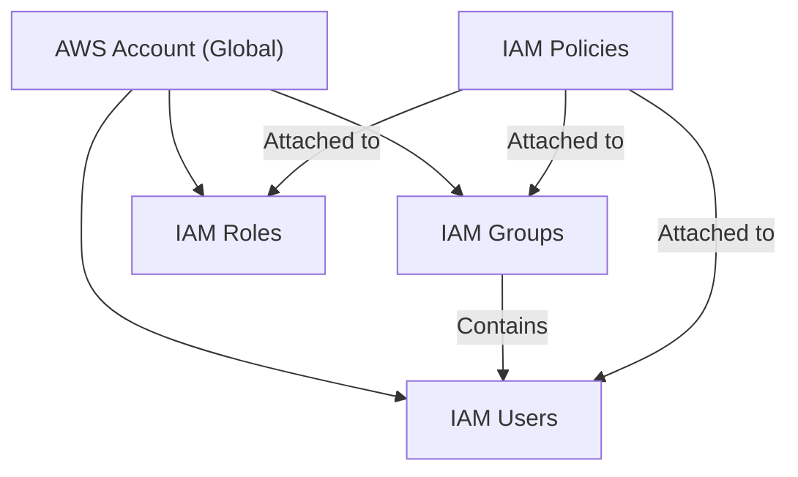

# Study Guide: Implementing IAM Policies, Roles, and Groups

## Learning Objectives
After studying this guide, you should be able to:
* **Define and Create** the four fundamental IAM resources: Users, Groups, Roles, and Policies.
* **Differentiate** between Identity-based and Resource-based policies.
* **Compare** Role-Based Access Control (RBAC) and Attribute-Based Access Control (ABAC).
* **Apply** the principle of least privilege using policy conditions and Access Analyzer.
* **Troubleshoot** access issues using the IAM Policy Simulator and CloudTrail.

## Key Terms & Glossary
* **IAM User**: A specific identity within your AWS account with unique credentials.
* **IAM Group**: A collection of IAM users. Permissions granted to a group are inherited by all users in that group.
* **IAM Role**: An identity with specific permissions that can be assumed by anyone (users, applications, or services) who needs it temporarily.
* **IAM Policy**: A JSON document that defines permissions. It can be attached to identities or resources.
* **Least Privilege**: The security best practice of granting only the minimum permissions required to perform a task.
* **Account Alias**: A user-friendly name used to replace the 12-digit AWS account ID in the sign-in URL.

## The "Big Idea"
Identity and Access Management (IAM) is the **gatekeeper** of your AWS environment. It is a **global service**, meaning the users and roles you create are available across all AWS regions. The core mission of IAM is to ensure that the right identities have the right access to the right resources under the right conditions, fundamentally supporting the "Zero Trust" security model through the Principle of Least Privilege.

## Formula / Concept Box

### The Anatomy of an IAM Policy
An IAM policy is written in JSON. Every statement generally follows this logic:

| Element | Description | Example |
| :--- | :--- | :--- |
| **Effect** | Whether the statement allows or denies access. | `"Effect": "Allow"` |
| **Action** | The specific API calls/operations allowed or denied. | `"Action": "s3:ListBucket"` |
| **Resource** | The AWS resource the action applies to. | `"Resource": "arn:aws:s3:::my-bucket"` |
| **Condition** | Optional: When the policy is in effect. | `"Condition": {"IpAddress": {"aws:SourceIp": "1.2.3.4/32"}}` |

## Hierarchical Outline
* **Identity Management**
    * **IAM Users**: Long-term credentials (password/access keys).
    * **IAM Groups**: Efficient management of multiple users with similar needs.
    * **IAM Roles**: Temporary security credentials; used by EC2 instances, Lambda, or cross-account access.
* **Access Control Mechanisms**
    * **RBAC (Role-Based)**: Permissions based on a user's job function (e.g., "Admin," "Developer").
    * **ABAC (Attribute-Based)**: Permissions based on tags (attributes) like `Project: Alpha` or `Environment: Prod`.
* **Policy Architecture**
    * **Identity-Based**: Attached to users/roles; "travels with the user."
    * **Resource-Based**: Attached to resources (e.g., S3 Bucket, KMS Key); specifies who can access that resource.
* **Auditing and Validation**
    * **IAM Access Analyzer**: Identifies resources shared outside the account/zone of trust.
    * **Policy Simulator**: Tests policies before deployment to ensure they work as intended.

## Visual Anchors

### IAM Entity Relationship

### Identity vs. Resource-Based Policies
\begin{tikzpicture}[node distance=2cm, every node/.style={fill=white, font=\small}, box/.style={draw, rectangle, minimum width=2.5cm, minimum height=1cm, align=center}]

% Entities
\node[box] (user) {\textbf{IAM User}\\ (Identity)};
\node[box, right=4cm of user] (bucket) {\textbf{S3 Bucket}\\ (Resource)};

% Identity Policy
\draw[blue, thick, ->] (user) -- node[above, text=blue] {Identity-Based Policy} (bucket);
\node[below=0.2cm of user, text=blue] {\textit{"I can access S3"}};

% Resource Policy
\draw[red, thick, <-] (user) -- node[below, text=red] {Resource-Based Policy} (bucket);
\node[below=0.2cm of bucket, text=red] {\textit{"User X can access me"}};

\end{tikzpicture}

## Definition-Example Pairs
* **ABAC (Attribute-Based Access Control)**
    * **Definition**: A strategy that defines permissions based on attributes (tags) attached to users and resources.
    * **Example**: A developer with the tag `Department=Finance` can only start EC2 instances that also have the tag `Department=Finance`.
* **IAM Access Analyzer**
    * **Definition**: A tool that analyzes resource-based policies to discover access from outside your account or organization.
    * **Example**: Running Access Analyzer to find an S3 bucket policy that accidentally grants `Public` read access to the internet.
* **Policy Conditions**
    * **Definition**: Extra criteria used in a policy statement to restrict when the policy is applied.
    * **Example**: Restricting a user so they can only log in if they have Multi-Factor Authentication (MFA) enabled.

## Worked Examples

### Example 1: Creating a "Power User" Group
**Scenario**: You need to give five new developers full access to all services except IAM and Organizations.
1.  **Navigate** to IAM > User Groups > Create Group.
2.  **Name**: `PowerUserGroup`.
3.  **Attach Policy**: Select the AWS managed policy named `PowerUserAccess`.
4.  **Add Users**: Select the developers from the list.
5.  **Result**: Developers inherit permissions immediately without needing individual policy attachments.

### Example 2: Assuming a Role (Cross-Account)
**Scenario**: An application in Account A needs to read data from an S3 bucket in Account B.
1.  **Account B**: Create an IAM Role with a trust policy allowing Account A to assume it.
2.  **Account B**: Attach an S3 ReadOnly policy to that role.
3.  **Account A**: Grant the application permission to call `sts:AssumeRole` for the Role ARN in Account B.
4.  **Result**: The application gets temporary credentials to access the bucket securely without sharing long-term keys.

## Checkpoint Questions
1.  Are IAM users and roles specific to a single AWS Region? 
    *   *Answer: No, IAM is a global service.*
2.  What is the main difference between an Account ID and an Account Alias?
    *   *Answer: The ID is a 12-digit number; the Alias is a user-friendly string used in the login URL to hide the ID.*
3.  Which tool would you use to find out why a user is getting an "Access Denied" error even though you think they have the right policy?
    *   *Answer: The IAM Policy Simulator.*
4.  If a user has an Identity-based policy that allows access to S3, but the S3 Bucket policy explicitly denies them, can they access the bucket?
    *   *Answer: No. An explicit Deny always overrides an Allow in AWS IAM.*

> [!IMPORTANT]
> Always use **Roles** for applications running on EC2 or Lambda instead of embedding Access Keys in your code. This ensures temporary, rotating credentials that are much more secure.