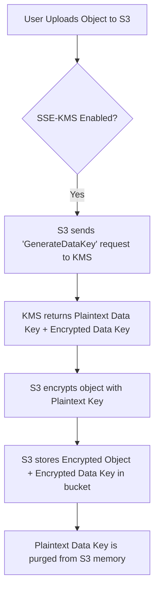

# AWS Certified SysOps: Mastering Encryption at Rest with AWS KMS

Encryption at rest is a critical security control designed to protect data stored on physical media. In the AWS ecosystem, the **AWS Key Management Service (KMS)** acts as the centralized hub for managing the lifecycle and permissions of the keys used to secure this data.

--- 

## Learning Objectives
After studying this guide, you should be able to:
- **Differentiate** between AWS-managed, Customer-managed, and AWS-owned keys.
- **Configure** SSE-KMS for Amazon S3 and Amazon EBS volumes.
- **Implement** S3 Bucket Keys to optimize KMS API costs and performance.
- **Explain** the mechanics of envelope encryption and key rotation.
- **Troubleshoot** common access issues related to KMS Key Policies and IAM.

--- 

## Key Terms & Glossary
- **KMS Key**: The primary resource in KMS (formerly called CMK). It is a logical representation of a key that contains metadata but never leaves AWS KMS unencrypted.
- **SSE-KMS**: Server-Side Encryption using AWS KMS keys. AWS manages the encryption process while you manage the key.
- **Data Key**: A unique cryptographic key generated by KMS used to encrypt a specific object or volume. KMS does not store data keys.
- **Envelope Encryption**: The practice of encrypting data with a data key, and then encrypting the data key with a root KMS key.
- **S3 Bucket Key**: A bucket-level key used to reduce the request traffic from S3 to KMS by deriving unique data keys locally within S3.
- **Key Policy**: A resource-based policy attached to a KMS key that defines who can use or manage the key. **This is the primary way to control access to KMS keys.**

--- 

## The "Big Idea"
AWS KMS provides a **centralized control plane** for encryption. Instead of managing thousands of individual keys for every file or database row, you manage a few "Root" keys (KMS Keys). The heavy lifting of encrypting millions of objects is handled via **Envelope Encryption**, where KMS provides a temporary data key that stays with the data, while the control (the ability to decrypt that data key) remains strictly inside the KMS service hardware security modules (HSMs).

--- 

## Formula / Concept Box

### Key Rotation & Management Table
| Feature | AWS Managed Key | Customer Managed Key | AWS Owned Key |
| :--- | :--- | :--- | :--- |
| **Naming Convention** | `aws/service-name` (e.g., `aws/s3`) | User-defined (Alias) | N/A (Hidden) |
| **Rotation Frequency** | Every 3 years (1,095 days) | Every 1 year (if enabled) | Managed by Service |
| **Control** | View only | Full Control (Rotate/Delete) | None |
| **Cost** | Free (usually) | $1/month + API usage | Free |

> [!IMPORTANT]
> When a key rotates, the **Key Material** changes, but the **Key ID** and **ARN** remain the same. Existing data encrypted with the old material can still be decrypted because KMS keeps the old material available.

--- 

## Hierarchical Outline
1. **KMS Infrastructure**
    - **Regional Scope**: KMS keys are regional and do not replicate automatically. You must export/import or use Multi-Region keys for cross-region disaster recovery.
    - **Symmetric vs. Asymmetric**: Symmetric keys are standard for AWS services (AES-256); Asymmetric keys are used for signing/verification or RSA encryption.
2. **Encryption for S3**
    - **SSE-S3**: Keys managed by S3 (AES-256).
    - **SSE-KMS**: Audit trails in CloudTrail; granular permissions.
    - **S3 Bucket Keys**: Crucial for high-traffic buckets to reduce KMS API costs.
3. **Encryption for EBS**
    - **Boot Volumes**: Can be encrypted at launch. Existing unencrypted volumes must be snapshotted and copied to an encrypted state.
    - **Default Encryption**: Can be enabled at the account level for a specific region.
4. **Access Control & Troubleshooting**
    - **Key Policies**: If the Key Policy does not explicitly allow access, even an Administrator with `AdministratorAccess` IAM permissions may be denied access to a key.
    - **Grants**: Temporary, granular permissions often used by AWS services to act on your behalf.

--- 

## Visual Anchors

### S3 Request Flow with SSE-KMS
This flowchart illustrates how S3 interacts with KMS during a standard object upload.



### Envelope Encryption Structure
This TikZ diagram visualizes the "Envelope" where the Master Key (KMS Key) protects the Data Key, which in turn protects the actual data.

```tikz
\begin{tikzpicture}[node distance=1.5cm, auto]
    % Elements
    \draw[fill=gray!10] (0,0) rectangle (6,4);
    \node at (3, 3.5) {\textbf{The "Envelope" (Stored Object/Disk)}};
    
    \draw[fill=blue!20] (0.5, 0.5) rectangle (5.5, 1.5);
    \node at (3, 1) {Encrypted Data (AES-256)};
    
    \draw[fill=green!20] (0.5, 2.0) rectangle (3.5, 3.0);
    \node at (2, 2.5) {Encrypted Data Key};
    
    % KMS External
    \draw[thick, red] (7, 2.5) circle (0.8cm);
    \node[red] at (7, 2.5) {\textbf{KMS Key}};
    
    % Connections
    \draw[->, thick] (7, 2.5) -- (3.5, 2.5) node[midway, above] {Decrypts};
    \draw[->, thick] (2, 2.0) -- (2, 1.5) node[midway, left] {Unlocks};
\end{tikzpicture}
```

--- 

## Definition-Example Pairs
- **Term**: **Automatic Key Rotation**
    - **Definition**: The process where KMS generates new cryptographic material for a KMS key every year (for CMKs) or 3 years (for AWS managed keys).
    - **Example**: A financial firm must comply with regulations to change keys annually. Instead of manual intervention, they enable a checkbox in KMS. Their application continues to call the same Key ID, and KMS seamlessly handles the backend material switch.
- **Term**: **KMS Grant**
    - **Definition**: A mechanism to delegate subset of permissions on a KMS key, often used for transient or programmatic access.
    - **Example**: When you encrypt an EBS volume, EBS uses a grant to allow the EC2 service to use your KMS key to decrypt the volume's data key so the instance can read the disk.

--- 

## Worked Examples

### Example 1: Troubleshooting "Access Denied" on S3
**Scenario**: An IAM user with `AmazonS3FullAccess` tries to download an object from an S3 bucket encrypted with a Customer Managed Key (CMK) but receives an `Access Denied` error.

**Step-by-Step Breakdown**:
1. **Check IAM Policy**: The user has S3 permissions, but do they have `kms:Decrypt`? 
2. **Check Key Policy**: Locate the CMK in the KMS console. Look at the "Key Policy" tab. 
3. **Identify the Gap**: In many CMK default policies, access is only granted to the account root or specific users. If the IAM user is not listed in the Key Policy's `"Principal"` section, they cannot use the key even if IAM allows it.
4. **Solution**: Add the IAM user's ARN to the `Allow` statement in the **KMS Key Policy**.

### Example 2: Implementing S3 Bucket Keys
**Scenario**: A SysOps admin notices high `KMS:GenerateDataKey` costs for an S3 bucket receiving 1,000 uploads per second.

**Solution**:
- **Action**: Enable "S3 Bucket Key" in the bucket's encryption settings.
- **Result**: S3 will now request a single "Bucket Key" from KMS for a period of time. It will derive unique data keys for each of the 1,000 objects locally. This reduces KMS API calls by >99%, significantly lowering costs.

--- 

## Checkpoint Questions
1. What is the rotation frequency for AWS-managed keys (e.g., `aws/ebs`) and can you change it?
2. True or False: If you delete a KMS key, you can immediately recover the data it encrypted using a backup of the key material from your own hardware.
3. Why does S3 use Envelope Encryption instead of sending the entire 5GB file to KMS for encryption?
4. A user can list objects in a bucket but cannot view their contents. The bucket uses SSE-KMS. Which two policies must you check?
5. Does rotating a key retroactively encrypt old data with the new key material?

<details>
<summary>Click to reveal answers</summary>

1. **3 Years (1,095 days).** No, you cannot change this frequency for AWS-managed keys.
2. **False.** If the KMS key is deleted (and the mandatory waiting period passes), the data is cryptographically erased unless you are using multi-region keys or have an external key store.
3. **Performance and Limits.** KMS has a 4KB limit for direct encryption. Sending large files over the network to KMS would be slow and hit API rate limits quickly.
4. **The IAM Policy and the KMS Key Policy.**
5. **No.** It only applies to new encryption operations. Old data remains encrypted with the material that was active at the time of its creation.
</details>

--- 

## Muddy Points & Cross-Refs
- **Manual vs. Auto Rotation**: If you use "Imported Key Material," you **cannot** use automatic rotation. You must manually create a new key and update your application's Key ID/Alias.
- **Cross-Account Access**: To allow Account B to use a key in Account A, you must allow Account B in the Key Policy (Account A) AND give the IAM user in Account B the `kms:Usage` permission.
- **Further Study**: Check the **CloudTrail** logs for `kms:Decrypt` events to audit who is accessing your sensitive data.