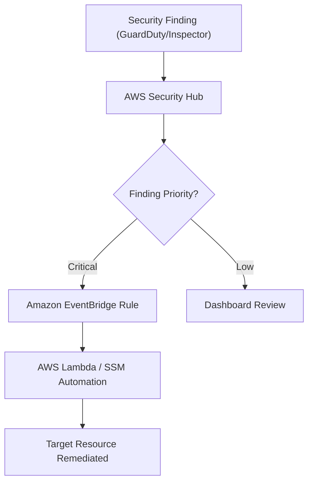

# AWS Security Operations: Configuring Reports and Remediating Findings

This guide covers the centralized management of security alerts and compliance across AWS services, focusing on **AWS Security Hub**, **Amazon GuardDuty**, **AWS Config**, and **Amazon Inspector**.

## Learning Objectives

After studying this guide, you should be able to:
* Configure and enable **Security Hub** and its associated security standards (CIS, PCI DSS).
* Identify potential threats using **Amazon GuardDuty** log analysis (VPC Flow Logs, DNS, CloudTrail).
* Perform automated vulnerability scans on EC2 and container workloads using **Amazon Inspector**.
* Utilize **AWS Config** for resource recording and compliance auditing.
* Implement **automated remediation** workflows using EventBridge and SSM Automation.

## Key Terms & Glossary

*   **Finding**: A single security issue or observation generated by a security service (e.g., an open SSH port or a suspected brute-force attack).
*   **Insight**: A collection of findings in Security Hub grouped by a specific attribute (e.g., "S3 buckets with public read access").
*   **Remediation**: The process of correcting a security vulnerability or threat (e.g., stopping an instance or updating a security group).
*   **Standard**: Prepackaged security best practices in Security Hub, such as the **CIS AWS Foundations Benchmark**.
*   **Managed Service**: A service where AWS handles the underlying infrastructure; for GuardDuty, you only manage the findings, not the detection engine itself.

## The "Big Idea"

The core philosophy of AWS Security Operations is **Centralized Governance**. Instead of checking individual services, Security Hub acts as a "single pane of glass." It aggregates findings from GuardDuty (threats), Inspector (vulnerabilities), and Config (compliance), allowing SysOps administrators to prioritize the highest-risk issues across the entire AWS environment.

## Formula / Concept Box

| Service | Primary Data Source | Core Purpose |
| :--- | :--- | :--- |
| **Security Hub** | Findings from other services | Aggregation, reporting, and compliance scores |
| **GuardDuty** | CloudTrail, VPC Flow Logs, DNS Logs | Intelligent threat detection (Malware, Crypto-mining) |
| **Inspector** | EC2 instances, ECR images | Vulnerability scanning (CVEs, Network reachability) |
| **AWS Config** | Resource configuration history | Compliance auditing and state tracking |

## Hierarchical Outline

1.  **Enabling Security Infrastructure**
    *   **Regional Scope**: Security Hub and GuardDuty are **regional**. To be fully compliant (e.g., CIS), they must be enabled in **all regions**.
    *   **Dependencies**: Security Hub requires **AWS Config** to be enabled for resource recording to validate findings.
2.  **Analyzing Findings**
    *   **GuardDuty Findings**: Use Machine Learning to detect anomalies in network activity.
    *   **Inspector Finding Types**:
        *   **Network Reachability**: Identifies if ports are reachable from VPC edges.
        *   **Package Vulnerability**: Scans for known software vulnerabilities (CVEs).
3.  **Remediation Architecture**
    *   **Manual**: Reviewing dashboards and taking action via the console.
    *   **Automated**: Routing findings to **Amazon EventBridge** to trigger Lambda or SSM Automation.

## Visual Anchors

### Remediation Workflow

### Security Ecosystem Integration

\begin{tikzpicture}[node distance=2cm, every node/.style={draw, rectangle, rounded corners, inner sep=5pt, align=center}]
    \node (Hub) [fill=orange!20] {AWS Security Hub \\ (Central Console)};
    \node (GD) [left of=Hub, xshift=-1.5cm, fill=red!10] {GuardDuty \\ (Threats)};
    \node (Insp) [right of=Hub, xshift=1.5cm, fill=blue!10] {Inspector \\ (Vulnerabilities)};
    \node (Conf) [below of=Hub, fill=green!10] {AWS Config \\ (Compliance/State)};
    
    \draw[->, thick] (GD) -- (Hub);
    \draw[->, thick] (Insp) -- (Hub);
    \draw[<->, thick] (Conf) -- (Hub);
    \draw[dashed] (Conf) -- (GD) node[midway, below, scale=0.7] {\mbox{Context}};
\end{tikzpicture}

## Definition-Example Pairs

*   **Network Reachability Finding**: A report indicating an EC2 instance has port 22 open to `0.0.0.0/0`. 
    *   *Example*: Inspector identifies that a web server is unintentionally accessible via Telnet from the internet.
*   **Auto-Remediation**: A programmatic response to a security event without human intervention.
    *   *Example*: When GuardDuty detects an instance communicating with a known Command & Control (C2) server, an EventBridge rule triggers a Lambda function to isolate that instance by changing its Security Group.
*   **Resource Recording**: The process of tracking changes to AWS resource configurations.
    *   *Example*: AWS Config records that an S3 bucket's policy was changed from private to public, triggering a non-compliant status in Security Hub.

## Worked Examples

### Problem: Automating Response to a GuardDuty Finding
**Scenario**: The Security Team wants to automatically disable any IAM Access Key that shows "Unauthorized Access" behavior detected by GuardDuty.

**Step-by-Step Solution**:
1.  **Enable GuardDuty**: Ensure the service is active and generating findings.
2.  **Create EventBridge Rule**: Define a rule where the event pattern is `source: aws.guardduty` and the detail-type is `GuardDuty Finding`.
3.  **Filter by Finding Type**: Specify `UnauthorizedAccess:IAMUser/ConsoleLoginSuccessFromUnknownIp`.
4.  **Target a Lambda Function**: Write a Lambda function that takes the `AccessKeyId` from the finding and calls `iam:UpdateAccessKey` to set the status to `Inactive`.
5.  **Verify**: Check the Lambda logs and Security Hub to ensure the action was taken.

> [!IMPORTANT]
> For Security Hub to perform automated remediation, **Amazon EventBridge** is the primary service required to bridge findings to action targets.

## Checkpoint Questions

1.  Which service must be enabled for Security Hub to evaluate security standards and controls properly?
2.  **True or False**: Amazon GuardDuty operates by installing agents on your EC2 instances to monitor memory and CPU usage.
3.  A security audit requires a report on all S3 buckets that have had objects deleted in the last 24 hours. Which service (among Macie, Inspector, GuardDuty, or CloudTrail/Config) is best suited for tracking these specific API actions?
4.  If you need to check if your EC2 instances have reachable TCP ports from the VPC edge, which Inspector finding type should you look for?

Click to view answers

1. **AWS Config** (Required for resource recording).
2. **False**. GuardDuty is a managed service that analyzes metadata (VPC Flow Logs, etc.) and is agentless.
3. **Amazon GuardDuty** (or CloudTrail) can track suspicious deletion patterns, though Config/CloudTrail are the primary sources for the raw history.
4. **Network reachability finding type**.

