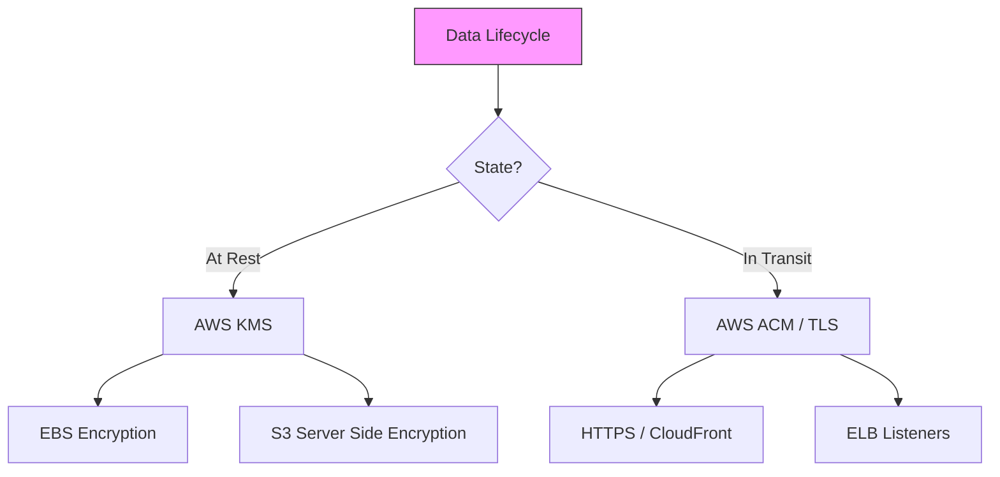

# Data Protection and Infrastructure Security

This guide covers the essential strategies for securing AWS environments, focusing on the protection of data at rest and in transit, alongside the hardening of infrastructure through network security and automated compliance monitoring.

## Learning Objectives

By the end of this study guide, you should be able to:
*   **Implement** data protection strategies including encryption at rest (KMS) and in transit (ACM/TLS).
*   **Configure** secrets management using AWS Secrets Manager to rotate and protect sensitive credentials.
*   **Analyze** and remediate security findings from services like Amazon Macie, GuardDuty, and Security Hub.
*   **Architect** multi-layered network security using Security Groups, NACLs, AWS WAF, and Shield.
*   **Audit** infrastructure compliance using AWS Config and Trusted Advisor.

## Key Terms & Glossary

*   **AWS KMS (Key Management Service):** A managed service that makes it easy to create and control the cryptographic keys used to protect data.
*   **AWS Secrets Manager:** A service designed to manage, rotate, and retrieve database credentials, API keys, and other secrets.
*   **Amazon Macie:** A fully managed data security service that uses machine learning and pattern matching to discover and protect sensitive data in S3.
*   **AWS WAF (Web Application Firewall):** A web application firewall that helps protect web applications or APIs against common web exploits (Layer 7).
*   **AWS Shield:** A managed Distributed Denial of Service (DDoS) protection service that safeguards applications running on AWS (Standard and Advanced).
*   **ACM (AWS Certificate Manager):** A service that lets you easily provision, manage, and deploy public and private SSL/TLS certificates.

## The "Big Idea"

Security in AWS is a **Shared Responsibility**. While AWS manages the security "of" the cloud (physical infrastructure, network layer encryption between data centers), the customer is responsible for security "in" the cloud. This means you must explicitly architect your applications to use encryption, manage your own keys, and define granular access policies. The "Big Idea" is **Defense in Depth**: layering security at the data, instance, and network levels so that the failure of one control does not lead to a total compromise.

## Formula / Concept Box

| Feature | Security Groups (SG) | Network ACLs (NACL) |
| :--- | :--- | :--- |
| **Layer** | Instance Level (EC2) | Subnet Level |
| **State** | **Stateful** (Return traffic allowed) | **Stateless** (Must explicitly allow return) |
| **Rules** | Allow rules only | Allow and Deny rules |
| **Evaluation** | All rules evaluated | Rules evaluated in order (numeric) |

## Hierarchical Outline

1.  **Data Protection Strategies**
    *   **Encryption at Rest**: Utilizing **AWS KMS** for EBS, RDS, and S3. Understand the difference between AWS-managed keys and Customer Managed Keys (CMKs).
    *   **Encryption in Transit**: Implementing **TLS/SSL** using **ACM**. Use **CloudFront** to enforce HTTPS-only access (403 Forbidden for HTTP).
    *   **Sensitive Data Discovery**: Deploying **Amazon Macie** to scan S3 buckets for PII (Personally Identifiable Information).
2.  **Infrastructure Protection**
    *   **Edge Security**: Protecting against Layer 7 attacks with **AWS WAF** and DDoS attacks with **AWS Shield**.
    *   **Network Firewalls**: Using **Route 53 Resolver DNS Firewall** to block malicious domain requests.
    *   **Secrets Management**: Using **AWS Secrets Manager** to automate credential rotation for RDS databases.
3.  **Auditing and Remediation**
    *   **Compliance Monitoring**: Using **AWS Config** to track resource changes and enforce "Desired State" (e.g., "All EBS volumes must be encrypted").
    *   **Security Analytics**: Aggregating findings in **AWS Security Hub** and **Amazon GuardDuty** for threat detection.

## Visual Anchors

### Data Protection Flow

### Network Defense Layers
\begin{tikzpicture}[node distance=1.5cm, every node/.style={rectangle, draw, fill=white, minimum width=4cm, minimum height=0.8cm}]
    \node (internet) [fill=gray!20] {\textbf{Public Internet}};
    \node (waf) [below of=internet] {AWS WAF / Shield (Layer 7/4)};
    \node (igw) [below of=waf] {Internet Gateway (VPC Edge)};
    \node (nacl) [below of=igw, fill=red!10] {Network ACL (Subnet Level)};
    \node (sg) [below of=nacl, fill=blue!10] {Security Group (Instance Level)};
    \node (ec2) [below of=sg] {EC2 Instance / Workload};

    \draw[->, thick] (internet) -- (waf);
    \draw[->, thick] (waf) -- (igw);
    \draw[->, thick] (igw) -- (nacl);
    \draw[->, thick] (nacl) -- (sg);
    \draw[->, thick] (sg) -- (ec2);
\end{tikzpicture}

## Definition-Example Pairs

*   **Service: AWS Secrets Manager**
    *   **Definition:** A service that manages the lifecycle of credentials including automatic rotation and fine-grained access.
    *   **Example:** Instead of hardcoding a database password in an application's `.env` file, the application calls the Secrets Manager API to retrieve the password at runtime. The password is automatically changed every 30 days by a Lambda function managed by the service.

*   **Service: Amazon Macie**
    *   **Definition:** A data privacy service that uses machine learning to identify sensitive data.
    *   **Example:** A company uploads thousands of PDF invoices to S3. Macie automatically scans these files and alerts the administrator if it finds unencrypted credit card numbers or Social Security numbers stored in the bucket.

## Worked Examples

### Scenario: Enforcing HTTPS on CloudFront
**Problem:** You have a CloudFront distribution serving static content from S3, but users are still accessing the site via insecure HTTP.

**Step-by-Step Solution:**
1.  **Request Certificate:** Use **AWS Certificate Manager (ACM)** to provision a public certificate for your domain.
2.  **Update Distribution:** Open the CloudFront Console and select your distribution.
3.  **Behaviors Tab:** Edit the default cache behavior.
4.  **Viewer Protocol Policy:** Change the setting from "Allow All" to **"Redirect HTTP to HTTPS"** or **"HTTPS Only"**.
5.  **Result:** Any user attempting to access `http://example.com` will be automatically redirected to `https://example.com` with a 301 status code.

### Scenario: Automating Remediation with AWS Config
**Problem:** You want to ensure that no S3 buckets in your account are ever made public.

**Step-by-Step Solution:**
1.  **Enable AWS Config:** Set up recording for S3 bucket resources.
2.  **Add Rule:** Search for the managed rule `s3-bucket-public-read-prohibited`.
3.  **Remediation Action:** Link an **SSM Automation document** (e.g., `AWS-PublishS3BucketPolicy`) to the rule.
4.  **Trigger:** If a user accidentally makes a bucket public, AWS Config detects the non-compliance and triggers the SSM runbook to automatically flip the bucket back to private.

## Checkpoint Questions

1.  What is the main difference between how Security Groups and Network ACLs handle return traffic?
2.  If you need to scan 500 S3 buckets for hidden PII, which AWS service should you use?
3.  True or False: AWS automatically encrypts data at the application layer as part of their shared responsibility.
4.  Which service is specifically designed to rotate database credentials without requiring application downtime?
5.  In CloudFront, what HTTP response code does a user receive if they try to access an object via HTTP when "Force HTTPS" is enabled?

> [!TIP]
> **Answers:**
> 1. Security Groups are stateful (automatic return); NACLs are stateless (manual return required).
> 2. Amazon Macie.
> 3. False (Customer is responsible for application-layer encryption).
> 4. AWS Secrets Manager.
> 5. 403 Forbidden.