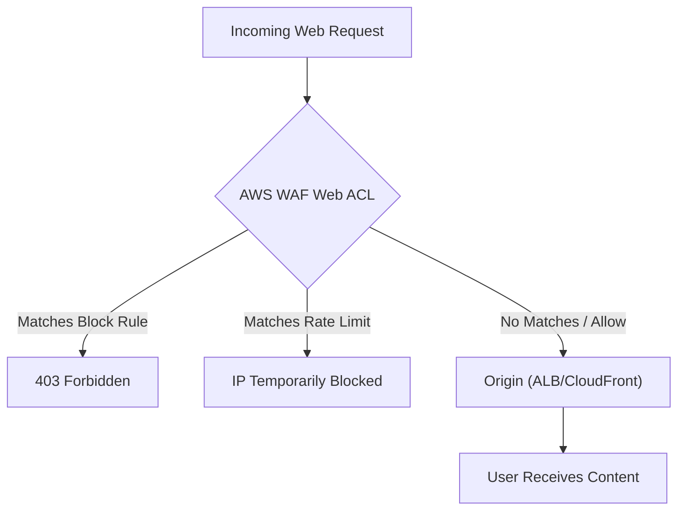

# Mastering AWS WAF and Shield for Application Security

Protecting web applications requires a multi-layered defense strategy. This guide covers how to leverage **AWS WAF** (Web Application Firewall) and **AWS Shield** to defend against common web exploits and Distributed Denial of Service (DDoS) attacks.

## Learning Objectives
After studying this guide, you should be able to:
- Differentiate between **AWS Shield Standard** and **Shield Advanced**.
- Configure **AWS WAF Web ACLs** and rules to filter malicious traffic.
- Implement **rate-based rules** to mitigate request flood attacks.
- Use **AWS Firewall Manager** to centrally manage security policies across accounts.
- Understand the architectural benefits of placing the security perimeter at the **Edge** vs. the **VPC**.

## Key Terms & Glossary
- **Web ACL (Access Control List):** A resource that contains the rules you want to use to filter web requests.
- **Rule Group:** A reusable set of rules that you can add to multiple Web ACLs.
- **SRT (Shield Response Team):** A specialized team available to Shield Advanced customers to help during active DDoS attacks.
- **Rate-Based Rule:** A rule that tracks the number of requests from each IP address and blocks them if they exceed a specified threshold.
- **DDoS (Distributed Denial of Service):** A malicious attempt to disrupt the normal traffic of a targeted server by overwhelming it with a flood of internet traffic.

## The "Big Idea"
Security in the cloud follows a **Defense-in-Depth** model. AWS Shield provides the baseline protection at the Network/Transport layers (Layers 3 & 4), while AWS WAF provides granular control at the Application layer (Layer 7). By combining these with a global distribution service like **CloudFront**, you move your security perimeter to the **AWS Edge**, catching threats before they ever reach your core infrastructure.

## Formula / Concept Box

| Service | OSI Layer | Scope | Primary Function |
| :--- | :--- | :--- | :--- |
| **AWS Shield Standard** | Layers 3 & 4 | Global | Automatic protection against common volumetric attacks (Free). |
| **AWS Shield Advanced** | Layers 3, 4, & 7 | Global/Regional | 24/7 SRT access, cost protection, and automated Layer 7 mitigation. |
| **AWS WAF** | Layer 7 | Global/Regional | Filters web traffic based on IP, headers, body, or rate (Paid). |
| **Firewall Manager** | Management | Multi-account | Centralized rule deployment via AWS Organizations. |

## Hierarchical Outline
- **I. AWS WAF (Layer 7 Protection)**
    - **Filtering Mechanisms:** Allow, Block, or Count requests.
    - **Rule Types:**
        - **Managed Rules:** Pre-configured rules by AWS or Marketplace vendors (e.g., SQLi, XSS protection).
        - **Custom Rules:** User-defined logic based on IP, strings, or regex.
        - **Rate-Based Rules:** Essential for mitigating **HTTP floods**.
    - **Advanced Features:** Bot Control, CAPTCHA, and Account Takeover Prevention (ATP).
- **II. AWS Shield (DDoS Mitigation)**
    - **Shield Standard:** Enabled by default; protects against SYN floods and Reflection attacks.
    - **Shield Advanced:** Proactive engagement and integration with WAF for automatic rule creation.
- **III. Architectural Placement**
    - **Edge Perimeter:** Using CloudFront or Global Accelerator to stop attacks at the network entry point.
    - **Regional Perimeter:** Applying WAF directly to Application Load Balancers (ALB) or API Gateway.

## Visual Anchors

### Traffic Filtering Flow

### Defense-in-Depth Architecture
\begin{tikzpicture}[node distance=1.5cm, every node/.style={draw, rectangle, rounded corners, inner sep=5pt, text centered}]
    \node (User) [fill=gray!20] {Internet User};
    \node (Shield) [below of=User, fill=blue!10] {AWS Shield (L3/L4 Protection)};
    \node (WAF) [below of=Shield, fill=green!10] {AWS WAF (L7 Protection)};
    \node (App) [below of=WAF, fill=orange!10] {Application (ALB/EC2)};

    \draw[->, thick] (User) -- (Shield);
    \draw[->, thick] (Shield) -- (WAF);
    \draw[->, thick] (WAF) -- (App);

    \node[draw=none, right of=Shield, xshift=3cm] (Note1) {\mbox{Blocks Volumetric Attacks}};
    \node[draw=none, right of=WAF, xshift=3cm] (Note2) {\mbox{Blocks SQLi/XSS/Floods}};
\end{tikzpicture}

## Definition-Example Pairs
- **Rate-Based Rule**  
  *Definition:* A rule that triggers when a specific IP sends more than $X$ requests in a 5-minute window.  
  *Example:* Blocking an IP address that sends more than 2,000 requests to your login page within 5 minutes, likely indicating a brute-force or DDoS attempt.

- **Shield Response Team (SRT)**  
  *Definition:* AWS security engineers who assist Shield Advanced customers with complex attack mitigation.  
  *Example:* During a massive, sophisticated Layer 7 attack that bypasses standard rules, you contact the SRT to write custom WAF rules on your behalf.

- **Managed Rule Groups**  
  *Definition:* Sets of rules maintained by AWS that address common vulnerabilities.  
  *Example:* Enabling the "Core Rule Set" (CRS) to automatically protect your application against the OWASP Top 10 vulnerabilities without writing code.

## Worked Examples

### Scenario: Mitigating an HTTP Flood on an ALB
**Goal:** Stop a single IP from overwhelming an Application Load Balancer.

1.  **Navigate to AWS WAF:** Open the WAF console and select **Web ACLs**.
2.  **Create Rule:** Select "Add rules" -> "Add my own rules and rule groups".
3.  **Rule Type:** Choose **Rate-based rule**.
4.  **Rate Limit:** Set the limit to 1,000 (meaning 1,000 requests per 5-minute window per IP).
5.  **Action:** Set to **Block**.
6.  **Scope:** Apply this Web ACL to the ARN of your **Application Load Balancer**.
7.  **Result:** If a bot attempts to scrape the site or flood it, its IP is automatically blocked for the duration of the high traffic, protecting the ALB resources.

## Checkpoint Questions
1. Which service is included at no additional cost for all AWS customers to protect against Layer 3 and 4 attacks?
2. What is the primary difference between a regular WAF rule and a rate-based rule?
3. If you have multiple AWS accounts in an Organization and want to ensure every ALB has a specific WAF rule, which service should you use?
4. Does Shield Advanced cover the costs of AWS WAF fees (Web ACLs and requests)?
5. True or False: Placing a WAF on a CloudFront distribution moves the security perimeter to the Edge, rather than the VPC.

Click to view answers

1. AWS Shield Standard.
2. A regular rule looks at request attributes (e.g., headers); a rate-based rule looks at the volume of requests over time from a specific IP.
3. AWS Firewall Manager.
4. Yes, the Shield Advanced subscription includes the cost of WAF basic fees for protected resources.
5. True.

