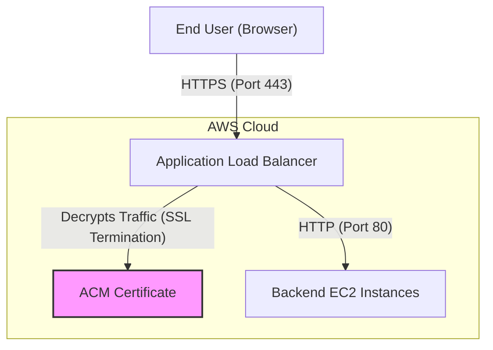

# Mastering Encryption in Transit with AWS Certificate Manager (ACM)

This guide covers the implementation, configuration, and troubleshooting of encryption in transit within AWS, focusing on the automation provided by AWS Certificate Manager (ACM) and its integration with Elastic Load Balancing (ELB) and CloudFront.

## Learning Objectives
After studying this guide, you should be able to:
- **Provision** and manage public and private SSL/TLS certificates using ACM.
- **Configure** HTTPS listeners on Application Load Balancers (ALB) and CloudFront distributions.
- **Differentiate** between ACM-managed certificates and imported third-party certificates.
- **Troubleshoot** common encryption-in-transit issues, including regionality constraints and renewal failures.
- **Explain** the AWS Shared Responsibility Model as it pertains to network encryption.

## Key Terms & Glossary
- **ACM (AWS Certificate Manager):** A service that lets you easily provision, manage, and deploy public and private SSL/TLS certificates for use with AWS services.
- **SSL/TLS:** Secure Sockets Layer / Transport Layer Security; cryptographic protocols designed to provide communications security over a computer network.
- **SNI (Server Name Indication):** An extension of TLS that allows multiple domains to be served from a single IP address/load balancer by indicating which hostname the client is trying to connect to.
- **Certificate Authority (CA):** A trusted entity that issues digital certificates.
- **Cipher Suite:** A set of algorithms used to secure a network connection via TLS.

## The "Big Idea"
In the past, managing SSL/TLS certificates was a manual, error-prone process involving tracking expiration dates in spreadsheets and manually uploading files to servers. **The "Big Idea" of ACM is Lifecycle Automation.** By integrating directly with AWS infrastructure (ELB, CloudFront, API Gateway), ACM removes the manual burden of certificate rotation and renewal, ensuring that application security never lapses due to an expired certificate.

## Formula / Concept Box

| Feature | ACM-Issued Certificates | Imported Certificates |
| :--- | :--- | :--- |
| **Renewal** | Fully Automated by AWS | Manual (Customer Responsibility) |
| **Cost** | Free for public certificates | Free (third-party costs apply) |
| **Integration** | Seamless (ELB, CloudFront, etc.) | Seamless (ELB, CloudFront, etc.) |
| **Private CA** | Supported via ACM Private CA | Not applicable |
| **Validation** | DNS or Email validation required | Validation handled by third-party CA |

## Hierarchical Outline
1. **Core Integration Points**
    - **Elastic Load Balancing (ELB):** Certificates are installed on the listener to terminate SSL at the load balancer.
    - **Amazon CloudFront:** Certificates secure content delivery at the edge locations.
2. **The Provisioning Process**
    - **Requesting:** Choose public vs. private.
    - **Validation:** **DNS Validation** (adding a CNAME record) or **Email Validation**.
3. **Shared Responsibility for Encryption**
    - **AWS Responsibility:** Physical layer encryption between data centers and network layer encryption within VPCs.
    - **Customer Responsibility:** Application-layer encryption (HTTPS/TLS configuration).
4. **Troubleshooting & Maintenance**
    - **Regionality:** CloudFront requires certs in `us-east-1` (N. Virginia).
    - **Protocols:** Handling HTTP to HTTPS redirection vs. 403 Forbidden errors.

## Visual Anchors

### HTTPS Request Flow with ALB

### Shared Responsibility Model: Encryption
\begin{tikzpicture}[scale=0.8]
    \draw[fill=orange!20] (0,0) rectangle (10,1) node[midway] {\textbf{Customer:} Application Layer (HTTPS/TLS)};
    \draw[fill=blue!20] (0,1.2) rectangle (10,2.2) node[midway] {\textbf{AWS:} Network Layer (VPC Peering Encryption)};
    \draw[fill=blue!40] (0,2.4) rectangle (10,3.4) node[midway] {\textbf{AWS:} Physical Layer (Inter-DC Encryption)};
    \draw[<->, thick] (10.5,0) -- (10.5,1) node[midway, right] {User Config};
    \draw[<->, thick] (10.5,1.2) -- (10.5,3.4) node[midway, right] {Transparent to User};
\end{tikzpicture}

## Definition-Example Pairs
- **SSL Termination:** The process of decrypting encrypted traffic at the load balancer before sending it to backend servers.
    - *Example:* An ALB receives traffic on port 443, uses an ACM certificate to decrypt it, and passes it to an EC2 instance on port 80 to reduce the CPU load on the instance.
- **Wildcard Certificate:** A certificate that covers a domain and all its first-level subdomains.
    - *Example:* A certificate for `*.example.com` will secure `www.example.com`, `api.example.com`, and `shop.example.com`.
- **SAN (Subject Alternative Name):** Allows a single certificate to protect multiple different domain names.
    - *Example:* One certificate covering both `example.com` and `myothersite.net`.

## Worked Examples

### Example 1: Configuring an HTTPS Listener for an ALB
1. **Request Certificate:** Open the ACM console and request a public certificate for `app.mydomain.com`.
2. **Validate:** Choose DNS validation. AWS will provide a CNAME record. Add this record to your Route 53 hosted zone.
3. **Wait for Issuance:** Once the status is "Issued," go to the EC2 Console > Load Balancers.
4. **Add Listener:** Select your ALB, go to the "Listeners" tab, and click "Add listener."
5. **Protocol/Port:** Select **HTTPS** on port **443**.
6. **Default Action:** Forward to your Target Group.
7. **Security Settings:** Select "From ACM" and pick the certificate requested in Step 1.

### Example 2: CloudFront Regional Requirement
> [!IMPORTANT]
> A common exam scenario involves a user unable to find their ACM certificate when setting up CloudFront.
- **Issue:** The certificate was created in `us-west-2` (Oregon).
- **Fix:** CloudFront is a global service but specifically requires certificates for custom domains to be located in the **us-east-1 (N. Virginia)** region. You must delete the cert in Oregon and re-request it in N. Virginia.

## Checkpoint Questions
1. **Which AWS service manages the automatic renewal of third-party SSL certificates imported into ACM?**
   - *Answer:* None. ACM cannot automatically renew third-party (imported) certificates; this is the customer's responsibility.
2. **Where must a certificate be stored if it is to be used with an Amazon CloudFront distribution?**
   - *Answer:* In the `us-east-1` (N. Virginia) region.
3. **If you want to ensure all HTTP traffic is automatically upgraded to HTTPS on CloudFront, what setting should you use?**
   - *Answer:* Set the Viewer Protocol Policy to "Redirect HTTP to HTTPS."
4. **Does AWS encrypt traffic between VPCs peered across different regions?**
   - *Answer:* Yes, AWS transparently encrypts all traffic within a VPC and between peered VPCs at the network layer.

## Muddy Points & Cross-Refs
- **SSL Termination vs. End-to-End Encryption:** Most use cases involve SSL termination at the ALB for performance. However, for high-compliance environments (like PCI-DSS), you may need end-to-end encryption where the ALB passes the encrypted traffic through to the EC2 instances, which then handle decryption.
- **Cross-Ref:** For encryption **at rest**, refer to the **AWS KMS (Key Management Service)** study guide.