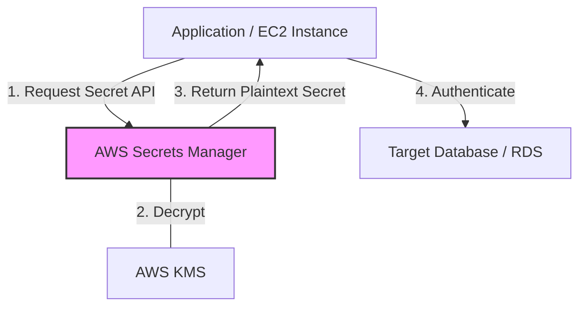
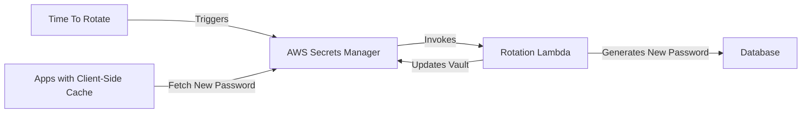

# Curriculum Overview: Securely Storing Secrets with AWS Secrets Manager

This curriculum overview details the learning path for mastering AWS Secrets Manager, a critical component of the AWS Certified SysOps Administrator (SOA-C03) exam domain: **Data Protection and Infrastructure Security (Task 4.2)**. By the end of this curriculum, you will understand how to securely store, rotate, and retrieve sensitive credentials.

---

## Prerequisites

Before diving into AWS Secrets Manager, learners must have a foundational understanding of the following AWS concepts:

*   **AWS Identity and Access Management (IAM):** Understanding of IAM policies, roles, and the principle of least privilege. You must know how to grant or deny API access.
*   **AWS Key Management Service (KMS):** Basic knowledge of symmetric encryption, as Secrets Manager relies on KMS to encrypt secrets at rest.
*   **Relational Databases:** Familiarity with Amazon RDS or DocumentDB, including how database credentials (username/password) are typically used by applications.
*   **Infrastructure as Code (IaC):** Basic understanding of AWS CloudFormation templates and stack deployments.
*   **Programming Basics:** Familiarity with making API calls using AWS SDKs (e.g., Boto3 for Python or the AWS SDK for Node.js).

> [!NOTE]
> **Why are these prerequisites important?**
> AWS Secrets Manager does not operate in a vacuum. It uses IAM for access control, KMS for encryption, and is most frequently used to protect credentials for RDS databases and external APIs.

---

## Module Breakdown

The curriculum is structured progressively, starting with foundational concepts and advancing to complex automation and Infrastructure as Code integrations.

| Module | Topic | Difficulty | Est. Time |
| :--- | :--- | :--- | :--- |
| **Module 1** | Introduction to Secret Management & KMS Encryption | Beginner | 1 Hour |
| **Module 2** | Programmatic Retrieval & Client-Side Caching | Intermediate | 1.5 Hours |
| **Module 3** | Automated Secret Rotation with AWS Lambda | Advanced | 2 Hours |
| **Module 4** | Infrastructure as Code (CloudFormation) Integration | Advanced | 1.5 Hours |

### System Architecture: Secret Retrieval Flow

To understand how these modules fit together, review the standard architectural flow for an application securely retrieving a secret:



---

## Learning Objectives per Module

### Module 1: Introduction to Secret Management
*   **Define** what constitutes a "secret" (e.g., database credentials, OAuth tokens, API keys).
*   **Configure** a new secret using the AWS Management Console.
*   **Apply** IAM policies to restrict access to specific secrets to authorized applications only.
*   **Explain** how AWS KMS is used to encrypt secrets at rest.

### Module 2: Programmatic Retrieval & Caching
*   **Retrieve** a secret programmatically using the AWS SDK.
*   **Implement** client-side caching to reduce API requests, improve application speed, and lower costs.
*   **Format** retrieved JSON key-value pairs to extract specific credential strings.

### Module 3: Automated Secret Rotation
*   **Enable** native automatic rotation for supported AWS services (RDS, DocumentDB, Redshift).
*   **Deploy** and configure custom AWS Lambda functions to rotate credentials for non-native services (e.g., Oracle databases on EC2, third-party API tokens).
*   **Troubleshoot** rotation failures using CloudWatch logs.

### Module 4: Infrastructure as Code Integration
*   **Create** secrets dynamically during infrastructure deployment using AWS CloudFormation.
*   **Construct** CloudFormation dynamic references to inject secrets into other resources.

> [!IMPORTANT]
> **CloudFormation Dynamic Reference Syntax:**
> Understanding this exact syntax is critical for the exam and real-world deployments:
> `{{resolve:secretsmanager:secret-id:SecretString:json-key:version-stage:version-id}}`

---

## Success Metrics

How will you know you have mastered this curriculum? You should be able to complete the following performance milestones:

1.  **Zero Hardcoded Credentials:** You can audit a codebase, remove all hardcoded passwords, and successfully replace them with Secrets Manager API calls.
2.  **Seamless Rotation:** You can force a secret rotation for an RDS database without causing application downtime or connection drops.
3.  **CloudFormation Deployment:** You can write a single CloudFormation template that provisions an RDS instance and automatically generates/stores its master password in Secrets Manager using dynamic references.
4.  **Least Privilege Access:** You can successfully write an IAM policy that allows an EC2 instance to read *only* `Secret A` and explicitly denies access to `Secret B`.

<details>
<summary>Click to view an example IAM Success Check</summary>

To prove mastery of least privilege, your policies should look similar to this, explicitly defining the Resource ARN rather than using `"*"`:

```json
{
  "Version": "2012-10-17",
  "Statement": [
    {
      "Effect": "Allow",
      "Action": "secretsmanager:GetSecretValue",
      "Resource": "arn:aws:secretsmanager:us-east-1:123456789012:secret:my-app-secret-XYZ"
    }
  ]
}
```
</details>

---

## Real-World Application

Why does this matter in your career as a CloudOps Engineer or SysOps Administrator?

### 1. Preventing Catastrophic Data Breaches
Hardcoded credentials in source code (like GitHub repositories) are one of the leading causes of massive data breaches. By utilizing Secrets Manager, developers never have to handle plaintext production passwords. The application retrieves what it needs at runtime.

### 2. Meeting Compliance Requirements
Security standards like SOC 2, HIPAA, and PCI-DSS require strict auditing and regular rotation of credentials. AWS Secrets Manager provides out-of-the-box compliance by logging all access via **AWS CloudTrail** and automating password rotation schedules (e.g., every 30, 60, or 90 days).

### 3. Automated Lifecycle Management
In a microservices architecture, dozens of applications might share a single database. If an administrator needs to change the database password manually, they must update dozens of applications simultaneously. 

With Secrets Manager, the lifecycle is automated:



By fully grasping this curriculum, you ensure your organization’s infrastructure remains agile, automated, and mathematically secure against credential-based attacks.