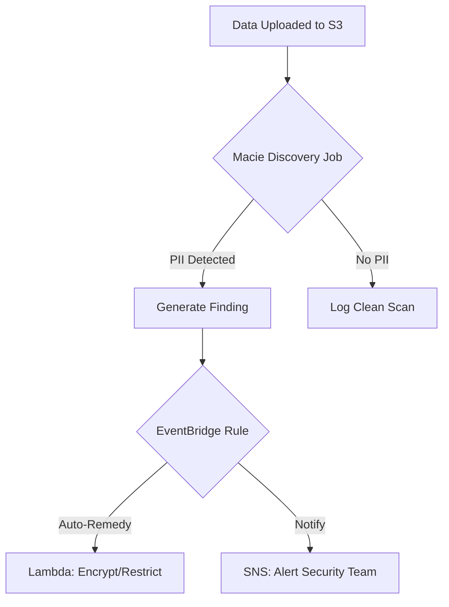

# Implementing and Enforcing Data Classification

This guide focuses on the strategies and tools used to identify, categorize, and protect sensitive data within an AWS environment, specifically focusing on **Amazon Macie** and **S3** storage.

## Learning Objectives
After studying this guide, you should be able to:
* Define a standard data classification scheme (Public, Internal, Restricted, Sensitive).
* Configure **Amazon Macie** to identify Personally Identifiable Information (PII) in S3.
* Set up recurring **Data Discovery Jobs** to maintain continuous compliance.
* Understand the integration between Macie findings and automated remediation via **Amazon EventBridge**.
* Manage regional Macie publication settings for security findings.

## Key Terms & Glossary
*   **Amazon Macie**: A fully managed data security and data privacy service that uses machine learning and pattern matching to discover and protect sensitive data in AWS.
*   **PII (Personally Identifiable Information)**: Any data that could potentially identify a specific individual (e.g., Social Security numbers, credit card details, phone numbers).
*   **Data Discovery Job**: A process in Macie that scans S3 buckets to identify sensitive data based on managed or custom identifiers.
*   **Managed Data Identifiers**: Built-in criteria used by Macie to detect sensitive data like passport numbers, bank account numbers, or private keys.
*   **Findings**: Actionable security alerts generated by Macie when it detects sensitive data or potential security risks (like unencrypted buckets).

## The "Big Idea"
Data protection is only as effective as the visibility you have into your data. Organizations often store massive amounts of data in S3 buckets, sometimes without clear knowledge of what is sensitive. **Data Classification** provides the labels, but **Amazon Macie** provides the eyes. By automating the discovery of sensitive data, you can enforce security policies (like encryption or restricted access) based on the actual content of the files, rather than just their location.

## Formula / Concept Box

| Classification Level | Definition | Example Data | Required Control |
| :--- | :--- | :--- | :--- |
| **Public** | No risk if disclosed | Marketing materials | Public Read Allowed |
| **Internal-Only** | Low-risk business data | Internal memos, directory | IAM Authentication |
| **Restricted** | Potential harm if leaked | Customer account numbers | SSE-S3 Encryption |
| **Sensitive** | Legal/Regulatory impact | PII, Intellectual Property | SSE-KMS + Logging |

## Hierarchical Outline
1.  **Defining the Scheme**
    *   Establish clear definitions (Public vs. Sensitive).
    *   Align storage locations (S3 Buckets) to classification levels.
2.  **Implementation with Amazon Macie**
    *   **Enabling Macie**: Must be enabled per region.
    *   **Configuration**: Settings for finding publication (1-hour or 6-hour intervals).
3.  **The Discovery Process**
    *   Creating **Data Discovery Jobs** (One-time vs. Recurring).
    *   Selecting targets (S3 buckets and objects).
    *   Using **Managed Data Identifiers** for PII detection.
4.  **Enforcement and Remediation**
    *   Reviewing findings in the Macie Console.
    *   **Automation**: Sending findings to **EventBridge** for auto-remediation (e.g., locking a bucket or notifying security).

## Visual Anchors

### Data Discovery Flow

### Classification Logic
\begin{tikzpicture}
    % Draw the classification pyramid
    \draw[thick] (0,0) -- (4,0) -- (2,4) -- cycle;
    \draw (0.5,1) -- (3.5,1);
    \draw (1,2) -- (3,2);
    \draw (1.5,3) -- (2.5,3);
    
    % Labels
    \node at (2,0.5) {Public};
    \node at (2,1.5) {Internal};
    \node at (2,2.5) {Restricted};
    \node at (2,3.5) {Sensitive};
    
    % Arrow showing sensitivity
    \draw[->, thick] (-1,0) -- (-1,4) node[midway, left, rotate=90] {Sensitivity \& Control};
\end{tikzpicture}

## Definition-Example Pairs
*   **Managed Data Identifier**
    *   *Definition*: Pre-defined sets of patterns provided by AWS to detect common sensitive data types.
    *   *Example*: Using the `CREDIT_CARD_NUMBER` identifier to find exposed financial data in a CSV file.
*   **Recurring Schedule**
    *   *Definition*: A job configuration that automatically scans new data added to a bucket after the initial scan.
    *   *Example*: A daily scan of an HR bucket to ensure no unencrypted employee records were uploaded overnight.

## Worked Examples

### Scenario: Securing an Unprotected S3 Bucket
**Problem**: A developer accidentally uploaded a customer list containing phone numbers to a bucket labeled "Internal-Only" that has no encryption.

**Step-by-Step Solution**:
1.  **Discovery**: Create a Macie Data Discovery job targeting the specific S3 bucket.
2.  **Identification**: Macie scans the objects and flags the phone numbers using the PII managed identifier.
3.  **Review**: The SysOps Admin reviews the "Finding" in the Macie console, seeing that the bucket is unencrypted and contains sensitive data.
4.  **Enforcement**: 
    *   The admin moves the file to a "Sensitive" bucket.
    *   The admin enables Default Encryption (AES-256 or KMS) on the original bucket to meet the organization's data protection strategy.

## Checkpoint Questions
1.  **How often can Macie publish updates to findings?** (Answer: Every 1 hour or every 6 hours, depending on regional settings).
2.  **Does Macie automatically move sensitive data to a secure bucket?** (Answer: No, Macie identifies and reports; you must use automation like EventBridge or manual action to move the data).
3.  **What is the benefit of a recurring discovery job?** (Answer: It ensures that any new data uploaded after the initial scan is evaluated for sensitive content).
4.  **True or False: Macie settings are global and apply to all regions once configured.** (Answer: False; publication settings must be updated in each specific region).

> [!IMPORTANT]
> Data classification is not a one-time event. It requires continuous monitoring via Macie to catch "shadow data" or human error in data placement.