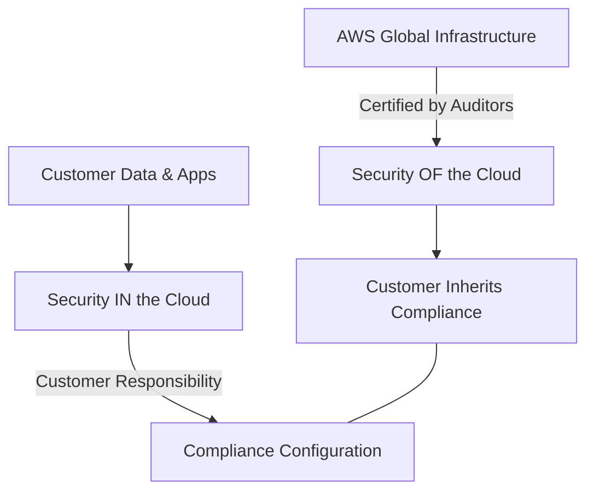

# Auditing and Compliance Management

This study guide focuses on the mechanisms used to ensure governance, regulatory alignment, and continuous auditing within an AWS environment, specifically for the SysOps Administrator Associate (SOA-C03) exam.

## Learning Objectives

After studying this module, you should be able to:
- Differentiate between AWS's and the customer's responsibilities in the **Shared Responsibility Model**.
- Navigate **AWS Artifact** to retrieve compliance reports.
- Use **AWS Audit Manager** for continuous assessment against compliance frameworks.
- Implement and automate governance using **AWS Config** rules and remediation.
- Understand the regional nature of compliance certifications.
- Manage security group auditing via **AWS Firewall Manager**.

## Key Terms & Glossary

- **Inheritance**: The concept where a customer automatically benefits from the security controls AWS has implemented for the physical infrastructure.
- **Control**: A specific policy or procedure that compliance regulations track to ensure security and privacy (e.g., "Encryption at rest").
- **Remediation**: The action of returning a non-compliant resource to its intended, compliant state, often automated via AWS Config or Systems Manager.
- **IAM Request Context**: The environmental data (IP, time, MFA status) captured during an API request used by IAM to determine if access is granted.
- **Attestation**: A formal statement (often from a third-party auditor) verifying that a system meets specific standards.

## The "Big Idea"

Compliance in the cloud is a **two-part, continuous process**. It is not a static "checkmark" but a living cycle of monitoring and automation. While AWS ensures the underlying infrastructure (Global Infrastructure, Compute, Storage) meets rigorous global standards, the customer is responsible for configuring the services they use to remain compliant. **Visibility** (knowing what is running) and **Automation** (fixing what is broken) are the two pillars of modern cloud auditing.

## Formula / Concept Box

| Concept | Responsibility / Logic |
| :--- | :--- |
| **Compliance Inheritance** | AWS (Infrastructure) → Customer (Inherits Attestations) |
| **Compliance Dimensions** | Service + Region + Compliance Program (e.g., HIPAA in us-east-1 ≠ HIPAA in eu-west-1 automatically) |
| **Audit vs. Artifact** | **Artifact**: Static third-party reports. **Audit Manager**: Live, automated internal assessments. |
| **Remediation Logic** | Monitor → Identify Change → Trigger Action (SSM/Lambda) → Return to Desired State |

## Hierarchical Outline

- **The Compliance Framework**
    - **Shared Responsibility Model**: AWS is responsible for security **of** the cloud; the customer is responsible for security **in** the cloud.
    - **Three Dimensions**: Compliance is evaluated by **Service**, **Region**, and **Program**.
- **Governance and Auditing Tools**
    - **AWS Artifact**: A self-service portal providing access to AWS’s compliance documentation (SOC, PCI, ISO).
    - **AWS Audit Manager**: Automates evidence collection for audits using prebuilt templates.
    - **AWS Config**: Records resource configurations, evaluates them against "rules," and provides a timeline of changes.
- **Infrastructure Security Auditing**
    - **Firewall Manager**: Manages Security Groups across accounts. Identifies redundant, unused, or non-compliant security group rules.
    - **IAM Contextual Awareness**: IAM evaluates requests based on the **Context** (e.g., is the request coming from a corporate IP?).
- **Finding & Vulnerability Analysis**
    - **Security Hub**: Centralized view of security alerts (Findings) across AWS accounts.
    - **Amazon Inspector**: Automated vulnerability assessment service for EC2 and container images.

## Visual Anchors

### Shared Responsibility & Inheritance



### IAM Request Context Evaluation

```tikz
\begin{tikzpicture}[node distance=2cm, auto]
    \draw[thick, fill=blue!10] (0,0) rectangle (10,4);
    \node at (5,3.5) {\textbf{IAM Evaluation Engine}};
    \node (req) at (-2,2) {\mbox{API Request}};
    \node (context) at (2,2) [draw, rounded corners, fill=white] {\mbox{Context Data}};
    \node (policies) at (5,2) [draw, fill=white] {\mbox{IAM Policies}};
    \node (decision) at (8,2) [draw, circle, fill=yellow!20] {\mbox{Allow?}};
    \draw[->, thick] (req) -- (context);
    \draw[->, thick] (context) -- (policies);
    \draw[->, thick] (policies) -- (decision);
    \node[below] at (2,1.5) {\tiny (IP, Time, MFA, Source)};
\end{tikzpicture}
```

## Definition-Example Pairs

- **Service-Specific Compliance**: A service must be individually certified in every region it operates in.
    - *Example*: A financial firm using RDS in the US-East-1 region for HIPAA data must verify that RDS is HIPAA-compliant specifically in that region via the AWS Services in Scope page.
- **Config Remediation**: A mechanism to fix a resource that has drifted from a required setting.
    - *Example*: An AWS Config Rule detects an S3 bucket is public. It triggers an AWS Systems Manager (SSM) Automation runbook that immediately flips the bucket to private.
- **Firewall Manager Finding**: An alert generated when security groups don't match the organization's policy.
    - *Example*: Firewall Manager detects a "Replica" security group in a member account is out of sync with the "Primary" security group defined by the admin. It automatically syncs them to ensure consistent port blocking.

## Worked Examples

### Scenario: Auditing S3 Bucket Encryption
**The Problem**: Your compliance policy requires all S3 buckets to have server-side encryption enabled. You need a way to detect and automatically fix any unencrypted buckets.

1.  **Step 1: Enable AWS Config**: Turn on recording for the S3 Bucket resource type.
2.  **Step 2: Deploy Config Rule**: Use the managed rule `s3-bucket-server-side-encryption-enabled`.
3.  **Step 3: Define Remediation**: Link the rule to an SSM Automation document (`AWS-EnableS3BucketEncryption`).
4.  **Step 4: Testing**: Create a test bucket without encryption. Within minutes, AWS Config marks it as "Non-compliant," triggers the SSM document, and the bucket is updated to use AES-256 encryption.

> [!TIP]
> In the SysOps exam, look for "AWS Config" when the requirement is about configuration history or compliance rules, and "AWS Artifact" when you need a SOC report for a physical auditor.

## Checkpoint Questions

1.  **Can you assume a service is HIPAA compliant in London just because it is in New York?**
    - *Answer*: No. Compliance is regional.
2.  **Where do you download the latest PCI DSS Attestation of Compliance (AOC) for AWS?**
    - *Answer*: AWS Artifact.
3.  **Which service provides continuous auditing using prebuilt templates for frameworks like GDPR?**
    - *Answer*: AWS Audit Manager.
4.  **How does Firewall Manager handle a "manually remediated" finding with INFORMATIONAL severity?**
    - *Answer*: Manually remediated findings are not updated automatically; you must manually clear them or set the correct severity in the console.
5.  **What tool would you use to simulate an IAM policy to troubleshoot why a user is denied access?**
    - *Answer*: IAM Policy Simulator.