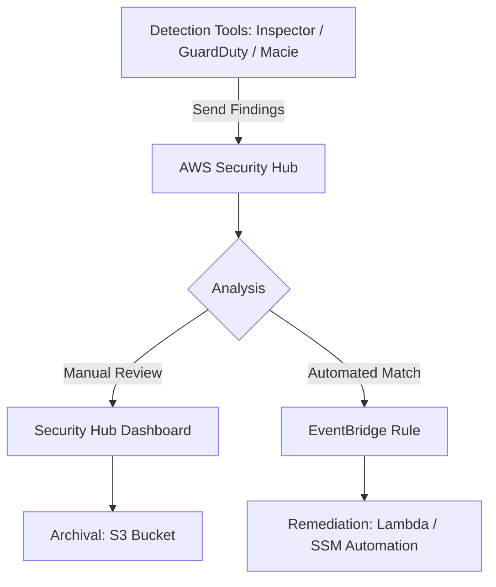

# Analyzing Security Findings: Amazon Inspector and AWS Security Hub

This guide focuses on the centralized management and analysis of security alerts within an AWS environment, specifically through the lens of Amazon Inspector and AWS Security Hub.

## Learning Objectives
After studying this guide, you should be able to:
- **Analyze** and group findings within the Amazon Inspector console.
- **Configure** suppression rules to filter out noise in vulnerability reports.
- **Explain** the benefits of centralizing security findings in AWS Security Hub.
- **Identify** the prerequisites for exporting Inspector findings to Amazon S3.
- **Implement** automated remediation workflows using EventBridge and Security Hub.

## Key Terms & Glossary
- **Finding:** A detailed report of a potential security issue or vulnerability identified by an AWS security service.
- **CVE (Common Vulnerabilities and Exposures):** A list of publicly disclosed computer security flaws. Inspector maps findings to these IDs.
- **Suppression Rule:** A set of criteria in Inspector used to automatically hide findings that are known risks or non-issues.
- **Insight:** A collection of related findings in Security Hub that helps identify specific areas of risk (e.g., "S3 buckets with public read access").
- **Security Standard:** A set of controls (e.g., CIS AWS Foundations) that Security Hub uses to measure your compliance.

## The "Big Idea"
In a modern cloud environment, "security fatigue" is a real threat—admins are often overwhelmed by thousands of disconnected alerts. The **Big Idea** here is **Centralized Visibility**. Instead of checking EC2, ECR, and IAM separately, AWS uses **Security Hub** as a "single pane of glass" to aggregate findings from **Inspector** (vulnerabilities), **GuardDuty** (threats), and **Macie** (data privacy), allowing for prioritized, automated remediation.

## Formula / Concept Box

| Feature | Amazon Inspector | AWS Security Hub |
| :--- | :--- | :--- |
| **Primary Goal** | Vulnerability & Reachability Scanning | Centralized Security Posture Management |
| **Scan Targets** | EC2 instances, ECR images, Lambda | Integrated AWS Services & 3rd Party Tools |
| **Logic** | Scans software packages and network paths | Aggregates findings and checks against Standards |
| **Output** | Findings (CSV/JSON/S3/Security Hub) | Insights, Compliance Scores, Actions |

## Hierarchical Outline
1. **Amazon Inspector: Vulnerability Management**
    - **Finding Types**: Software package vulnerabilities and network reachability.
    - **Analysis Techniques**: Grouping by account, instance, or finding state.
    - **Suppression Rules**: Using filters to exclude specific findings from the view.
    - **Exporting Data**: 
        - **EventBridge**: For real-time notifications/remediation.
        - **S3 Buckets**: For long-term archival (requires **AWS KMS** encryption).
2. **AWS Security Hub: The Aggregator**
    - **Centralization**: Collects findings from Inspector, GuardDuty, and Config.
    - **Compliance**: Automated checks against standards (PCI DSS, CIS, AWS Best Practices).
    - **Dashboards**: Visualizing security trends and high-priority issues.
    - **Automation**: Triggering Lambda or SSM via EventBridge custom actions.

## Visual Anchors

### Finding Lifecycle Flow

### Logical Architecture of Analysis
\begin{tikzpicture}[node distance=2cm, every node/.style={rectangle, draw, rounded corners, minimum width=3cm, minimum height=1cm, align=center}]
    \node (detect) [fill=blue!10] {Detection\\(Inspector/GuardDuty)};
    \node (agg) [right of=detect, node distance=5cm, fill=green!10] {Aggregation\\(Security Hub)};
    \node (response) [below of=agg, fill=red!10] {Response\\(EventBridge + Lambda)};
    \node (storage) [below of=detect, fill=gray!10] {Archival\\(S3 + KMS)};

    \draw[->, thick] (detect) -- (agg);
    \draw[->, thick] (agg) -- (response);
    \draw[->, thick] (detect) -- (storage);
    \draw[dashed, ->] (agg) -- node[right] {Compliance Checks} (response);
\end{tikzpicture}

## Definition-Example Pairs
- **Suppression Rule**
    - *Definition:* A filter that hides specific findings based on criteria like AMI ID or Severity.
    - *Example:* Suppressing all "Medium" severity findings on a legacy development server that is scheduled for decommissioning next week.
- **Finding Grouping**
    - *Definition:* Organizing findings by shared attributes to identify patterns.
    - *Example:* Grouping by "Vulnerability ID" to see if one specific outdated library is present across 50 different EC2 instances.
- **Security Standard**
    - *Definition:* A prepackaged set of security best practices used for automated auditing.
    - *Example:* Using the **CIS AWS Foundations Benchmark** to automatically detect if the 'root' user has an active access key.

## Worked Examples

### Example 1: Exporting Inspector Findings to S3
**Scenario:** You need to archive all Inspector findings for compliance auditing over the next 7 years.
1. **Create an S3 Bucket:** Ensure the bucket exists in the target region.
2. **Configure KMS:** Create a symmetric KMS key. Inspector *requires* a customer-managed key to encrypt findings during the export process.
3. **Set Permissions:** Update the S3 bucket policy and KMS key policy to allow the Inspector service principal (`inspector2.amazonaws.com`) to perform `s3:PutObject` and `kms:GenerateDataKey`.
4. **Generate Report:** In the Inspector console, select "Reports," choose S3 as the destination, and provide the KMS Key ARN.

### Example 2: Auto-Remediation Workflow
**Scenario:** Automatically stop an EC2 instance if Security Hub reports it has a "Critical" vulnerability.
1. **Finding Source:** Inspector detects a critical CVE on instance `i-12345` and sends it to Security Hub.
2. **Security Hub Insight:** Security Hub flags the finding as critical.
3. **EventBridge Rule:** Create a rule with an event pattern matching `Source: aws.securityhub` and `Severity.Label: CRITICAL`.
4. **Target:** Set the target to an **SSM Automation** document `AWS-StopEC2Instance`.

## Checkpoint Questions
1. Which service provides prepackaged security standards like PCI DSS and CIS?
2. What is mandatory for Amazon Inspector to export findings to an Amazon S3 bucket?
3. How do you exclude known low-risk vulnerabilities from the Inspector console view without deleting them?
4. To which AWS service does Inspector automatically export findings for real-time remediation triggers?

<b>Click for Answers</b>

1. AWS Security Hub.
2. A Customer Managed KMS Key for encryption.
3. Create a Suppression Rule.
4. Amazon EventBridge.

