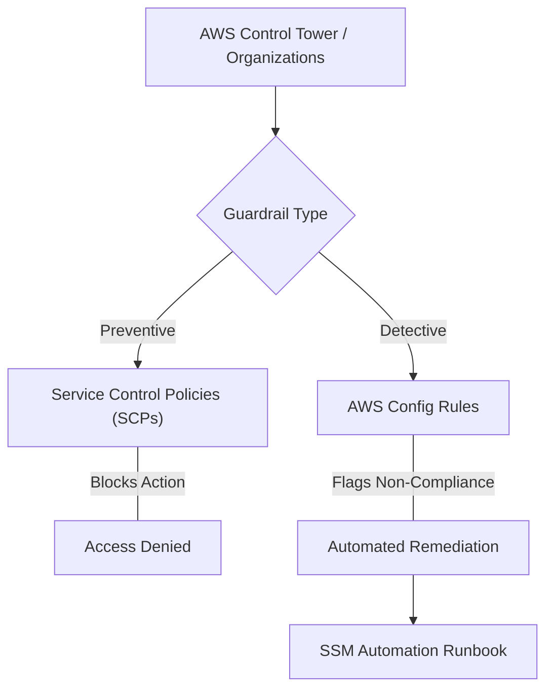

# Curriculum Overview: Enforcing Governance using AWS Config

Welcome to the curriculum overview for **Enforcing Governance using AWS Config**, directly aligned with the AWS Certified CloudOps Engineer - Associate (SOA-C03) exam domain for Security, Compliance, and Data Protection.

## Prerequisites

Before diving into AWS governance, you must have a baseline understanding of AWS foundational services and access management tools. Ensure you are comfortable with the following:

*   **AWS Organizations**: Basic knowledge of Organizational Units (OUs), member accounts, and the management account.
*   **Identity and Access Management (IAM)**: Familiarity with the principle of least privilege, IAM policies, roles, and groups.
*   **AWS Resource Hierarchy**: Understanding how resources are deployed and tracked within specific AWS regions and accounts.
*   **JSON Syntax**: Ability to read basic JSON, as AWS Config rules, IAM policies, and Service Control Policies (SCPs) heavily rely on it.

> [!IMPORTANT]
> If you are not familiar with **AWS Organizations**, review that topic first. AWS Config and Control Tower guardrails operate at scale by leveraging your Organizations structure.

## Module Breakdown

This curriculum is designed to systematically build your expertise from high-level governance concepts down to automated remediation techniques.

| Module | Topic Focus | Difficulty | Estimated Time |
| :--- | :--- | :--- | :--- |
| **Module 1** | Governance Fundamentals & AWS Control Tower | Beginner | 2 Hours |
| **Module 2** | Deep Dive: AWS Config & Resource Recording | Intermediate | 3 Hours |
| **Module 3** | Preventive vs. Detective Guardrails | Intermediate | 2 Hours |
| **Module 4** | Integration: Firewall Manager & Security Hub | Advanced | 2 Hours |
| **Module 5** | Automated Remediation & Event-Driven Ops | Advanced | 3 Hours |

### The Governance Landscape



## Learning Objectives per Module

### Module 1: Governance Fundamentals & AWS Control Tower
*   Understand how the **Account Factory** (formerly Account Vending Machine) enables self-service provisioning while maintaining strict compliance.
*   Navigate the AWS Control Tower dashboard to gain visibility into account structures and guardrail enforcement.

### Module 2: Deep Dive: AWS Config & Resource Recording
*   Enable and configure AWS Config across multiple member accounts in an organization.
*   Understand the mechanics of the configuration recorder and configuration snapshots.
*   Differentiate between AWS managed rules and custom Config rules.

### Module 3: Preventive vs. Detective Guardrails
*   Define **Preventive Guardrails**: Implemented as SCPs from AWS Organizations (States: enforced / not enabled).
*   Define **Detective Guardrails**: Implemented using AWS Config rules (States: clear / in violation / not enabled).
*   Deploy guardrails to specific Organizational Units (OUs).

### Module 4: Integration: Firewall Manager & Security Hub
*   Configure **AWS Firewall Manager** as a centralized management tool across an organization.
*   Identify which AWS Config resource types must be enabled for Firewall Manager policies to function.
*   Analyze findings centrally from AWS Security Hub and Amazon Inspector.

### Module 5: Automated Remediation & Event-Driven Ops
*   Configure AWS Config to automatically trigger remediation using **AWS Systems Manager (SSM) Automation** runbooks.
*   Route non-compliance events via **Amazon EventBridge** to targets like AWS Lambda or Slack notifications.

## Success Metrics

How will you know you have mastered this curriculum? You should be able to consistently meet the following benchmarks:

1.  **Architecture Validation**: Successfully diagram a multi-account strategy that accurately maps SCPs at the root/OU level and Config rules at the member-account level.
2.  **Lab Completion**: Build a custom AWS Config rule that detects unencrypted EBS volumes and automatically remediates them by triggering an SSM runbook.
3.  **Exam Readiness (SOA-C03)**: Score 85% or higher on practice questions related to Task 4.2.5: *"Configure reports and remediate findings from AWS services (for example, AWS Security Hub, Amazon GuardDuty, AWS Config, Amazon Inspector)."*

### Continuous Compliance Lifecycle

Below is the continuous compliance cycle that you will be expected to master:

```tikz
\begin{tikzpicture}[font=\sffamily, thick]
  \node[draw=blue!80, fill=blue!10, rectangle, rounded corners, minimum width=3cm, minimum height=1.5cm, align=center] (record) at (0,0) {1. Record\\(AWS Config)};
  \node[draw=green!80, fill=green!10, rectangle, rounded corners, minimum width=3cm, minimum height=1.5cm, align=center] (evaluate) at (5,0) {2. Evaluate\\(Config Rules)};
  \node[draw=orange!80, fill=orange!10, rectangle, rounded corners, minimum width=3cm, minimum height=1.5cm, align=center] (remediate) at (5,-4) {3. Remediate\\(SSM / Lambda)};
  \node[draw=purple!80, fill=purple!10, rectangle, rounded corners, minimum width=3cm, minimum height=1.5cm, align=center] (report) at (0,-4) {4. Report\\(Security Hub)};
  
  \draw[->, >=latex, line width=1.5pt] (record) -- (evaluate);
  \draw[->, >=latex, line width=1.5pt] (evaluate) -- (remediate);
  \draw[->, >=latex, line width=1.5pt] (remediate) -- (report);
  \draw[->, >=latex, line width=1.5pt] (report) -- (record);
\end{tikzpicture}
```

> [!NOTE]
> **Compliance Score Calculation**  
> Governance health is often measured mathematically. While AWS provides visual dashboards, the underlying compliance formula for an OU is effectively:  
> $$ \text{Compliance Score} = \left( \frac{\text{Compliant Resources}}{\text{Total Evaluated Resources}} \right) \times 100\% $$

## Real-World Application

Why does this matter in your career as a CloudOps Engineer?

*   **Automated Audit Defense**: In enterprise environments, manual audits are impossible. Using AWS Config allows organizations to prove point-in-time compliance to auditors for frameworks like HIPAA, PCI-DSS, and SOC2.
*   **Stopping Security Breaches Early**: By enforcing preventive guardrails (like preventing public S3 buckets via SCP) and detective guardrails (alerting when an unapproved port is opened in a Security Group via Config), you minimize the blast radius of misconfigurations.
*   **Cost & Resource Sprawl Control**: AWS Config is frequently used to hunt down "orphan" resources (e.g., unattached Elastic IPs, unattached EBS volumes) to enforce cost-saving policies automatically.
*   **Centralized Firewall Management**: To centrally monitor and block DDoS attacks across hundreds of accounts, administrators rely on AWS Firewall Manager—which strictly requires AWS Config to be correctly enabled across all member accounts to scope policies accurately.