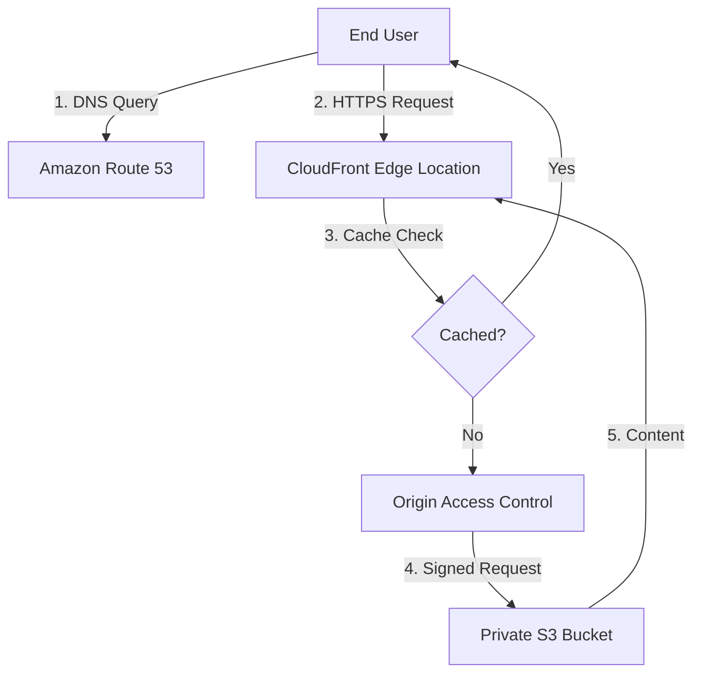

# Lab: Building High-Performance Content Delivery with Amazon CloudFront and S3 OAC

This lab focuses on configuring a secure, global content delivery network (CDN) using Amazon CloudFront, backed by an Amazon S3 origin. You will implement **Origin Access Control (OAC)** to ensure your content is only accessible via the CDN, optimizing both security and performance as per AWS SysOps best practices (Skill 5.2.3 and 5.3.3).

## Prerequisites

*   **AWS Account**: An active AWS account with permissions for S3, CloudFront, and Route 53.
*   **AWS CLI**: Configured with an IAM user or role having `PowerUserAccess` or equivalent.
*   **IAM Permissions**: Ensure you can create S3 buckets and CloudFront distributions.
*   **Environment**: A terminal for CLI commands or access to the AWS Management Console.

## Learning Objectives

*   Provision a private S3 bucket to serve as a web origin.
*   Create a CloudFront distribution with **Origin Access Control (OAC)**.
*   Secure S3 content by restricting access exclusively to CloudFront via Bucket Policies.
*   Configure Amazon Route 53 for alias record routing (Conceptual/Walkthrough).
*   Test and troubleshoot caching and connectivity issues.

## Architecture Overview



## Step-by-Step Instructions

### Step 1: Create the Private S3 Origin

First, we need a bucket to store our static assets. This bucket will NOT be configured for static website hosting; it will remain private.

```bash
# Replace <RANDOM_ID> with a unique string
aws s3 mb s3://brainybee-lab-content-<RANDOM_ID> --region us-east-1
```

<details><summary>Console alternative</summary>

1.  Navigate to **S3** > **Create bucket**.
2.  **Bucket name**: `brainybee-lab-content-<ID>`.
3.  Keep **Block all public access** checked (On).
4.  Click **Create bucket**.

</details>

### Step 2: Upload Sample Content

Create a simple `index.html` file and upload it to your bucket.

```bash
echo "<h1>Hello from BrainyBee CloudFront Lab!</h1>" > index.html
aws s3 cp index.html s3://brainybee-lab-content-<RANDOM_ID>/
```

### Step 3: Create CloudFront Origin Access Control (OAC)

OAC is the modern way to secure S3 origins. We must first create the OAC configuration before the distribution.

```bash
aws cloudfront create-origin-access-control --origin-access-control-config '{
    "Name": "S3-OAC-Lab",
    "SigningProtocol": "sigv4",
    "SigningBehavior": "always",
    "OriginAccessControlOriginType": "s3"
}'
```

### Step 4: Deploy the CloudFront Distribution

Deploy the distribution pointing to your S3 bucket using the OAC created in Step 3.

> [!TIP]
> In the AWS Console, choosing the S3 bucket from the dropdown will automatically prompt you to create or use an OAC. 

1.  Navigate to **CloudFront** > **Create distribution**.
2.  **Origin domain**: Select your S3 bucket.
3.  **Origin access**: Select **Origin access control settings (recommended)**.
4.  **OAC**: Select the one created in Step 3.
5.  **Viewer Protocol Policy**: Select **Redirect HTTP to HTTPS**.
6.  **Default cache behavior**: Keep defaults (Optimized for S3).
7.  Click **Create distribution**.

### Step 5: Update S3 Bucket Policy

CloudFront provides a policy snippet after creation. You must apply this to S3 to allow CloudFront to read your objects.

```json
{
    "Version": "2012-10-17",
    "Statement": {
        "Sid": "AllowCloudFrontServicePrincipalReadOnly",
        "Effect": "Allow",
        "Principal": {
            "Service": "cloudfront.amazonaws.com"
        },
        "Action": "s3:GetObject",
        "Resource": "arn:aws:s3:::brainybee-lab-content-<RANDOM_ID>/*",
        "Condition": {
            "StringEquals": {
                "AWS:SourceArn": "arn:aws:cloudfront::<ACCOUNT_ID>:distribution/<DISTRIBUTION_ID>"
            }
        }
    }
}
```
Apply this in the **S3 Console** under **Permissions** > **Bucket Policy**.

## Checkpoints

| Verification Task | Action | Expected Result |
| :--- | :--- | :--- |
| **Direct S3 Access** | Browse to `https://<bucket>.s3.amazonaws.com/index.html` | **Access Denied (403)** |
| **CloudFront Access** | Browse to `https://<distribution-id>.cloudfront.net/index.html` | **Success (200)** displaying HTML |
| **Cache Check** | Run `curl -I <CF-URL>` twice | `X-Cache: Hit from cloudfront` on second run |

## Troubleshooting

| Issue | Possible Cause | Fix |
| :--- | :--- | :--- |
| **403 Forbidden** | S3 Bucket Policy is missing or has wrong ARN | Verify the `SourceArn` in S3 Policy matches the CloudFront Dist ID. |
| **404 Not Found** | Incorrect path or file name | Ensure the S3 object key matches the URL path (case sensitive). |
| **Stale Content** | CloudFront cache hasn't expired | Create an **Invalidation** for path `/*` to clear the edge cache. |

## Clean-Up / Teardown

> [!WARNING]
> CloudFront distributions can take up to 15 minutes to delete. You must disable them first.

1.  **CloudFront**: Select your distribution, click **Disable**, then wait for the status to reflect "Disabled" before clicking **Delete**.
2.  **S3**: Empty the bucket `brainybee-lab-content-<ID>` and then delete it.
3.  **OAC**: Navigate to CloudFront > Origin access > Select your OAC and delete it.

## Stretch Challenge

**Implement a Custom Error Page**: Upload an `error.html` to S3. In CloudFront, configure a **Custom Error Response** so that any 403 error from S3 (e.g., when a user tries to access a non-existent file) returns the `error.html` page with a 200 OK status. This is a common requirement for Single Page Applications (SPAs).