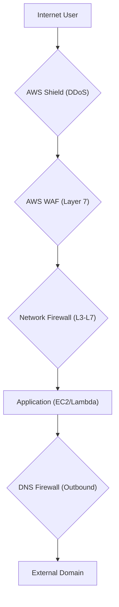

# Auditing AWS Network Protection Services

This guide focuses on evaluating and auditing the security posture of AWS network protection services within a single account, including AWS WAF, AWS Shield, AWS Network Firewall, and Route 53 Resolver DNS Firewall.

## Learning Objectives

By the end of this guide, you should be able to:
- **Distinguish** between the primary use cases for AWS WAF, Shield, and Network Firewall.
- **Identify** the key metrics and logs required to audit network protection services.
- **Explain** how AWS Firewall Manager and AWS Config track compliance for these services.
- **Evaluate** a single-account architecture for gaps in perimeter and application-layer security.

## Key Terms & Glossary

- **Web ACL (Web Access Control List):** A set of rules that you apply to an AWS resource (like CloudFront or an ALB) to control web traffic.
- **Managed Rule Groups:** Collections of predefined rules provided by AWS or third-party sellers (e.g., OWASP Top 10) for AWS WAF.
- **DNS Exfiltration:** A technique where data is smuggled out of a network via DNS queries; prevented by DNS Firewall.
- **Stateful Inspection:** A firewall feature that monitors the state of active connections and makes decisions based on the context of the traffic flow.
- **DDoS (Distributed Denial of Service):** An attempt to make a service unavailable by overwhelming it with traffic from multiple sources.

## The "Big Idea"

Auditing network protection is about verifying a **Defense in Depth** strategy. No single service protects everything. Auditing ensures that your perimeter is shielded (Shield), your web applications are filtered (WAF), your internal VPC traffic is inspected (Network Firewall), and your DNS queries are restricted (Route 53 Resolver DNS Firewall). Compliance is verified by checking if these services are active, logging correctly, and adhering to organizational policies.

## Formula / Concept Box

| Service | OSI Layer | Primary Audit Focus |
| :--- | :--- | :--- |
| **AWS Shield** | Layers 3 & 4 | Shield Advanced subscription status and DDoS incident history. |
| **AWS WAF** | Layer 7 | Web ACL association with ALBs/CloudFront and rule match logs. |
| **Network Firewall** | Layers 3 - 7 | VPC entry/exit points and stateful rule compliance. |
| **DNS Firewall** | Application (DNS) | Block lists for malicious domains and query logging. |

## Hierarchical Outline

1.  **Application Layer Protection (AWS WAF)**
    - **Web ACL Associations:** Ensure WAF is actually attached to the correct resources.
    - **Logging:** Verify that Web ACL logs are sent to S3 or Kinesis Firehose for auditing.
    - **Rule Analysis:** Check for the presence of **SQLi** and **XSS** protection rules.
2.  **Infrastructure & DDoS Protection (AWS Shield)**
    - **Standard vs. Advanced:** Standard is automatic; Advanced requires explicit setup and auditing for resource protection.
    - **SRT Access:** Check if the Shield Response Team (SRT) has permissions to modify rules during an event.
3.  **VPC-Level Security (AWS Network Firewall)**
    - **Deployment Models:** Audit whether the firewall is in a centralized or decentralized (per-VPC) configuration.
    - **Rule Groups:** Review stateless vs. stateful rule logic to ensure no "allow all" gaps.
4.  **DNS Layer Security (Route 53 Resolver DNS Firewall)**
    - **Domain Lists:** Audit the "Blocked" and "Allowed" domain lists.
    - **VPC Association:** Ensure the DNS Firewall rule group is associated with all critical VPCs.
5.  **Centralized Auditing Tools**
    - **AWS Config:** Use for point-in-time configuration snapshots and compliance history.
    - **AWS Firewall Manager:** Identifies non-compliant resources across the account automatically.

## Visual Anchors

### Traffic Flow Through Protection Layers

### Defense in Depth Layers

\begin{tikzpicture}[node distance=1cm]
    \draw[thick] (0,0) circle (3cm);
    \draw[thick] (0,0) circle (2cm);
    \draw[thick] (0,0) circle (1cm);
    \node at (0,2.5) {Perimeter: Shield/WAF};
    \node at (0,1.5) {VPC: Network Firewall};
    \node at (0,0) {Host/DNS};
\end{tikzpicture}

## Definition-Example Pairs

- **Rule Group:** A reusable set of criteria used to inspect and filter traffic.
  - *Example:* An AWS WAF Managed Rule Group for **IP Reputation** that automatically blocks requests from known malicious IP addresses.
- **Non-Compliant Resource:** A resource that does not meet the security criteria defined in an audit policy.
  - *Example:* An Application Load Balancer (ALB) that is public-facing but does NOT have an AWS WAF Web ACL associated with it.
- **Auto-Remediation:** The process where a tool automatically fixes a security misconfiguration.
  - *Example:* **AWS Firewall Manager** detecting a Security Group with port 22 open to the world and automatically applying a restrictive policy to close it.

## Worked Examples

### Example 1: Auditing AWS WAF Association
**Scenario:** An auditor needs to confirm that all public Application Load Balancers (ALBs) in a single account are protected by AWS WAF.
1.  **Step 1:** Use **AWS Config** to list all `AWS::ElasticLoadBalancingV2::LoadBalancer` resources.
2.  **Step 2:** Check the `WAF_ALB_RESOURCE_ASSOCIATED` config rule.
3.  **Step 3:** If the rule returns "NON_COMPLIANT," identify the specific ALB ARN.
4.  **Result:** The auditor discovers an ALB for a dev environment that is exposed to the internet without a Web ACL.

### Example 2: Reviewing DNS Firewall Logs for Exfiltration
**Scenario:** You suspect an EC2 instance is communicating with a Command & Control (C2) server.
1.  **Step 1:** Access **CloudWatch Logs** for the Route 53 Resolver query logging.
2.  **Step 2:** Filter for `action="BLOCK"` to see which domains were attempted.
3.  **Step 3:** Analyze the `query_name` field for suspicious patterns (e.g., `long-string-of-hex.attacker.com`).
4.  **Result:** You confirm the DNS Firewall prevented the connection and use the log to identify the compromised instance ID.

## Checkpoint Questions

1. Which service is best suited for blocking a specific SQL Injection attack targeting an API Gateway?  
   *(Answer: AWS WAF)*
2. True or False: AWS Shield Standard provides the same level of reporting and 24/7 support as AWS Shield Advanced.  
   *(Answer: False)*
3. What is the primary difference between a Security Group and AWS Network Firewall?  
   *(Answer: Security Groups are host-based and stateful for L3/L4, while Network Firewall provides deep packet inspection across the entire VPC and can filter based on FQDNs.)*
4. If a resource is marked as "Noncompliant" in AWS Firewall Manager, what is the next step it can take automatically?  
   *(Answer: It can perform auto-remediation to bring the resource back into compliance.)* 

> [!IMPORTANT]
> When auditing, always check **AWS Config** first. It provides the historical timeline of changes, which is critical for understanding when a security gap was introduced.