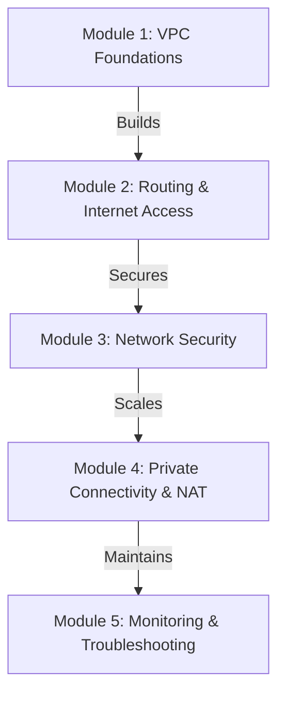
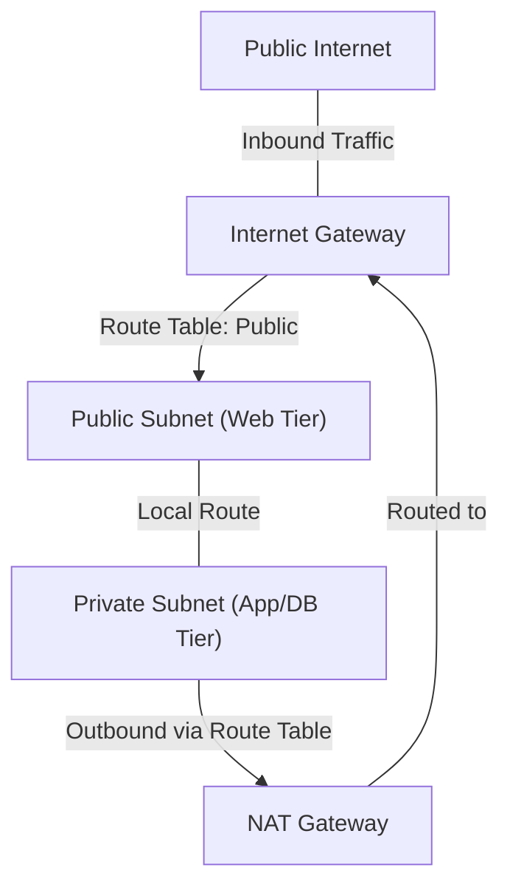

# Curriculum Overview: Configure and Manage an AWS VPC

Welcome to the comprehensive curriculum for configuring and managing an Amazon Virtual Private Cloud (VPC). This curriculum is designed to align with the AWS Certified SysOps Administrator / CloudOps Engineer requirements (Task 5.1), focusing on implementing, optimizing, and troubleshooting network connectivity.

## Prerequisites

Before diving into this curriculum, learners must possess the following foundational knowledge and tools:

*   **Cloud Computing Basics:** Understanding of regional and availability zone (AZ) architecture.
*   **Networking Fundamentals:** Basic grasp of IP addressing, TCP/IP, and CIDR (Classless Inter-Domain Routing) notation. You should understand how a `/24` subnet yields $2^{32-24} = 256$ total IP addresses (with 5 reserved by AWS).
*   **AWS Tools:** An active AWS Account, and the AWS Command Line Interface (CLI) installed and configured with appropriate IAM credentials.
*   **Identity & Access:** Familiarity with AWS IAM principles of least privilege.

## Module Breakdown

This curriculum is structured to take you from foundational networking concepts to advanced routing, security, and troubleshooting.

| Module | Topic | Difficulty | Estimated Time |
| :--- | :--- | :--- | :--- |
| **1** | VPC Foundations & Subnetting | Beginner | 2 Hours |
| **2** | Routing & Internet Access (IGW) | Intermediate | 2.5 Hours |
| **3** | Network Security (SGs & NACLs) | Intermediate | 3 Hours |
| **4** | Private Connectivity & NAT Gateways | Advanced | 2.5 Hours |
| **5** | Monitoring & Troubleshooting | Advanced | 3 Hours |

## Learning Objectives per Module

### Module 1: VPC Foundations & Subnetting
*   **Provision a VPC:** Create a VPC and assign an IPv4/IPv6 CIDR block.
*   **Create Subnets:** Provision subnets in specific Availability Zones using the AWS CLI (e.g., `aws ec2 create-subnet --vpc-id <id> --cidr-block 10.180.1.0/24 --availability-zone us-east-1a`).
*   **Tagging Resources:** Apply tags effectively to categorize subnets as Public or Private.

### Module 2: Routing & Internet Access
*   **Deploy Internet Gateways (IGW):** Attach an IGW to a VPC to enable external connectivity.
*   **Manage Route Tables:** Obtain route IDs (`aws ec2 describe-route-tables`) and provision route table entries for public internet access targeting `0.0.0.0/0`.
*   **Associate Route Tables:** Link custom route tables to specific subnets to dictate traffic flow.

### Module 3: Network Security
*   **Configure Security Groups (SGs):** Implement stateful instance-level security rules.
*   **Implement Network ACLs:** Configure stateless subnet-level boundaries.
*   **Integrate AWS Network Firewall:** Direct traffic through firewall endpoints and understand how AWS Firewall Manager handles centralized VPC route tables.

### Module 4: Private Connectivity & NAT
*   **Deploy NAT Gateways:** Allow private subnets outbound internet access while blocking inbound internet requests.
*   **Egress-Only Internet Gateways:** Configure outbound-only access for IPv6 workloads.
*   **VPC Endpoints:** Access AWS services privately without traversing the public internet.

### Module 5: Monitoring & Troubleshooting
*   **Analyze Traffic Patterns:** Enable and interpret VPC Flow Logs to troubleshoot security group and ACL drops.
*   **Diagnose Connectivity:** Perform automated network path validation using VPC Reachability Analyzer.
*   **Audit Compliance:** Use AWS Config and Firewall Manager to identify non-compliant routing configurations (e.g., asymmetric routing or bypassed firewall inspections).

## Success Metrics

How will you know you have mastered this curriculum? You will be able to successfully:

1.  **Deploy a 3-Tier Architecture:** Programmatically deploy a VPC with public web subnets, private application subnets, and isolated database subnets via the AWS CLI or CloudFormation.
2.  **Pass Scenario-Based Checks:** Successfully troubleshoot a simulated environment where a private instance cannot reach the internet (diagnosing missing NAT routes or NACL blockages).
3.  **Achieve 100% Compliance:** Ensure zero alerts in AWS Firewall Manager regarding traffic bypassing firewall inspection for your designated VPCs.
4.  **CLI Fluency:** Execute complex AWS CLI queries using JMESPath (e.g., `--query 'RouteTables[*].RouteTableId'`) without relying on the Management Console.

## Real-World Application

In enterprise cloud environments, the VPC is the foundational perimeter of your infrastructure. Misconfiguring a VPC can lead to data exfiltration, unreachable applications, or compliance violations.

For example, when a company deploys a highly available web application, they must ensure the database instances are isolated from the public internet to prevent direct attacks. However, those databases still need to download critical security patches. 

> [!IMPORTANT] 
> **Cost Optimization Warning**
> While NAT Gateways provide essential secure outbound connectivity for private subnets, they incur hourly charges and data processing fees. A critical real-world skill is optimizing these architectures by using VPC Gateway Endpoints for services like S3 and DynamoDB to keep traffic internal and reduce NAT data processing costs.

By completing this curriculum, you will possess the precise engineering skills required to architect networks that are simultaneously highly available, performant, secure, and cost-optimized.