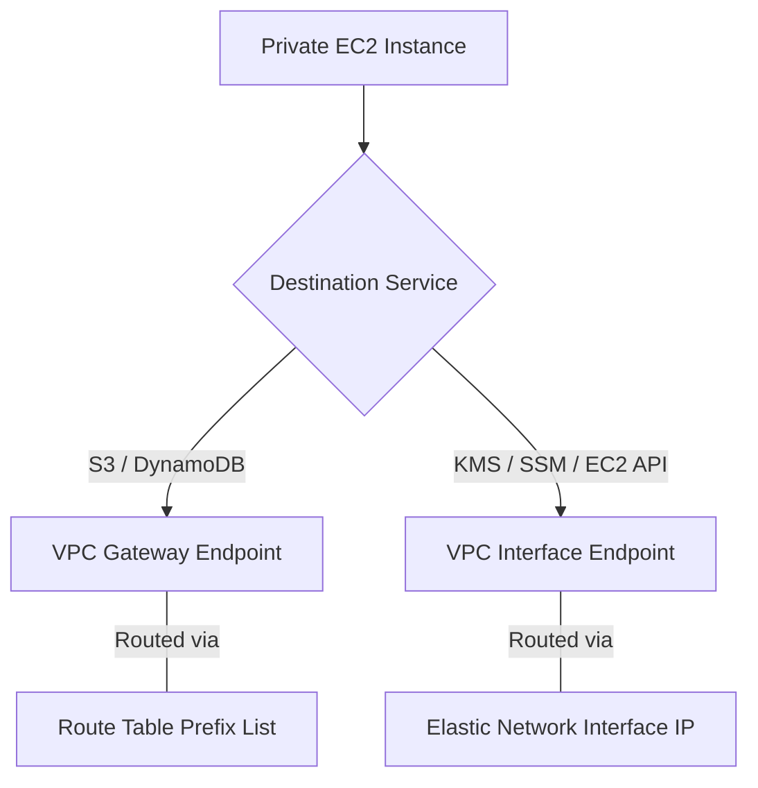
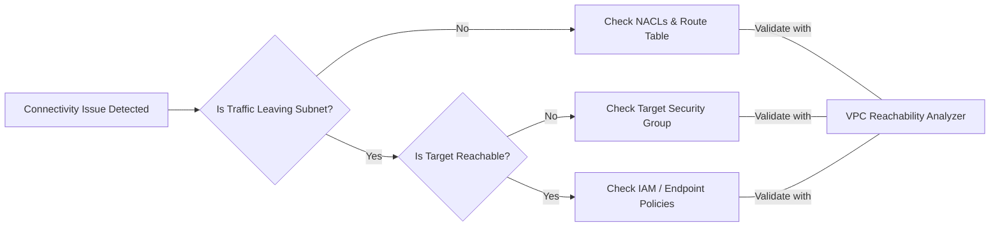

# Curriculum Overview: Configuring Private Networking Connectivity

This curriculum overview maps directly to the AWS Certified CloudOps Engineer / SysOps Administrator Associate (SOA-C03) requirements, specifically focusing on **Skill 5.1.2: Configure private networking connectivity** and **Skill 5.3.4: Identify and troubleshoot hybrid and private connectivity issues**. 

## Prerequisites

Before beginning this curriculum, learners must possess foundational knowledge in both general networking and core AWS services:

*   **Basic Networking:** Understanding of the OSI model, TCP/UDP protocols, and subnetting.
*   **AWS CLI & Console Proficiency:** Experience navigating the AWS Management Console and using the AWS CLI for basic resource queries.
*   **AWS Identity and Access Management (IAM):** Understanding of least privilege, IAM policies, and roles.
*   **CIDR Math:** Comfort calculating network boundaries. 

> [!NOTE] 
> **Refresher on AWS CIDR Block Calculation**
> AWS reserves 5 IP addresses in every subnet. The formula to calculate available usable IPs is:
> $$ \text{Usable IPs} = 2^{(32 - \text{subnet prefix})} - 5 $$

## Module Breakdown

This curriculum is structured to progressively build your expertise from isolated networks to complex, multi-region hybrid architectures.

| Module | Title | Difficulty | Key Focus Area |
| :--- | :--- | :--- | :--- |
| **Module 1** | VPC Fundamentals & Core Isolation | Beginner | Subnets, Route Tables, Security Groups, NACLs |
| **Module 2** | Intra-AWS Private Connectivity | Intermediate | VPC Endpoints (Gateway vs. Interface), AWS PrivateLink |
| **Module 3** | Inter-VPC & Hybrid Architectures | Advanced | VPC Peering, AWS Transit Gateway, DirectConnect, VPN |
| **Module 4** | Private DNS & Identity Security | Intermediate | Route 53 Resolver, ACM Private Certificate Authority (CA) |
| **Module 5** | Network Troubleshooting & Auditing | Advanced | VPC Flow Logs, Reachability Analyzer, Amazon Inspector |

## Learning Objectives per Module

### Module 1: VPC Fundamentals & Core Isolation
*   Configure private subnets that have no direct route to an Internet Gateway (IGW).
*   Implement strict Network Access Control Lists (NACLs) and Security Groups to block unauthorized inbound access.

### Module 2: Intra-AWS Private Connectivity
*   Deploy **VPC Gateway Endpoints** for private access to Amazon S3 and DynamoDB without NAT Gateways.
*   Deploy **VPC Interface Endpoints** (AWS PrivateLink) to securely access services like AWS KMS and Systems Manager without traversing the public internet.

### Module 3: Inter-VPC & Hybrid Architectures
*   Configure **VPC Peering** for direct, one-to-one VPC connectivity.
*   Implement **AWS Transit Gateway** to connect multiple VPCs and on-premises networks in a scalable hub-and-spoke model.
*   Access EC2 instances privately using **Systems Manager (SSM) Session Manager** instead of relying on vulnerable Bastion Hosts.

### Module 4: Private DNS & Identity Security
*   Configure **Amazon Route 53 Resolver** to manage DNS resolution between your on-premises data center and AWS VPCs.
*   Implement **ACM Private Certificate Authority (CA)** to issue and validate private certificates for internal resources, eliminating the overhead of managing self-signed certificates.

### Module 5: Network Troubleshooting & Auditing
*   Collect and interpret **VPC Flow Logs** to diagnose dropped packets and security group misconfigurations.
*   Use **VPC Reachability Analyzer** to perform automated network path validation.
*   Analyze **Amazon Inspector** network reachability findings to identify misconfigured paths (e.g., unintended exposures of ports to `0.0.0.0/0`).

## Success Metrics

To demonstrate mastery of this curriculum, learners must successfully achieve the following measurable outcomes:

1.  **Zero Public Exposure Validation:** Run an Amazon Inspector network reachability scan and achieve zero findings for `0.0.0.0/0` permissive rules on sensitive application tiers.
2.  **Successful Path Validation:** Use VPC Reachability Analyzer to successfully verify a network path from an isolated private subnet to an AWS service (like S3 or KMS) using only private endpoints.
3.  **Audit Compliance:** Use AWS CloudTrail and CloudWatch Log Insights to verify that traffic to AWS APIs is correctly routing over private IP spaces rather than public AWS endpoints.

## Real-World Application

Mastering private networking connectivity is a non-negotiable skill for cloud operations engineers handling sensitive data. In the real world, these skills are applied to:

*   **Regulatory Compliance (PCI-DSS, HIPAA):** Ensuring that financial transactions or patient data never traverse the public internet, satisfying strict compliance mandates.
*   **Ransomware Mitigation:** Using ACM Private CAs and KMS over private endpoints to ensure that even if an attacker breaches the perimeter, data cannot be easily exfiltrated to the public web.
*   **Cost Optimization:** Reducing costly NAT Gateway data processing charges by routing internal AWS traffic through VPC Gateway and Interface Endpoints.
*   **Secure Administration:** Completely eliminating SSH keys and Bastion Hosts by using Systems Manager Session Manager over private endpoints to access corporate servers.