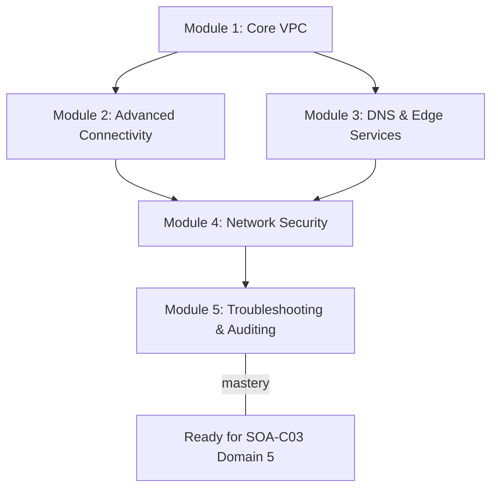
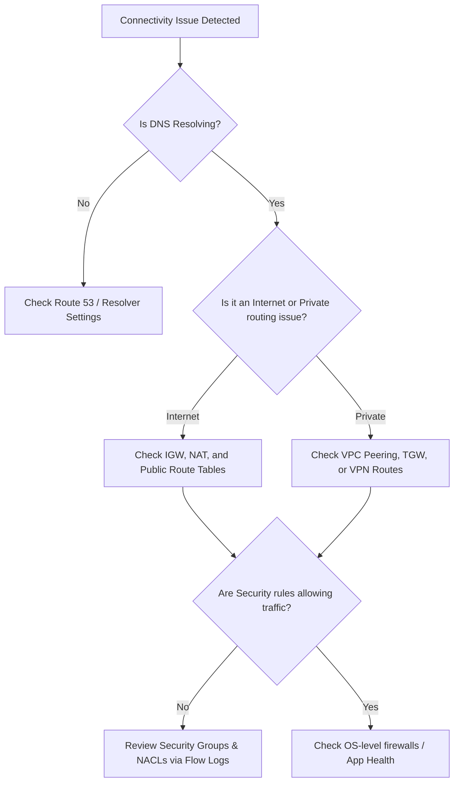

# Curriculum Overview: Implement and Optimize Networking Features and Connectivity

Welcome to the curriculum overview for **Implementing and Optimizing Networking Features and Connectivity** on AWS. This curriculum is explicitly aligned with Domain 5 (Networking and Content Delivery) of the AWS Certified CloudOps Engineer – Associate (SOA-C03) exam. It covers the end-to-end lifecycle of AWS networking, from provisioning isolated virtual networks to troubleshooting complex cross-region connectivity.

---

## Prerequisites

Before diving into this curriculum, learners should have a solid baseline in both general IT networking and foundational AWS cloud concepts:

*   **Fundamental Networking Principles**: Understanding of the OSI model, TCP/IP protocols, DNS resolution, and routing principles.
*   **IP Addressing**: Proficiency with IPv4 and IPv6 addressing, specifically Classless Inter-Domain Routing (CIDR) notation (e.g., understanding the difference between a $ /16 $ and a $ /24 $ block).
*   **AWS Basics**: Familiarity with navigating the AWS Management Console and executing basic AWS CLI commands.
*   **Identity and Security Foundations**: Basic understanding of AWS Identity and Access Management (IAM) and the principle of least privilege.

> [!IMPORTANT]
> If you are rusty on subnetting or CIDR calculations, it is highly recommended to review those concepts before starting Module 1. AWS VPC configurations rely heavily on accurate IP address management.

---

## Module Breakdown

This curriculum is divided into sequential modules that build from core infrastructure to advanced optimization and troubleshooting. 

| Module | Core Topics | Exam Domain Alignment | Difficulty |
| :--- | :--- | :--- | :--- |
| **1. VPC Administration & Core Networking** | Subnets, Route Tables, IGWs, NAT Gateways, Security Groups, NACLs | Task 5.1 | Fundamental |
| **2. Private & Hybrid Connectivity** | VPC Endpoints, VPC Peering, Transit Gateway, AWS Direct Connect | Task 5.1 | Intermediate |
| **3. DNS & Content Delivery** | Route 53 Routing Policies, Resolver, Amazon CloudFront, Global Accelerator | Task 5.2 | Intermediate |
| **4. Network Security & Protection** | AWS WAF, AWS Shield, Network Firewall, Route 53 DNS Firewall | Task 5.1 & 4.2 | Advanced |
| **5. Network Monitoring & Troubleshooting** | VPC Flow Logs, Reachability Analyzer, CloudWatch Network Monitoring | Task 5.3 | Advanced |

### Curriculum Progression Flow

---

## Learning Objectives per Module

### Module 1: VPC Administration & Core Networking
*   **Provision** a well-architected Virtual Private Cloud (VPC) with public and private subnets.
*   **Configure** appropriate route tables, Internet Gateways (IGWs), and NAT Gateways to establish proper internet access boundaries.
*   **Enforce** instance-level and subnet-level security using Security Groups and Network Access Control Lists (NACLs).

### Module 2: Private & Hybrid Connectivity
*   **Implement** private networking connectivity to AWS services using VPC Endpoints (Gateway and Interface endpoints) to avoid traversing the public internet.
*   **Manage** inter-VPC connectivity at scale using VPC Peering and AWS Transit Gateway.
*   **Identify** solutions for hybrid connectivity linking on-premises data centers to AWS.

### Module 3: DNS & Content Delivery
*   **Configure** Amazon Route 53 routing policies (Latency, Weighted, Geolocation, Failover) for highly available application routing.
*   **Optimize** content delivery and caching behaviors globally using Amazon CloudFront and AWS Global Accelerator.
*   **Implement** internal DNS resolution using Route 53 Resolver.

### Module 4: Network Security & Protection
*   **Audit** and implement AWS network protection services within a single account.
*   **Configure** AWS WAF and AWS Shield to defend against common web exploits and DDoS attacks.
*   **Implement** encryption in transit using AWS Certificate Manager (ACM).

### Module 5: Network Monitoring & Troubleshooting
*   **Collect and interpret** networking logs (VPC Flow Logs, ELB access logs, CloudFront logs, WAF logs) to diagnose connectivity issues.
*   **Troubleshoot** VPC configurations and hybrid routing misconfigurations.
*   **Identify and remediate** CloudFront caching issues (e.g., stale content, high cache miss rates).
*   **Diagnose** connectivity dynamically using the VPC Reachability Analyzer.

---

## Success Metrics

How will you know you have mastered this curriculum? You should be able to consistently demonstrate the following:

*   **Architectural Validation**: Successfully provision a secure, three-tier network architecture using AWS CloudFormation or the AWS CLI without public exposure to database tiers.
*   **Diagnostic Proficiency**: Given a scenario where an EC2 instance cannot reach the internet, isolate the issue to a Security Group, NACL, Route Table, or NAT Gateway within 5 minutes.
*   **Log Analysis**: Accurately interpret a raw VPC Flow Log record to determine if traffic was `ACCEPT` or `REJECT` and trace it back to the governing rule.
*   **Cost Optimization**: Successfully audit a given network architecture and identify cost-saving measures (e.g., substituting a NAT Gateway with a Gateway VPC Endpoint for Amazon S3 traffic).
*   **Exam Readiness**: Score 80% or higher on practice exam domains explicitly covering Task 5.1, 5.2, and 5.3 of the SOA-C03 guide.

### Troubleshooting Mental Model

When mastering Module 5, you will adopt a structured troubleshooting workflow:

---

## Real-World Application

In a modern Cloud Operations role, networking is the backbone of system reliability and security. Mastering these concepts moves you beyond simply "making things communicate" to architecting networks that are **resilient, secure, and cost-optimized**.

For example, consider a globally distributed e-commerce platform:
*   **Performance:** By properly implementing Amazon CloudFront and Route 53 Geolocation routing, you ensure users in Tokyo and users in London both experience sub-100ms load times, directly impacting revenue.
*   **Security & Compliance:** By utilizing VPC Endpoints for S3 and DynamoDB, you ensure that sensitive customer data never travels across the public internet, satisfying strict compliance requirements (like PCI-DSS or HIPAA).
*   **Cost Control:** A deep understanding of network data transfer costs allows you to optimize architectures. Recognizing that data traversing a NAT Gateway incurs per-GB processing charges enables you to implement Gateway Endpoints instead, potentially saving thousands of dollars a month on heavy workloads.

By the end of this curriculum, you will possess the operational confidence to design, secure, and troubleshoot the intricate web of services that make enterprise cloud computing possible.