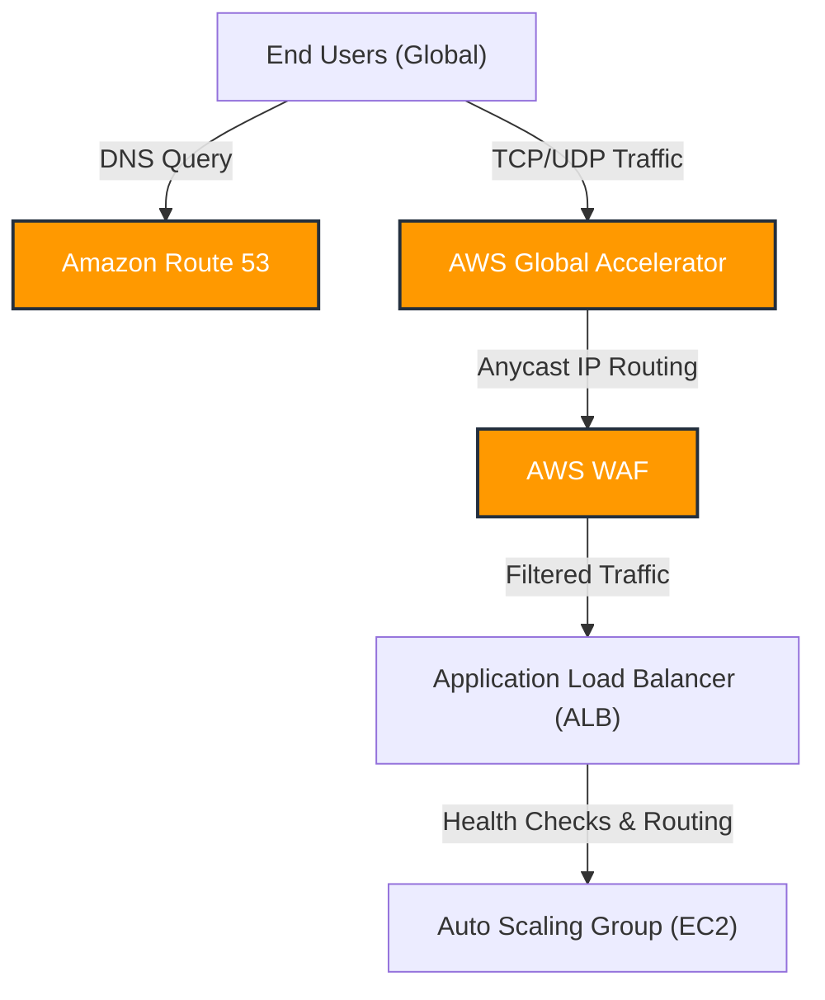

# Curriculum Overview: Configure Content and Service Distribution on AWS

> [!NOTE]
> This curriculum overview is aligned with the **AWS Certified SysOps Administrator - Associate (SOA-C03)** exam guide. It focuses specifically on configuring domains, DNS services, and edge content delivery solutions such as Amazon CloudFront and AWS Global Accelerator.

## Prerequisites

Before beginning this curriculum, learners must possess foundational knowledge in both general networking and core AWS services to ensure success:

*   **Networking Fundamentals:** Understanding of the OSI model, particularly Layer 4 (TCP/UDP protocols) and Layer 7 (HTTP/HTTPS). Solid grasp of DNS query resolution.
*   **AWS Core Services:** Familiarity with Amazon Virtual Private Cloud (VPC), Elastic Compute Cloud (EC2), and Application Load Balancers (ALB).
*   **Security Basics:** Basic knowledge of web vulnerabilities, DDoS attacks, and stateless vs. stateful packet filtering.
*   **Identity & Access:** Basic understanding of AWS Identity and Access Management (IAM) and cross-account roles.

## Module Breakdown

This curriculum is structured to take you from foundational DNS configuration to advanced, DDoS-resilient edge architectures.

| Module | Topic | Difficulty | Estimated Time | Core AWS Services |
| :--- | :--- | :--- | :--- | :--- |
| **1** | Domain & DNS Management | ⭐ Introductory | 2 Hours | Amazon Route 53 |
| **2** | Content Delivery & Caching | ⭐⭐ Intermediate | 3 Hours | Amazon CloudFront |
| **3** | Global Network Acceleration | ⭐⭐⭐ Advanced | 2.5 Hours | AWS Global Accelerator |
| **4** | Edge Security & Resiliency | ⭐⭐⭐ Advanced | 3 Hours | AWS WAF, AWS Shield |
| **5** | Monitoring & Troubleshooting | ⭐⭐ Intermediate | 2 Hours | CloudWatch, VPC Flow Logs |

## Learning Objectives per Module

### Module 1: Domain & DNS Management
*   **Configure DNS:** Set up Amazon Route 53 and configure the Route 53 Resolver to manage internal and external DNS queries.
*   **Implement Routing Policies:** Deploy advanced routing configurations including *Latency*, *Weighted*, *Geolocation*, and *Failover* routing to optimize user access.
*   **Enable Query Logging:** Configure Route 53 query logging for auditing and troubleshooting.

### Module 2: Content Delivery & Caching (Amazon CloudFront)
*   **Optimize Content Delivery:** Configure CloudFront distributions, define origins, and map out custom caching behaviors.
*   **Implement Dynamic Scalability:** Use CloudFront as a caching mechanism to enhance the dynamic scalability of backend compute environments.
*   **Secure Delivery:** Enforce HTTPS, restrict access using Origin Access Control (OAC), and implement signed URLs/cookies.

### Module 3: Global Network Acceleration (AWS Global Accelerator)
*   **Accelerate Application Response:** Provision AWS Global Accelerator to route user traffic through the AWS global edge network, reducing latency by up to 60%.
*   **Manage Static Entry Points:** Utilize anycast-routed static IP addresses for applications that require TCP and UDP protocols.
*   **Compare Edge Services:** Differentiate between CloudFront (content distribution) and Global Accelerator (network packet routing).

### Module 4: Edge Security & Resiliency
*   **Mitigate DDoS Attacks:** Design an architecture utilizing Route 53, Global Accelerator, and AWS WAF to mitigate web application-layer request floods as well as TCP/UDP attacks.
*   **Implement High Availability:** Configure Route 53 health checks integrated with Elastic Load Balancing (ELB) to ensure fault-tolerant systems.

### Module 5: Monitoring & Troubleshooting
*   **Identify Caching Issues:** Diagnose and remediate CloudFront caching issues (e.g., stale content, low cache hit ratios).
*   **Analyze Logs:** Collect and interpret CloudFront access logs, AWS WAF web ACL logs, and ELB access logs to isolate network connectivity problems.
*   **Monitor Network Health:** Configure Amazon CloudWatch metrics and alarms for network monitoring.

## Success Metrics

How will you know you have mastered this curriculum? You should be able to consistently demonstrate the following:

1.  **Architectural Design:** Successfully sketch and provision an architecture that serves static assets globally with sub-50ms latency.
2.  **Troubleshooting Proficiency:** Given a scenario with high application latency or broken asset delivery, correctly identify the misconfigured CloudFront cache behavior or routing policy within 5 minutes.
3.  **Security Posture:** Successfully configure an AWS WAF Web ACL on a CloudFront distribution that actively blocks malicious SQL injection attempts.
4.  **Exam Readiness:** Score 85% or higher on practice questions related to SOA-C03 Task 5.2 (Configure domains, DNS services, and content delivery) and Task 5.3 (Troubleshoot network connectivity issues).

## Real-World Application

In the real world, enterprise applications are rarely hosted in a single location with a single entry point. Modern systems require high availability, low latency for a global user base, and robust defense against Distributed Denial of Service (DDoS) attacks.

### Example Scenario: TCP and UDP DDoS-Resilient Architecture

Consider an application that requires fast response times for TCP and UDP requests and relies on static IP addresses. If you cannot modify the client code to redirect traffic in the event of a failure, relying purely on standard regional Load Balancers is insufficient.

By leveraging **AWS Global Accelerator** and **Route 53**, you can offer static IP addresses that are anycast-routed directly to the AWS global edge network. 

> [!TIP]
> **Why this matters:** Combining Route 53 and AWS Global Accelerator with an ALB and AWS WAF rules allows operations teams to **detect and mitigate web application-layer request floods as well as TCP and UDP attacks** before they ever reach the underlying compute infrastructure. This ensures the application remains online, performant, and secure, no matter where the traffic originates.