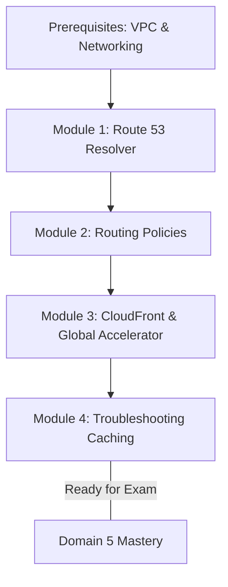
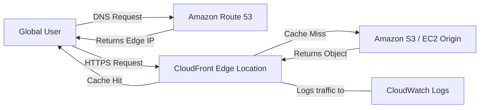

# Curriculum Overview: Configure Domains, DNS Services, and Content Delivery

This curriculum covers a critical component of Domain 5 (Networking and Content Delivery) for the AWS Certified SysOps Administrator - Associate (SOA-C03) exam. You will learn to route traffic securely, optimize content delivery, and troubleshoot complex caching architectures.

## Prerequisites

Before diving into this curriculum, learners should have a solid foundation in core networking and cloud concepts:

- **General Networking:** Understanding of IP addressing, TCP/UDP protocols, and how internet routing functions at a high level.
- **DNS Fundamentals:** Familiarity with standard Domain Name System concepts, including A records, CNAMEs, Alias records, and Time to Live (TTL).
- **AWS Core Services:** Experience navigating the AWS Management Console and using the AWS Command Line Interface (CLI).
- **Amazon VPC:** Basic knowledge of Virtual Private Clouds, including subnets, route tables, and Internet Gateways (IGWs).

> [!IMPORTANT]
> If you are unfamiliar with VPCs and core networking, it is highly recommended to review **Domain 5.1: Implement networking features and connectivity** before proceeding with this path.

## Module Breakdown

This curriculum is designed to progressively build your skills from fundamental DNS management to advanced content acceleration and log-based troubleshooting.

| Module | Focus Area | Exam Skill Alignment | Difficulty |
|---|---|---|---|
| **Module 1** | Amazon Route 53 & DNS Fundamentals | Skill 5.2.1 | Beginner |
| **Module 2** | Advanced Routing Policies & Traffic Management | Skill 5.2.2 | Intermediate |
| **Module 3** | Content Delivery & CloudFront Optimization | Skill 5.2.3 | Intermediate |
| **Module 4** | Troubleshooting Network & Caching Issues | Skill 5.3.3 | Advanced |

## Learning Objectives per Module

### Module 1: Amazon Route 53 & DNS Fundamentals
- **Configure DNS:** Provision and manage public and private hosted zones for internal and external application access.
- **Implement Route 53 Resolver:** Configure inbound and outbound endpoints to resolve DNS queries seamlessly between on-premises networks and AWS VPCs.
- **Query Logging:** Enable and analyze Route 53 query logs to audit DNS traffic and identify resolution failures.

### Module 2: Advanced Routing Policies & Traffic Management
- **Implement Routing Policies:** Select and configure the correct routing policy based on business and application requirements.
- **Health Checks & Failover:** Configure Route 53 health checks to monitor application endpoints and automatically route traffic away from unhealthy resources.

Click to expand: Route 53 Routing Policies Deep Dive

You will master the following routing types throughout Module 2:
- **Simple Routing:** Standard single-resource routing with no intelligence.
- **Weighted Routing:** Distribute traffic proportionally (e.g., A/B testing or blue/green deployments).
- **Latency Routing:** Route users to the AWS region with the lowest network latency.
- **Geolocation Routing:** Route traffic based on the user's physical geographic location.
- **Failover Routing:** Active-passive configuration for high availability and disaster recovery.

### Module 3: Content Delivery & CloudFront Optimization
- **Configure CloudFront Distributions:** Set up web distributions to accelerate static and dynamic content delivery globally to end-users.
- **Secure Origins:** Restrict direct access to Amazon S3 buckets using Origin Access Control (OAC) and Origin Access Identity (OAI).
- **Manage Caching Behaviors:** Optimize cache hit ratios using cache policies, TTL settings, cache keys, and origin request policies.

### Module 4: Troubleshooting Network & Caching Issues
- **Identify Caching Issues:** Diagnose stale content problems and successfully implement cache invalidations without degrading performance.
- **Analyze Logs:** Collect and interpret CloudFront access logs, AWS WAF web ACL logs, and VPC Flow Logs to isolate connectivity drops.
- **Resolve Connectivity:** Troubleshoot hybrid and private connectivity issues using native tools like VPC Reachability Analyzer.

## Success Metrics

To ensure you have mastered this curriculum and are ready for the SOA-C03 exam, you should be able to consistently meet the following performance indicators:

1. **Architectural Implementation:** Successfully provision a highly available web application utilizing Route 53 for DNS failover and CloudFront for global content caching.
2. **Security Compliance:** Ensure 100% of S3-hosted content is only accessible via CloudFront using OAC, effectively blocking all direct S3 URL access.
3. **Operational Troubleshooting:** Given an exam scenario involving "stale web content," correctly identify the caching behavior in CloudFront and issue an invalidation request within a simulated 5-minute SLA.
4. **Exam Readiness:** Score 85% or higher on Domain 5.2 and 5.3 practice questions from the official SysOps question bank.

## Real-World Application

In an enterprise environment, reducing latency and ensuring high availability are critical for user retention and revenue. Consider a global e-commerce platform: users from Europe and Asia are experiencing slow page load times because the primary application servers are hosted in the `us-east-1` region.

By applying the concepts in this curriculum, you can solve this problem by deploying **Amazon CloudFront** to cache static assets at Edge Locations worldwide, and using **Route 53 Latency Routing** to direct dynamic API requests to the closest regional deployment. 

> [!TIP]
> **Cost Optimization Bonus:** Serving traffic out of CloudFront is often significantly cheaper than serving it directly from S3 or EC2 across the public internet. Mastering this concept not only improves performance but directly aligns with **Domain 6 (Cost and Performance Optimization)** of the SysOps Administrator exam!